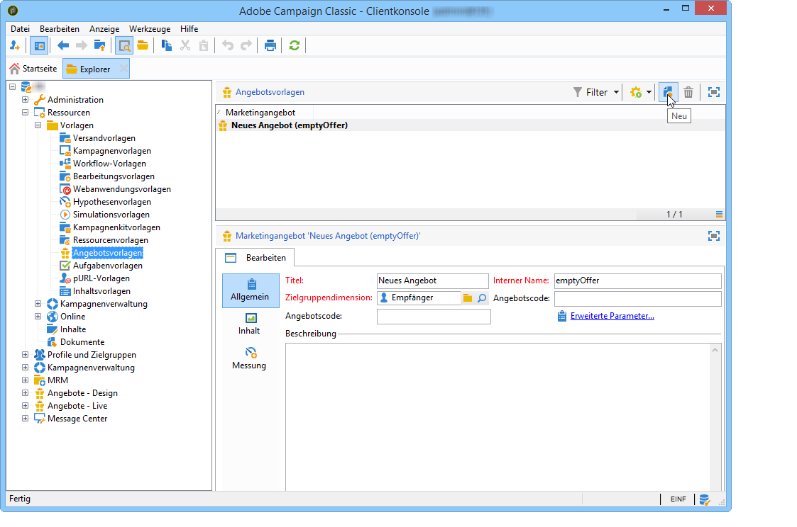
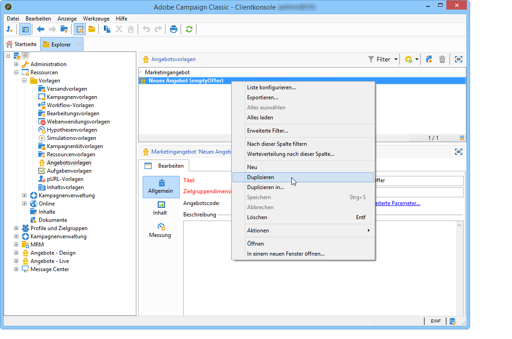
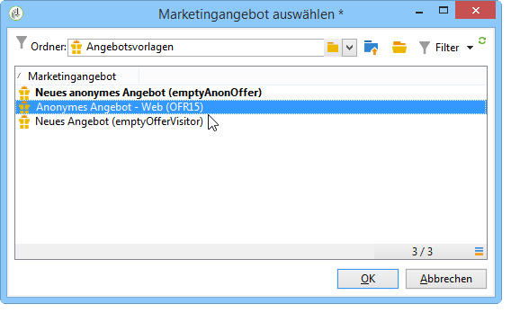

# Angebotsvorlagen{#managing-offer-templates}

In Adobe Campaign sind werksmäßig Angebotsvorlagen enthalten. Diese können bei der Angebotserstellung direkt verwendet, dupliziert und angepasst werden. Sie können außerdem eigene Vorlagen erstellen. Auf Angebotsvorlagen kann im Knoten **Ressourcen** > **Vorlagen** > **Angebotsvorlagen** zugegriffen werden.

## Angebotsvorlagen erstellen {#creating-an-offer-template}

Gehen Sie wie folgt vor, um eine Angebotsvorlage zu erstellen:

1. Gehen Sie in den Knoten **Ressourcen** > **Vorlagen** > **Angebotsvorlagen**.
1. Klicken Sie auf **Neu**.

   

1. Konfigurieren Sie die Vorlage auf die gleiche Weise wie ein Angebot und bestätigen Sie die Konfiguration durch Klick auf die Schaltfläche **Speichern**.

## Angebotsvorlagen duplizieren {#duplicate-an-existing-template}

Gehen Sie wie folgt vor, um eine Angebotsvorlage (nativ oder benutzerdefiniert) zu duplizieren:

1. Gehen Sie in den Knoten **Ressourcen > Vorlagen > Angebotsvorlagen**.
1. Klicken Sie mit der rechten Maustaste auf die Vorlage, die Sie duplizieren möchten, und wählen Sie die Option **Duplizieren** aus dem Kontextmenü aus.

   

1. Ändern Sie gegebenenfalls diverse Parameter und schließen Sie den Vorgang ab, indem Sie auf **Speichern** klicken.

Die Vorlage wird zukünftig bei der Angebotserstellung vorgeschlagen.

