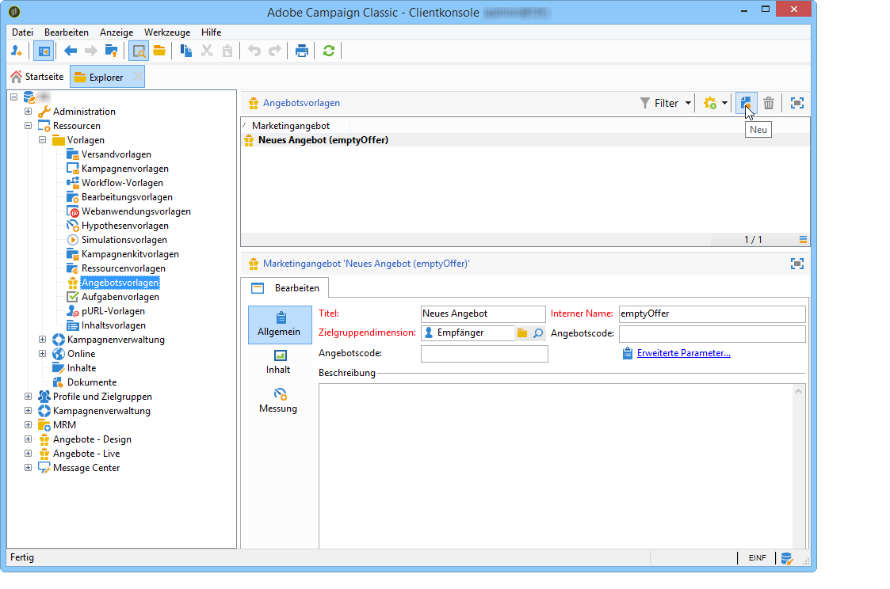
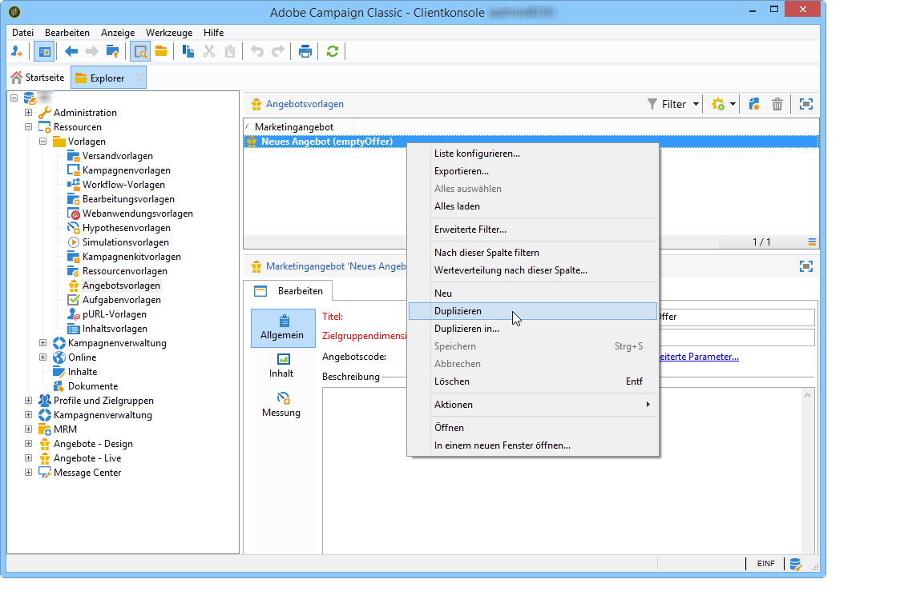
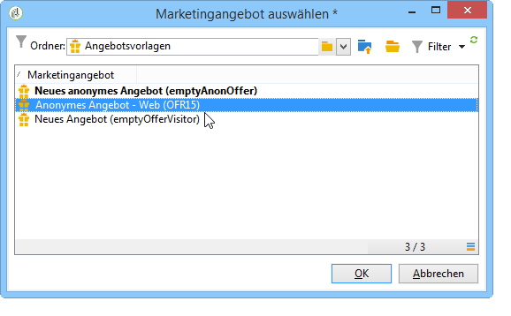

# Verwalten von Angebotsvorlagen{#managing-offer-templates}

Angebotsvorlagen sind standardmäßig in Adobe Campaign verfügbar. Sie können sie verwenden, nachdem Sie Ihre Angebote erstellt, dupliziert oder ihre Konfiguration an Ihre Anforderungen angepasst haben. Sie können auch eigene Vorlagen erstellen. Vorlagenangebote werden im Ordner **Ressourcen** > **Vorlagen** > **Angebotsvorlagen** gespeichert.

## Angebotsvorlagen erstellen {#creating-an-offer-template}

Gehen Sie wie folgt vor, um eine Angebotsvorlage zu erstellen:

1. Gehen Sie in den Knoten **Ressourcen** > **Vorlagen** > **Angebotsvorlagen**.
1. Klicken Sie auf **Neu**.

   

1. Konfigurieren Sie die Vorlage auf die gleiche Weise wie ein Angebot und bestätigen Sie die Konfiguration durch Klick auf die Schaltfläche **Speichern**.

## Angebotsvorlagen duplizieren {#duplicate-an-existing-template}

Gehen Sie wie folgt vor, um eine Angebotsvorlage (nativ oder benutzerdefiniert) zu duplizieren:

1. Gehen Sie in den Knoten **Ressourcen > Vorlagen > Angebotsvorlagen**.
1. Klicken Sie mit der rechten Maustaste auf die Vorlage, die Sie duplizieren möchten, und wählen Sie die Option **Duplizieren** aus dem Kontextmenü aus.

   

1. Ändern Sie gegebenenfalls diverse Parameter und schließen Sie den Vorgang ab, indem Sie auf **Speichern** klicken.

Die Vorlage wird zukünftig bei der Angebotserstellung vorgeschlagen.

