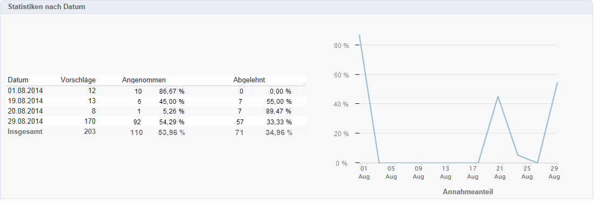
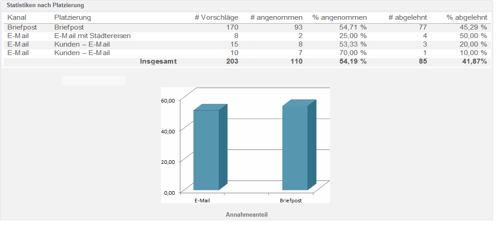
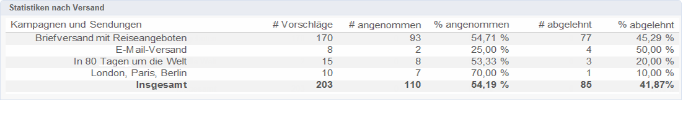
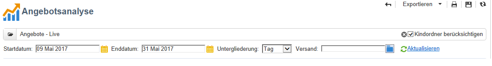

# Angebotsanalyse-Bericht{#offer-analysis-report}

Der **[!UICONTROL Angebotsanalyse]**-Bericht bietet eine Zusammenfassung der akzeptierten und abgelehnten Vorschläge.

>[!NOTE]
>
>Diese Option steht nur dem Versandverantwortlichen in Live-Umgebungen zur Verfügung.

Die Statistiken gliedern sich nach drei Merkmalen:

* Datum:

   

* Platzierung:

   

* Sendungen:

   

Im Berichtskopf können Sie die angezeigten Daten mithilfe bestimmter Kriterien einschränken. Wählen Sie z. B. einen Zeitraum aus und klicken Sie abschließend auf **[!UICONTROL Aktualisieren]**, um die Filter auf den Bericht anzuwenden.

