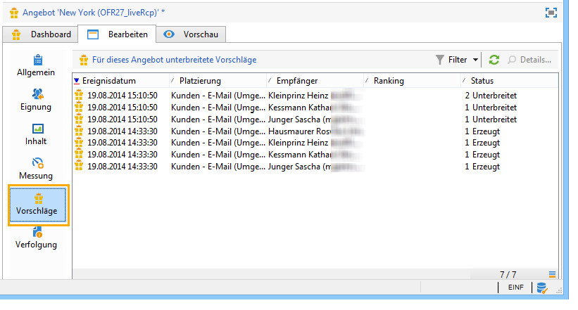
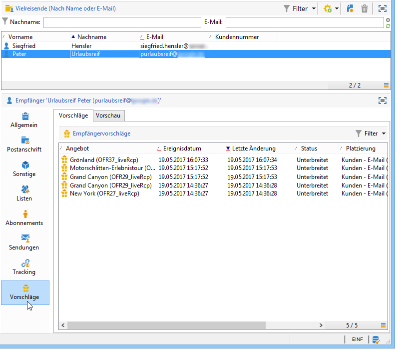
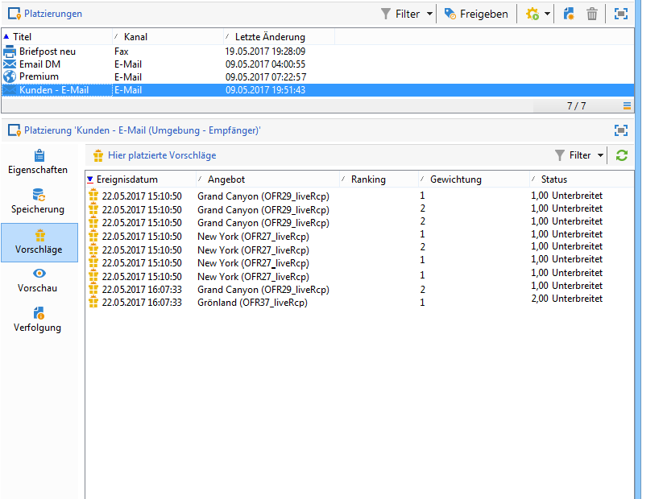

# Angebotsvorschlagsverlauf{#offer-proposition-history}

Nach der Unterbreitung von Angeboten haben Sie die Möglichkeit, den Verlauf der Unterbreitung einzusehen.

>[!NOTE]
>
>Diese Option steht nur dem Versandverantwortlichen in Live-Umgebungen zur Verfügung.

* Ausgehend vom Angebot: Klicken Sie im Tab **[!UICONTROL Bearbeiten]** des Angebots auf **[!UICONTROL Vorschläge]**.

  

* Ausgehend vom Empfänger: Klicken Sie auf den Tab **[!UICONTROL Vorschläge]**.

  

* Ausgehend von einer Platzierung: Klicken Sie auf den Tab **[!UICONTROL Vorschläge]**.

  
