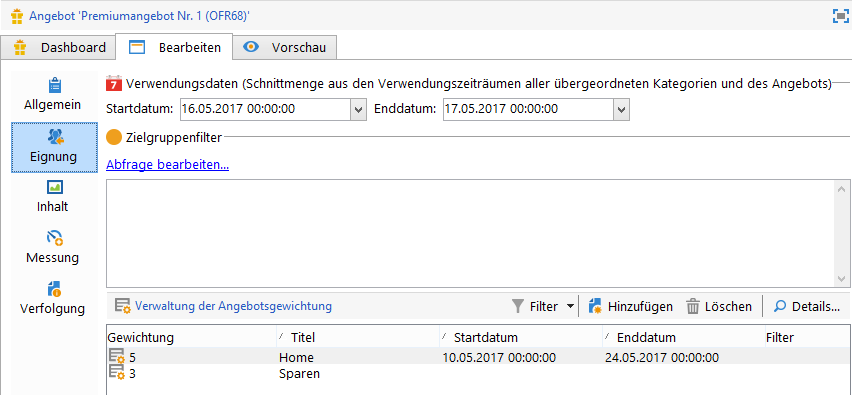

# Eingehender Kanal{#offers-on-an-inbound-channel}

## Anonymen Besuchern Angebote unterbreiten {#presenting-an-offer-to-an-anonymous-visitor}

Das Unternehmen Neobank möchte auf seiner Webseite Besuchern, die sich nicht mit ihren Kundendaten angemeldet haben, ein Angebot anzeigen.

Folgende Etappen sind zur Umsetzung dieser Interaktion zu durchlaufen:

1. [Anonyme Umgebung erstellen](#creating-an-anonymous-environment)
1. [Anonyme Platzierungen erstellen](#creating-anonymous-offer-spaces)
1. [Angebotskategorie und Thema erstellen](#creating-an-offer-category-and-a-theme)
1. [Anonyme Angebote erstellen.](#creating-anonymous-offers)
1. [Angebotsplatzierungen auf der Website konfigurieren](#configure-the-web-offer-space-on-the-website)

### Erstellung einer anonymen Umgebung {#creating-an-anonymous-environment}

Gehen Sie wie im Abschnitt [Angebotsumgebungen](../../interaction/using/live-design-environments.md#creating-an-offer-environment) beschrieben vor, um eine anonyme, auf der **Besucher**-Dimension basierende Umgebung zu erstellen.

Das Ergebnis ist eine Navigationsstruktur, welche Ihre neue Umgebung enthält:


### Erstellung von anonymen Platzierungen {#creating-anonymous-offer-spaces}

1. Markieren Sie im Navigationszweig Ihrer anonymen Umgebung (**Besucher**) den Knoten **[!UICONTROL Administration]** > **[!UICONTROL Platzierungen]**.
1. Klicken Sie auf **[!UICONTROL Neu]**, um eine Platzierung zu erstellen.

   

   >[!NOTE]
   >
   >Die Platzierung wird automatisch der anonymen Umgebung zugeordnet.

1. Benennen Sie die Platzierung und wählen Sie den Kanal **[!UICONTROL Web (eingehend)]**. Aktivieren Sie darüber hinaus auch die Option **[!UICONTROL Einzelmodus zulassen]**.

   

1. Wählen Sie die für den Angebotsinhalt in dieser Platzierung verwendeten Felder aus und kennzeichnen Sie sie als Pflichtfelder.

   Auf diese Weise werden Angebote, bei denen eins der folgenden Elemente fehlt, für diese Platzierung ausgeschlossen:

   * Title
   * HTML-Inhalt,
   * Bild-URL,
   * Ziel-URL

   

1. Geben Sie die HTML-Rendering-Funktion an. Sie kann beispielsweise folgende Form annehmen:

   ```
   function (imageUrl, targetUrl, shortContent, htmlSource){
         var html = "<p><b>" + shortContent + "</b></p>";
         html += "<p>" + htmlSource + "</p>";
         html += "<a _urlType='11' href='" + targetUrl + "'></a>";
         return html;
       }   
   ```

   >[!IMPORTANT]
   >
   >Damit die Angebote korrekt angezeigt werden, muss die Rendering-Funktion die in der Platzierung verwendeten Felder in der gleichen Reihenfolge aufrufen, in der sie zuvor ausgewählt wurden.

   

1. Speichern Sie die Platzierung.

### Erstellung einer Angebotskategorie und eines Themas {#creating-an-offer-category-and-a-theme}

1. Markieren Sie in der zuvor erstellten Umgebung den Knoten **[!UICONTROL Angebotskatalog]**.
1. Klicken Sie mit der rechten Maustaste und wählen Sie im Kontextmenü die Option **[!UICONTROL Angebotskategorie-Ordner hinzufügen]****[!UICONTROL aus]**.

   Nennen Sie die neue Kategorie, beispielsweise **Finanzprodukte**.

1. Geben Sie im Tab **[!UICONTROL Eignung]** der Kategorie das Thema **Finanzierungen** ein und speichern Sie die Änderungen ab.

   

### Erstellung anonymer Angebote {#creating-anonymous-offers}

1. Markieren Sie die soeben erstellte Kategorie.
1. Klicken Sie auf **[!UICONTROL Neu]**.

   

1. Wählen Sie die native Vorlage für anonyme Angebote oder eine zuvor von Ihnen konfigurierte Vorlage aus.

   

1. Benennen und speichern Sie das Angebot.

   

1. Definieren Sie im Tab **[!UICONTROL Eignung]** die Gewichtung des Angebots in Abhängigkeit von den diversen Anwendungskontexten.

   Im vorliegenden Beispiel soll das Angebot bis zum Jahresende auf der Startseite der Webpräsenz mit Priorität erscheinen.

   

1. Konfigurieren Sie nun den Angebotsinhalt im entsprechenden Tab.****

   >[!NOTE]
   >
   >Um die für eine Web-Platzierung erforderlichen Elemente anzuzeigen, können Sie auf **[!UICONTROL Inhaltsdefinition]** klicken.

   

1. Erstellen Sie ein zweites Angebot.

   

1. Definieren Sie im Tab **[!UICONTROL Eignung]** die gleiche Gewichtung wie für das erste Angebot.
1. Lassen Sie beide Angebote den Validierungszyklus durchlaufen, um sie und ihre Platzierungen in der Live-Umgebung verfügbar zu machen.

### Konfiguration der Angebotsplatzierung auf der Webseite {#configure-the-web-offer-space-on-the-website}

Damit die zuvor erstellten Angebote auf der Web-Seite erscheinen können, fügen Sie einen JavaScript-Code in die HTML-Seite Ihrer Web-Präsenz ein, der die Abfrage des Angebotsmoduls auslöst (siehe [Über eingehende Kanäle](../../interaction/using/about-inbound-channels.md)).

1. Fügen Sie in der HTML-Seite ein @id-Attribut ein, dessen Wert dem internen Namen der zuvor erstellten anonymen Platzierung entspricht (siehe [Anonyme Platzierungen erstellen](#creating-anonymous-offer-spaces)), mit einem vorangestellten **i_**.

   

1. Fügen Sie die Abfrage-URL ein.

   

   Die blauen URL-Felder oben entsprechen dem Instanznamen, dem internen Namen der Umgebung (siehe [Erstellung einer anonymen Umgebung](#creating-an-anonymous-environment)) und dem Thema, das mit der Kategorie verknüpft ist ([Erstellunge einer Angebotskategorie und eines Themas](#creating-an-offer-category-and-a-theme)). Das Thema ist optional.

Wenn ein Besucher auf die Startseite der Webpräsenz zugreift, werden die Angebote des Themas **Finanzierungen** wie zuvor konfiguriert angezeigt.


Besucht er wiederholt die Startseite, wird ihm alternativ das eine oder das andere Angebot der Kategorie angezeigt, da sie die gleiche Gewichtung aufweisen.

## In eine anonyme Umgebung wechseln, wenn ein Kontakt nicht identifiziert wurde {#switching-to-an-anonymous-environment-in-case-of-unidentified-contacts}

Neobank möchte auf seiner Webseite Marketingangebote für zwei verschiedene Zielgruppen präsentieren: Für anonyme Besucher sollen allgemeine Produkte angezeigt werden. Wenn sich einer der Besucher als registrierter Kunde erweist, sollen ihm, sobald er sich in seinem Konto anmeldet, personalisierte Angebote unterbreitet werden.

Es wird von folgendem Szenario ausgegangen:

1. Eine Person besucht die Neobank-Webseite, ohne sich anzumelden.

   

   Drei anonyme Angebote werden angezeigt: zwei **Premium**-Angebote, die Neobank-Produkte bewerben, und ein Angebot eines Neobank-Partners.

   

1. Da es sich bei dem Besucher um einen Neobank-Kunden handelt, meldet er sich mit seinen Kontodaten an.

   

   Nun werden drei für ihn personalisierte Angebote angezeigt.

   

Für dieses Anwendungsbeispiel müssen Sie neben der üblichen Umgebung für identifizierte über eine zweite für anonyme Kontakte verfügen. Die Umgebung für identifizierte Kontakte wird dahingehend konfiguriert, dass sie automatisch zur Umgebung für anonyme Kontakte wechselt, wenn der Besucher sich nicht anmeldet, also nicht identifiziert werden kann.

Gehen Sie wie folgt vor:

* Erstellen Sie einen spezifischen Angebotskatalog für eingehende anonyme Interaktionen:

   1. [Erstellung einer Umgebung für anonyme Kontakte](#creating-an-environment-for-anonymous-contacts)
   1. [Konfiguration der Platzierungen für die anonyme Umgebung](#configuring-offer-spaces-for-the-anonymous-environment)
   1. [Erstellung der Angebotskategorien in der anonymen Umgebung](#creating-offer-categories-in-an-anonymous-environment)
   1. [Erstellung der Angebote für anonyme Besucher](#creating-offers-for-anonymous-visitors)

* Erstellen Sie einen spezifischen Angebotskatalog für eingehende identifizierte Interaktionen:

   1. [Konfiguration der Platzierungen für die identifizierte Umgebung](#configure-the-offer-spaces-in-the-identified-environment)
   1. [Erstellung der Angebotskategorien in der identifizierten Umgebung](#creating-offer-categories-in-an-identified-environment)
   1. [Erstellung personalisierter Angebote](#creating-personalized-offers)

* Konfigurieren Sie die Abfrage des Angebotsmoduls:

   1. [Konfiguration der Angebotsplatzierungen auf der Webseite](#configuring-offer-spaces-on-the-web-page)
   1. [Definition der erweiterten Parameter der identifizierten Umgebung](#specifying-the-advanced-settings-of-the-identified-offer-spaces)

### Erstellung einer Umgebung für anonyme Kontakte {#creating-an-environment-for-anonymous-contacts}

1. Erstellen Sie mit dem Versand-Zuordnungsassistenten (**Besucher**-Mapping) eine Angebotsumgebung für anonyme eingehende Interaktionen. Weiterführende Informationen dazu finden Sie unter [Angebotsumgebungen](../../interaction/using/live-design-environments.md#creating-an-offer-environment).

   

### Konfiguration der Platzierungen für die anonyme Umgebung {#configuring-offer-spaces-for-the-anonymous-environment}

Die auf der Webseite zu unterbreitenden Angebote stammen aus zwei verschiedenen Kategorien: **Premium** und **Partner**. Im vorliegenden Beispiel wird für jede Kategorie eine spezifische Platzierung erstellt.

Gehen Sie wie folgt vor, um die Platzierung der Kategorie **Premium** zu erstellen:

1. Gehen Sie in die anonyme Design-Umgebung und fügen Sie eine Platzierung hinzu.

   

1. Wählen Sie den Kanal **[!UICONTROL Web (eingehend)]**.

   

1. Benennen Sie die Platzierung, z. B. **Premiumangebote - Web Anonym**.
1. Konfigurieren Sie die Inhaltsfelder und die Rendering-Funktionen.

   

   >[!IMPORTANT]
   >
   >Damit die Angebote korrekt angezeigt werden, muss die Rendering-Funktion die in der Platzierung verwendeten Felder in der gleichen Reihenfolge aufrufen, in der sie zuvor ausgewählt wurden.

1. Erstellen Sie auf die gleiche Weise die Platzierung für die Angebote der Kategorie **Partner**.

   

### Erstellung der Angebotskategorien in der anonymen Umgebung {#creating-offer-categories-in-an-anonymous-environment}

Erstellen Sie zwei Angebotskategorien: **Premium** und **Partner**. Jede Kategorie soll zwei Angebote für anonyme Kontakte enthalten.

1. Markieren Sie hierfür in der anonymen Umgebung, die Sie zuvor erstellt haben, den Knoten **[!UICONTROL Angebotskatalog]**.
1. Klicken Sie mit der rechten Maustaste und wählen Sie im Kontextmenü die Option **[!UICONTROL Angebotskategorie-Ordner hinzufügen]** aus. Nennen Sie die Kategorie **Premium**.

   

1. Wiederholen Sie den Vorgang und nennen Sie die zweite Kategorie **Partner**.

   

### Erstellung der Angebote für anonyme Besucher {#creating-offers-for-anonymous-visitors}

Erstellen Sie nun jeweils zwei Angebote in jeder der zuvor erstellten Kategorien.

1. Markieren Sie hierfür die Kategorie **Premium** und erstellen Sie ein erstes anonymes Angebot.

   

1. Definieren Sie im Tab **[!UICONTROL Eignung]** die Gewichtung des Angebots in Abhängigkeit von den diversen Anwendungskontexten.

   

1. Konfigurieren Sie nun den Angebotsinhalt im entsprechenden Tab.****

   

1. Wiederholen Sie den Vorgang für das zweite Angebot der Kategorie **Premium**.

   

1. Markieren Sie die Kategorie **Partner** und erstellen Sie das erste anonyme Angebot der Kategorie.
1. Konfigurieren Sie nun den Angebotsinhalt im entsprechenden Tab.****

   

1. Definieren Sie im Tab **[!UICONTROL Eignung]** die Gewichtung des Angebots in Abhängigkeit von den diversen Anwendungskontexten.

   

1. Erstellen Sie analog das zweite Angebot der Kategorie **Partner**.

   

1. Definieren Sie im Tab **[!UICONTROL Eignung]** die gleiche Gewichtung wie für das erste Angebot dieser Kategorie, damit die Angebote abwechselnd auf der Webseite angezeigt werden.

   

1. Lassen Sie alle Angebote den Validierungszyklus durchlaufen, um sie in der Live-Umgebung verfügbar zu machen. Stellen Sie sicher, dass im Zuge der Inhaltsvalidierung je nach Angebot entweder die Platzierung **Partner** oder die Platzierung **Premium** aktiviert wird.

### Konfiguration der Platzierungen für die identifizierte Umgebung {#configure-the-offer-spaces-in-the-identified-environment}

Die auf der Webseite zu unterbreitenden Angebote für identifizierte Kontakte stammen aus zwei verschiedenen Kategorien: **Premium** und **Partner**. Im vorliegenden Beispiel wird für jede Kategorie eine spezifische Platzierung erstellt.

Erstellen Sie die beiden Platzierungen auf die gleiche Weise wie die anonymen Platzierungen. Siehe [Konfiguration der Platzierungen für die anonyme Umgebung](#configuring-offer-spaces-for-the-anonymous-environment).

1. Gehen Sie in die identifizierte Design-Umgebung und fügen Sie die Platzierungen **Premium** und **Partner** hinzu.
1. Wenden Sie das unter [Konfiguration der Platzierungen für die anonyme Umgebung](#configuring-offer-spaces-for-the-anonymous-environment) beschriebene Verfahren an.

   

1. Kreuzen Sie die Option **[!UICONTROL Zu einer anonymen Platzierung wechseln, wenn keine Zielperson identifiziert wurde]** an.

   

1. Wählen Sie mithilfe der Dropdown-Liste die zuvor erstellte anonyme Web-Platzierung aus (siehe [Konfiguration der Platzierungen für die anonyme Umgebung](#configuring-offer-spaces-for-the-anonymous-environment)).

   

### Definition der erweiterten Parameter der identifizierten Umgebung {#specifying-the-advanced-settings-of-the-identified-offer-spaces}

Im vorliegenden Beispiel soll der Kontakt über seine E-Mail-Adresse in der Adobe-Campaign-Datenbank identifiziert werden. Fügen Sie die E-Mail-Adresse des Empfängers wie folgt in die Platzierung ein:

1. Gehen Sie in der identifizierten Umgebung in den Platzierungsknoten.
1. Wählen Sie die Platzierung **Premium** aus und klicken Sie auf **[!UICONTROL Erweiterte Parameter...]**.

   

1. Klicken Sie im Tab **[!UICONTROL Zielgruppenidentifizierung]** auf **[!UICONTROL Hinzufügen]**.

   

1. Klicken Sie auf **[!UICONTROL Ausdruck bearbeiten]** und wählen Sie das Feld **[!UICONTROL E-Mail]** aus der Empfängertabelle aus.

   

1. Klicken Sie dann auf **[!UICONTROL OK]**, um das Fenster **[!UICONTROL Erweiterte Parameter]** zu verlassen und die Konfiguration der **Premium**-Platzierung abzuschließen.
1. Wiederholen Sie den Vorgang für die **Partner**-Platzierung.

   

### Erstellung der Angebotskategorien in der identifizierten Umgebung {#creating-offer-categories-in-an-identified-environment}

Erstellen Sie zwei Angebotskategorien: **Premium** und **Partner**. Jede Kategorie soll zwei personalisierte Angebote enthalten.

1. Markieren Sie hierfür in der identifizierten Umgebung den Knoten **[!UICONTROL Angebotskatalog]**.
1. Fügen Sie wie zuvor für die anonyme Umgebung zwei Ordner vom Typ **[!UICONTROL Angebotskategorie]** hinzu. Nennen Sie sie **Premium** und **Partner**.

   

### Erstellung personalisierter Angebote {#creating-personalized-offers}

Erstellen Sie nun in jeder Kategorie zwei Angebote, d. h. vier Angebote insgesamt. Gehen Sie wie folgt vor:

1. Markieren Sie die Kategorie **Premium** und erstellen Sie ein erstes personalisiertes Angebot.

   

1. Definieren Sie im Tab **[!UICONTROL Eignung]** die Gewichtung des Angebots in Abhängigkeit von den diversen Anwendungskontexten.

   

1. Konfigurieren Sie nun den Angebotsinhalt im entsprechenden Tab.****

   

1. Wiederholen Sie den Vorgang für das zweite Angebot der Kategorie **Premium**.

   

1. Markieren Sie jetzt die Kategorie **Partner** und erstellen Sie auch hier ein erstes personalisiertes Angebot.

   

1. Definieren Sie im Tab **[!UICONTROL Eignung]** die Gewichtung des Angebots in Abhängigkeit von den diversen Anwendungskontexten.

   

1. Erstellen Sie analog das zweite Angebot der Kategorie **Partner**.

   

1. Definieren Sie im Tab **[!UICONTROL Eignung]** die gleiche Gewichtung wie für das erste Angebot dieser Kategorie, damit die Angebote abwechselnd auf der Webseite angezeigt werden.
1. Lassen Sie alle Angebote den Validierungszyklus durchlaufen, um sie in der Live-Umgebung verfügbar zu machen. Stellen Sie sicher, dass im Zuge der Inhaltsvalidierung je nach Angebot entweder die Platzierung **Partner** oder die Platzierung **Premium** aktiviert wird.

### Konfiguration der Angebotsplatzierungen auf der Webseite {#configuring-offer-spaces-on-the-web-page}

Die Neobank-Webseite verfügt über drei Platzierungen zur Anzeige von Angeboten: zwei für Angebote der Kategorie **Premium** und eine für Angebote der Kategorie **Partner**.


Gehen Sie wie folgt vor, um die Platzierungen der Angebote in der HTML-Seite der Webpräsenz zu konfigurieren:

1. Fügen Sie im Inhalt der HTML-Seite drei

   Elemente mit einem @id-Attribut ein, dessen Wert es uns ermöglicht, die Angebote in den verschiedenen Platzierungen der Web-Seite aufzurufen.

   

1. Im Anschluss daran ist das Script anzugeben, das die Attributwerte definiert.

   

   Im vorliegenden Beispiel nehmen **ContBO1** und **ContBO2** den Wert **SPC24** an, d. h. den internen Namen der zuvor in der identifizierten Umgebung erstellten **Premium**-Platzierung. Die Werte **OC10** bzw. **OC12** entsprechen den internen Namen der **Premium**-Kategorie der anonymen bzw. identifizierten Umgebung.

   

   Des Weiteren nimmt **ContPtn** den Wert **SPC22** an, was dem internen Namen der in der identifizierten Umgebung erstellten **Partner**-Platzierung entspricht. **OC11** bzw. **OC13** entsprechen den internen Namen der **Partner**-Kategorie der anonymen bzw. identifizierten Umgebung.

   

1. Ordnen Sie der Variable **interactionTarget** die Informationen zu, die die Identifizierung des Besuchers ermöglichen, der sich auf der Neobank-Webseite anmeldet.

   

   Die Identifizierung der Person kann anhand eines Browser-Cookies, eines Leseparameters in der URL, der E-Mail-Adresse oder der Kennung der Person erfolgen. Wenn ein Feld der Empfängertabelle verwendet wird, bei dem es sich nicht um den Primärschlüssel handelt, muss es in den erweiterten Parametern der Platzierung definiert werden (siehe [Definition der erweiterten Parameter der identifizierten Umgebung](#specifying-the-advanced-settings-of-the-identified-offer-spaces)).

1. Fügen Sie die Abfrage-URL ein.

   

   Die URL enthält den internen Namen (**liveRcp**) der identifizierten Umgebung.

Bei Aufruf der Webseite löst das Script die Abfrage des Angebotsmoduls aus, damit der Angebotsinhalt in den hierfür vorgesehenen Platzierungen angezeigt wird. Mit nur einer Abfrage des Adobe-Campaign-Servers erkennt das Angebotsmodul die auszuwählende Umgebung, Platzierung und Angebotskategorie.

Im vorliegenden Beispiel erkennt das Modul die identifizierte Umgebung (**liveRcp**), die Platzierung (**SPC24**) und die **Premium**-Kategorie (**OC10**) für die erste und zweite Platzierung der Webseite sowie die Platzierung (**SPC22**) und die **Partner**-Kategorie (**OC11**) für die dritte Platzierung der Webseite.

Wenn das Modul den Besucher nicht identifizieren kann, wechselt es zu den anonymen Platzierungen, die in den identifizierten Platzierungen referenziert wurden, und zu den anonymen Kategorien (**OC12** bzw. **OC13**), wie im Script angegeben.
