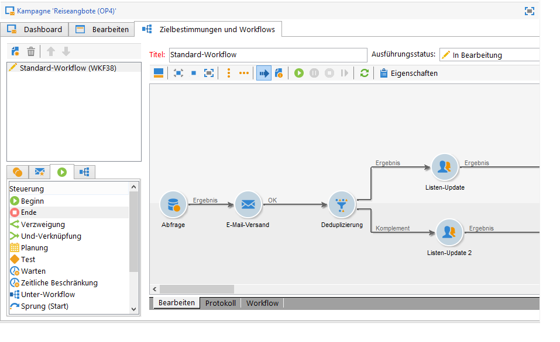

# Ausgehender Kanal{#offers-on-an-outbound-channel}

## Angebote per E-Mail versenden {#email-offer-delivery}

Angenommen, Sie verfügen in Ihrer Datenbank über eine Reihe von Angeboten für Reisen nach Afrika. Eignung, Kontexte und Darstellungen der Angebote wurden bereits konfiguriert. Nun soll eine E-Mail-Kampagne zur Unterbreitung der Angebote erstellt werden.

1. Erstellen Sie Ihre Kampagne und den Workflow zur Bestimmung der Zielgruppe.

   

1. Edit the email delivery and click the **[!UICONTROL Offers]** icon.

   

1. Wählen Sie die E-Mail-Platzierung der Live-Umgebung aus, die die Reiseangebote enthält.

   

1. Wählen Sie die Kategorie mit den Angeboten für Afrikareisen aus.

   

1. Geben Sie an, dass pro E-Mail jeweils zwei Angebote unterbreitet werden sollen.

   

1. Schließen Sie das Angebotsfenster und erstellen Sie den Inhalt Ihres Versands.

   

1. Fügen Sie nun mithilfe der Personalisierungsfelder den ersten Angebotsvorschlag in den Versandinhalt ein und wählen Sie die HTML-Rendering-Funktion.

   

1. Fügen Sie auf die gleiche Weise den zweiten Angebotsvorschlag ein.

   

1. Click **[!UICONTROL Preview]** to preview your offers in the delivery then select a recipient to preview the offers as they will receive them.

   

1. Speichern Sie den Versand und starten Sie den Zielgruppen-Workflow.
1. Open your delivery and click the **[!UICONTROL Audit]** tab of your delivery: you can see that the offer engine has selected the propositions to be made from the various offers in the catalog.

   

## Angebote simulieren {#perform-an-offer-simulation}

1. Klicken Sie im **[!UICONTROL Profiles and Targets]** Universum auf den **[!UICONTROL Simulations]** Link und dann auf die **[!UICONTROL Create]** Schaltfläche.

   

1. Benennen Sie die Simulation und geben Sie gegebenenfalls Ausführungsparameter an.

   

1. Speichern Sie die Simulation. Sie öffnet sich automatisch in einem neuen Tab.

   

1. Klicken Sie auf die **[!UICONTROL Edit]** Registerkarte und dann **[!UICONTROL Scope]**.

   

1. Wählen Sie die Kategorie aus, für die Sie die Angebotssimulation durchführen möchten.

   

1. Wählen Sie die Platzierung aus.

   

1. Geben Sie einen Zeitraum an. Es muss zumindest ein Startdatum definiert werden. Dies ermöglicht es dem Angebotsmodul, die Angebote zu filtern und nur jene zu berücksichtigen, die zum angegebenen Zeitpunkt tatsächlich zur Verfügung stehen werden.
1. Geben Sie bei Bedarf Themen an, um die Anzahl der Angebote zu begrenzen.

   Im vorliegenden Beispiel enthält die Kategorie **Finanzdienstleistungen** zwei Unterkategorien mit je einem unterschiedlichen Thema. Die Simulation soll sich nur auf die Kategorie mit dem Anwendungsthema **Kunden &lt; 1 Jahr** beziehen.

   

1. Definieren Sie die Zielgruppe.

   

1. Geben Sie die Anzahl an Angeboten an, die Sie jedem Empfänger unterbreiten möchten.

   Im vorliegenden Beispiel soll das Angebotsmodul für jeden Empfänger die drei Angebote auswählen, die die höchste Gewichtung aufweisen.

   

1. Save your settings, then click **[!UICONTROL Start]** in the **[!UICONTROL Dashboard]** tab to run the simulation.

   

1. Once the simulation is finished, consult the **[!UICONTROL Results]** for a detailed breakdown of propositions per offer.

   Im vorliegenden Beispiel beruht die Verteilung wie konfiguriert auf drei Vorschlägen.

   

1. Zeigen Sie die **[!UICONTROL Breakdown of offers by rank]** an, um die Liste der von der Angebotsmaschine ausgewählten Angebote anzuzeigen.

   

1. If necessary, you can change the scope settings and run the simulation again by clicking **[!UICONTROL Start simulation]**.

   

1. Sie haben mithilfe der Verlaufs- und Exportfunktionen des Berichts die Möglichkeit, die Simulationsdaten zu speichern.

   

