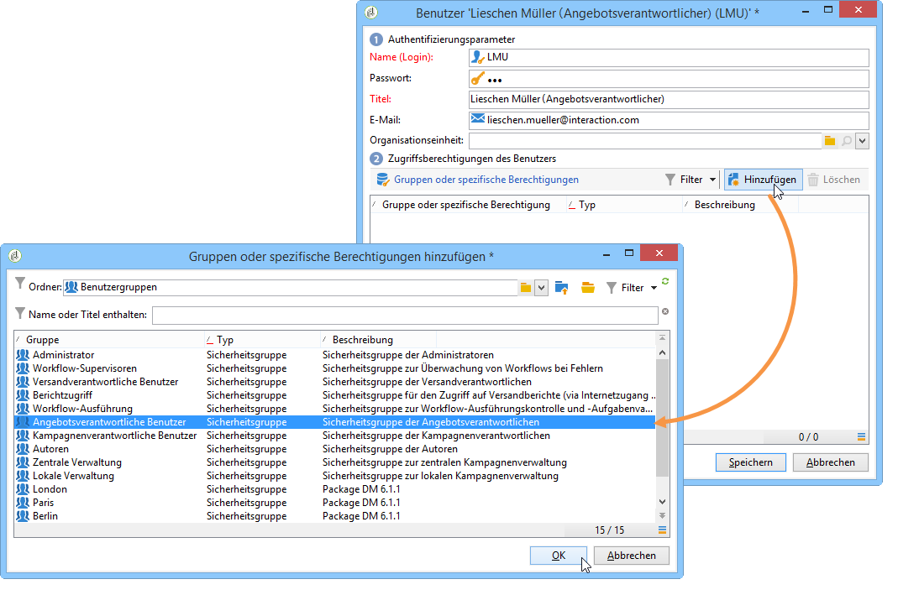
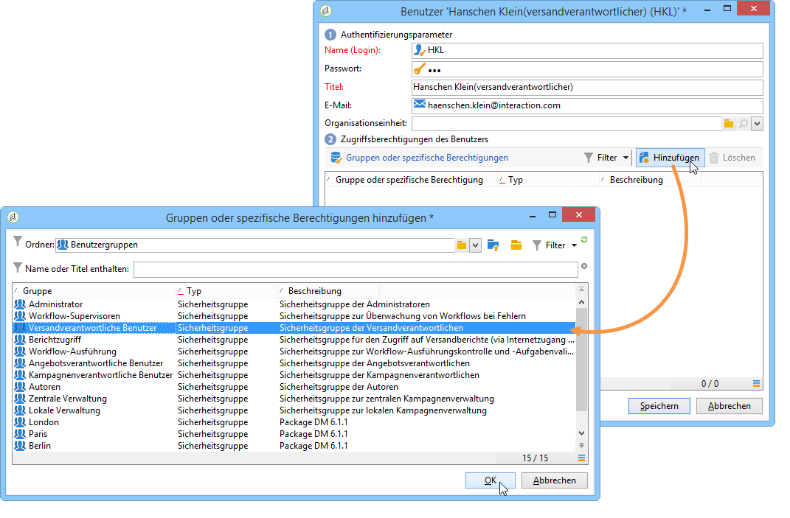

# Benutzerprofile{#operator-profiles}

In Interaction werden zwei verschiedene Profile benötigt: ein angebotsverantwortlicher und ein versandverantwortlicher Benutzer. Die entsprechenden Benutzer haben jeweils nur auf bestimmte Bereiche des Navigationsbaums Zugriff.

* **[!UICONTROL Angebotsverantwortlicher]**: erstellt und verwaltet Angebote;. Beachten Sie, dass, wenn Angebote im Workflow verwendet werden, der Benutzer in der Benutzergruppe **[!UICONTROL Administrator]** oder **[!UICONTROL Angebotsverantwortliche Benutzer]** sein muss, um den Workflow auszuführen.
* **[!UICONTROL Versandverantwortlicher]**: validiert und verwendet Angebote.

Die Erstellung der Interaction-Benutzerprofile folgt der üblichen Vorgehensweise. Lesen Sie diesbezüglich [diesen Abschnitt](../../platform/using/access-management.md#creating-an-operator). Die spezifischen Berechtigungen werden im Verlauf der Benutzererstellung zugewiesen.

## Angebotsverantwortliche Benutzer {#offer-manager}

1. Erstellen Sie den neuen Benutzer.
1. Klicken Sie im Fenster **[!UICONTROL Gruppen oder spezifische Berechtigungen]** auf die Schaltfläche **[!UICONTROL Hinzufügen]** und wählen Sie die Gruppe **[!UICONTROL Angebotsverantwortliche Benutzer]** aus.

   

Die dem Angebotsverantwortlichen zugewiesenen Berechtigungen erlauben ihm folgende Tätigkeiten:

* Änderung von **[!UICONTROL Design-Umgebungen]**;
* Ansicht von **[!UICONTROL Live-Umgebungen]**;
* Konfiguration von administrativen Funktionen (Platzierungen und vordefinierte Filter);
* Erstellung und Änderung von Angebotskategorien;
* Erstellung und Änderung von Angeboten;
* Konfiguration von Angebotseignungen;
* Validierung von Angeboten.

   >[!NOTE]
   >
   >Der Angebotsverantwortliche kann nur die Angebote validieren, für die kein anderer Validierer konfiguriert oder in deren Angebotsvorlage er als Validierer bezeichnet wurde. Letzteres erfolgt durch den für die Vorlagenerstellung zuständigen Administrator, der in diesem Fall über die spezifische Berechtigung zur &quot;Validierungsadministration&quot; verfügen muss.

## Versandverantwortliche Benutzer {#delivery-manager}

1. Erstellen Sie den neuen Benutzer.
1. Klicken Sie im Fenster **[!UICONTROL Gruppen oder spezifische Berechtigungen]** auf die Schaltfläche **[!UICONTROL Hinzufügen]** und wählen Sie die Gruppe **[!UICONTROL Versandverantwortliche Benutzer]** aus.

   

Die dem Versandverantwortlichen zugewiesenen Berechtigungen erlauben ihm folgende Tätigkeiten:

* Ansicht der **[!UICONTROL Design-Umgebungen]**;
* Anzeige und Änderung von Angebotskategorien;
* Validierung von Angeboten, wenn er als Validierer bezeichnet wurde.

   >[!NOTE]
   >
   >Der Versandverantwortliche kann nur Angebote validieren, für die er bei deren Konfiguration als Validierer bezeichnet wurde.

## Zusammenfassende Darstellung der Rechte nach Benutzertyp {#recap-of-rights-according-to-operator}

<table> 
 <tbody> 
  <tr> 
   <td> </td> 
   <td> <strong>Angebotsverantwortlicher (Design-Umgebung)</strong>  </td> 
   <td> <strong>Angebotsverantwortlicher (Live-Umgebung)</strong>  </td> 
  </tr> 
  <tr> 
   <td> <strong>Knoten im Navigationsbaum</strong>  </td> 
   <td> </td> 
   <td> </td> 
  </tr> 
  <tr> 
   <td> Angebote - Design/Live  </td> 
   <td> Lesen/Schreiben  </td> 
   <td> Lesen  </td> 
  </tr> 
  <tr> 
   <td> Umgebung - Empfänger  </td> 
   <td> Lesen/Schreiben  </td> 
   <td> Lesen  </td> 
  </tr> 
  <tr> 
   <td> Administration  </td> 
   <td> Lesen/Schreiben  </td> 
   <td> Lesen  </td> 
  </tr> 
  <tr> 
   <td> Platzierungen  </td> 
   <td> Lesen/Schreiben  </td> 
   <td> Lesen  </td> 
  </tr> 
  <tr> 
   <td> Vordefinierte Angebotsfilter  </td> 
   <td> Lesen/Schreiben  </td> 
   <td> Lesen  </td> 
  </tr> 
  <tr> 
   <td> Typologien  </td> 
   <td> Lesen/Schreiben  </td> 
   <td> Lesen  </td> 
  </tr> 
  <tr> 
   <td> Typologieregeln  </td> 
   <td> Lesen/Schreiben  </td> 
   <td> Lesen  </td> 
  </tr> 
  <tr> 
   <td> Angebotskatalog  </td> 
   <td> Lesen/Schreiben  </td> 
   <td> Lesen  </td> 
  </tr> 
  <tr> 
   <td> Angebotskategorien  </td> 
   <td> Lesen/Schreiben  </td> 
   <td> Lesen  </td> 
  </tr> 
 </tbody> 
</table>

<table> 
 <tbody> 
  <tr> 
   <td> </td> 
   <td> <strong>Versandverantwortlicher (Design-Umgebung)</strong>  </td> 
   <td> <strong>Versandverantwortlicher (Live-Umgebung)</strong>  </td> 
  </tr> 
  <tr> 
   <td> <strong>Knoten im Navigationsbaum</strong>  </td> 
   <td> </td> 
   <td> </td> 
  </tr> 
  <tr> 
   <td> Angebote - Design/Live  </td> 
   <td> </td> 
   <td> Lesen  </td> 
  </tr> 
  <tr> 
   <td> Umgebung - Empfänger  </td> 
   <td> </td> 
   <td> Lesen  </td> 
  </tr> 
  <tr> 
   <td> Administration  </td> 
   <td> </td> 
   <td> </td> 
  </tr> 
  <tr> 
   <td> Platzierungen  </td> 
   <td> </td> 
   <td> </td> 
  </tr> 
  <tr> 
   <td> Vordefinierte Angebotsfilter  </td> 
   <td> Lesen  </td> 
   <td> Lesen  </td> 
  </tr> 
  <tr> 
   <td> Typologien  </td> 
   <td> Lesen  </td> 
   <td> Lesen  </td> 
  </tr> 
  <tr> 
   <td> Typologieregeln  </td> 
   <td> </td> 
   <td> Lesen  </td> 
  </tr> 
  <tr> 
   <td> Angebotskatalog  </td> 
   <td> Lesen  </td> 
   <td> Lesen  </td> 
  </tr> 
  <tr> 
   <td> Angebotskategorien  </td> 
   <td> </td> 
   <td> Lesen  </td> 
  </tr> 
 </tbody> 
</table>

