# Unterbreitungsregeln{#presentation-rules}

## Unterbreitungsregeln erstellen {#creating-a-presentation-rule}

Angenommen, in Ihrer Datenbank sind verschiedene Angebote für Reisen nach Europa, Afrika, die USA und Kanada enthalten. Sie möchten Kanadareisen vorschlagen. Wenn jedoch ein Empfänger Angebote dieser Kategorie ablehnt, sollen sie kein zweites Mal unterbreitet werden.

Die zu erstellende Regel muss somit sicherstellen, dass Reisen nach Kanada jedem Empfänger nur einmal unterbreitet werden, sollte er sie bei der ersten Unterbreitung ablehnen.

1. Markieren Sie im Adobe-Campaign-Navigationsbaum den Knoten **[!UICONTROL Administration]** > **[!UICONTROL Kampagnen]** > **[!UICONTROL Typologieverwaltung]** > **[!UICONTROL Typologieregeln]**.
1. Erstellen Sie eine neue Regel vom Typ **[!UICONTROL Angebotsunterbreitung]**.

   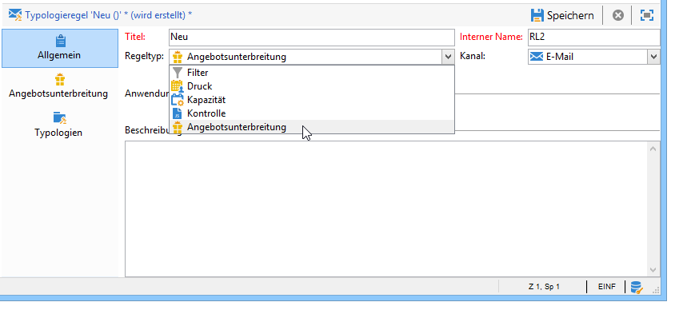

1. Benennen Sie die Regel und geben Sie gegebenenfalls eine Beschreibung ein.

   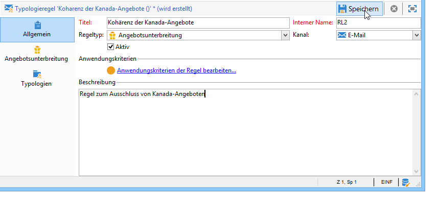

1. Wählen Sie die Option **[!UICONTROL Alle Kanäle]** aus, damit die Regel universell gültig ist.

   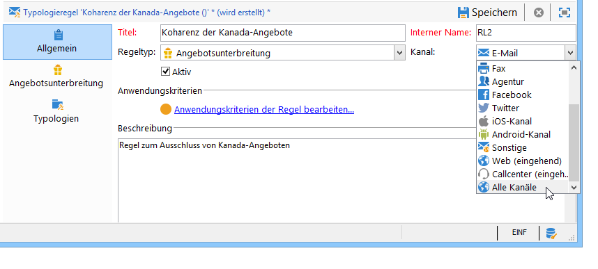

1. Klicken Sie auf den Link **[!UICONTROL Anwendungskriterien der Regel bearbeiten...]** und wählen Sie den Knoten **[!UICONTROL Kategorie]** als Ausdruck.

   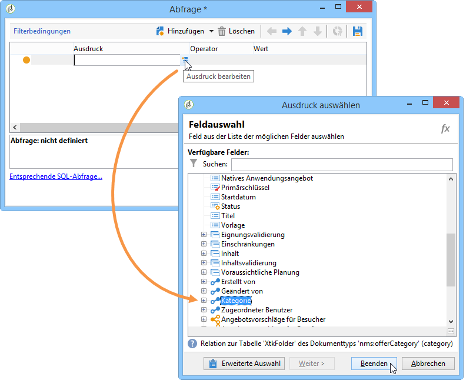

1. Wählen Sie als Wert aus dem Angebotskatalog die Kategorie Kanada aus und klicken Sie auf **[!UICONTROL OK]**, um das Abfragefenster zu schließen.

   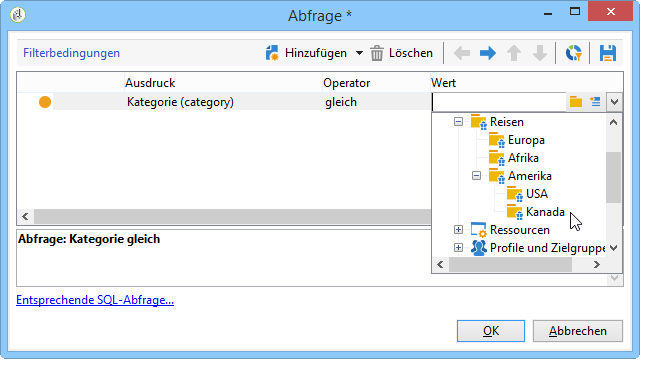

1. Wählen Sie dann im Tab **[!UICONTROL Angebotsunterbreitung]** die Dimensionen aus, die Sie auch auf Umgebungsebene konfiguriert haben.

   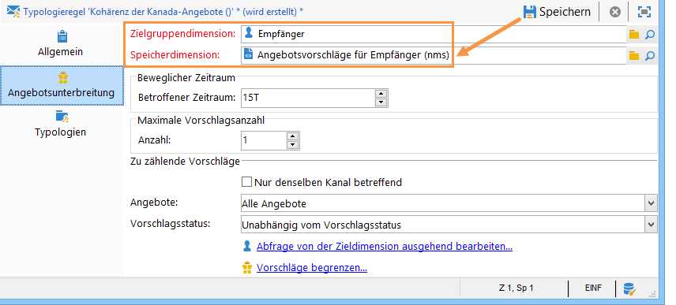

1. Geben Sie den Zeitraum an, in dem die Regel angewendet werden soll.

   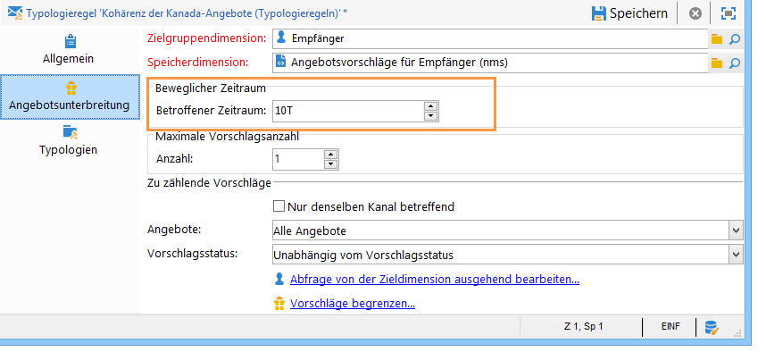

1. Begrenzen Sie die maximale Vorschlagsanzahl auf einen Vorschlag, damit die Empfänger, die bereits eine Kanadareise abgelehnt haben, nicht erneut ein ähnliches Angebot erhalten.

   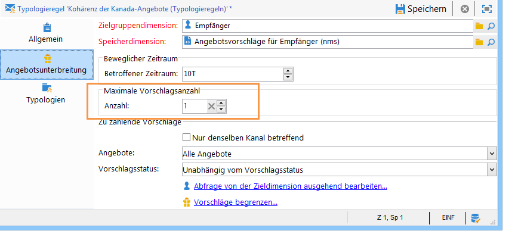

1. Wählen Sie aus der Dropdown-Liste den Filter **[!UICONTROL Angebote derselben Kategorie]** aus, um alle Angebote der Kategorie **Kanada** von der Unterbreitung auszuschließen.

   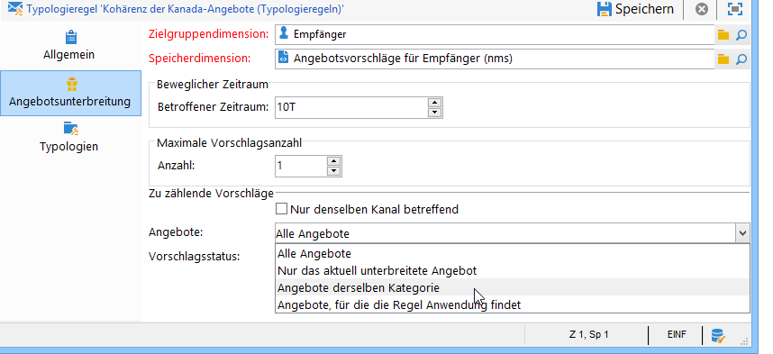

1. Wählen Sie den Vorschlagsstatus **[!UICONTROL Abgelehnte Vorschläge]**, damit nur die Vorschläge berücksichtigt werden, die der Empfänger nicht angenommen hat.

   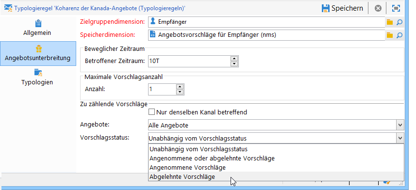

1. Wählen Sie nun die von der Regel betroffenen Empfänger aus.

   Im vorliegenden Beispiel handelt es sich um **Vielreisende**.

   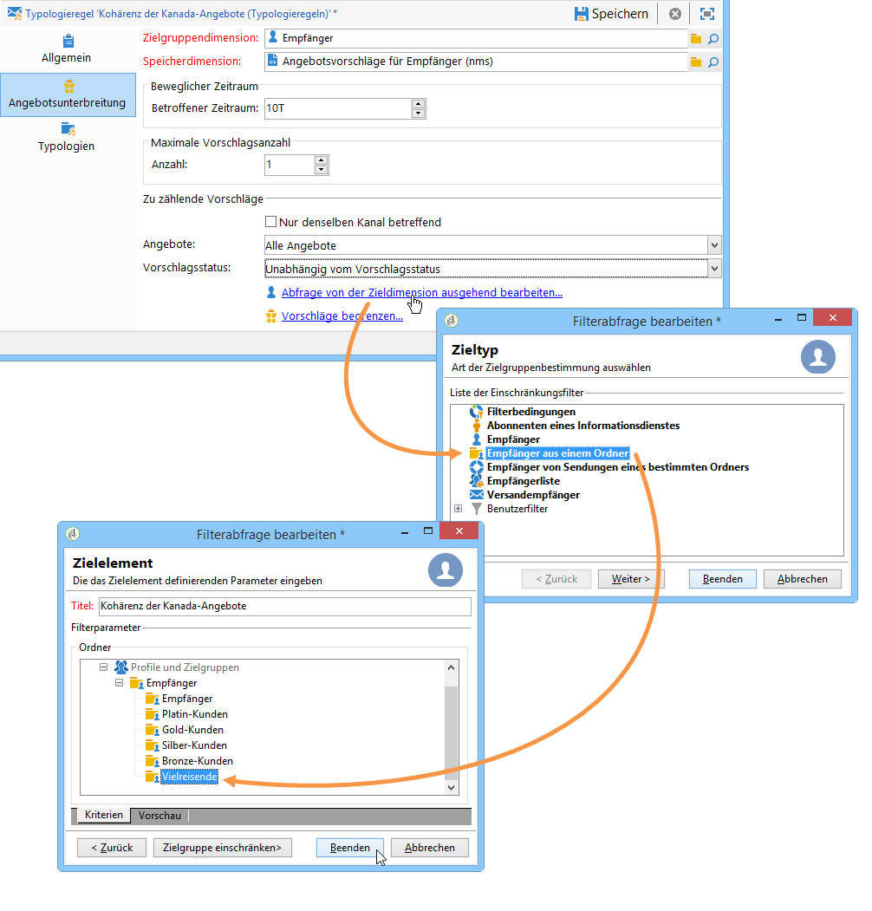

1. Referenzieren Sie die Regel in einer Angeboten vorbehaltenen Typologie.

   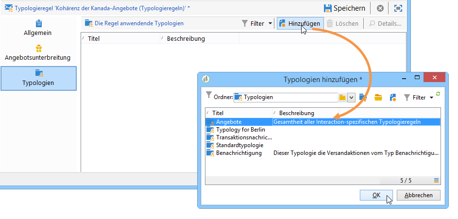

1. Gehen Sie zum Abschluss in Ihre Angebotsumgebung, hier **Umgebung - Empfänger**, und referenzieren Sie im Tab **[!UICONTROL Eignung]** die Typologie, die auf die zuvor erstellte Regel verweist.

   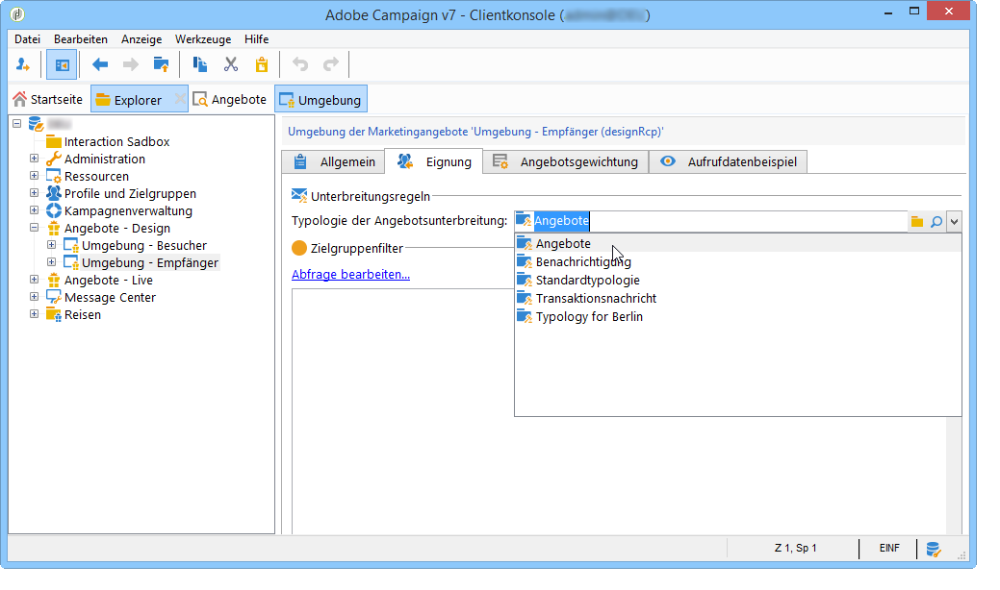

## Unterbreitungsregeln anwenden {#applying-the-presentation-rule}

Nachfolgend wird aufgezeigt, wie die zuvor erstellte Typologieregel arbeitet.

Unterbreiten Sie ein Angebot aus der Kategorie &quot;Kanada&quot;. Wenn das Angebot von einem Empfänger bei der ersten Unterbreitung abgelehnt wird, wird es diesem Empfänger kein zweites Mal vorgeschlagen.

1. Wählen Sie ein Profil aus dem Empfängerordner **Vielreisende** aus und prüfen Sie, für welche Angebote dieser Empfänger infrage kommt. Klicken Sie hierfür auf den Tab **[!UICONTROL Vorschläge]** und dann auf **[!UICONTROL Vorschau]**:

   Im vorliegenden Beispiel kommt **Peter Urlaubsreif** für ein Angebot aus der Kategorie **Kanada** infrage.

   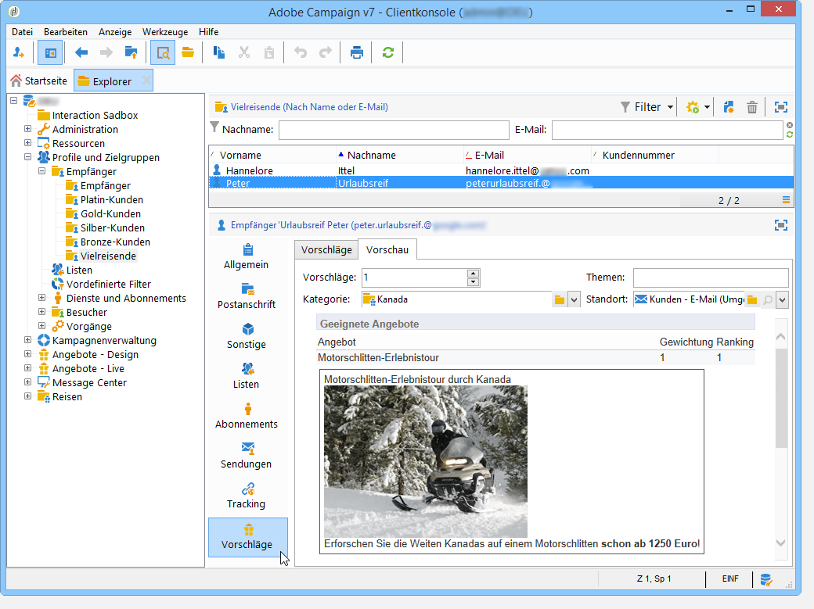

1. Erstellen Sie einen ersten E-Mail-Versand mit Angeboten an die Zielgruppe **Vielreisende**.
1. Wählen Sie die Parameter der Angebotsmodul-Abfrage aus.

   Im vorliegenden Beispiel wird die Kategorie **Amerika** gewählt. Sie enthält die Unterkategorien **USA** und **Kanada**.

   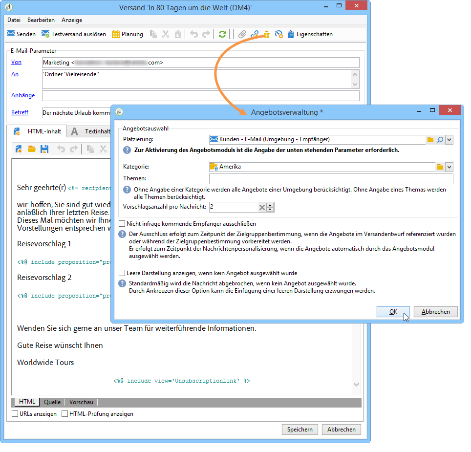

1. Fügen Sie Ihre Angebote in den Text der Nachricht ein und versenden Sie die Nachricht. Weitere Informationen hierzu finden Sie im Abschnitt [Über ausgehende Kanäle](../../interaction/using/about-outbound-channels.md).

   Der zuvor ausgewählte Empfänger hat das für ihn infrage kommende Angebot wie geplant erhalten.

1. Aus dem Vorschlagsverlauf ist ersichtlich, dass der Empfänger das Angebot abgelehnt hat.

   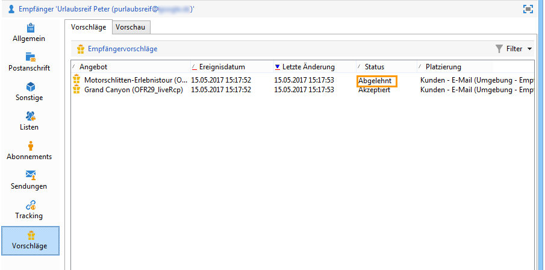

1. Prüfen Sie, für welche Angebote er nun infrage kommt.

   Es zeigt sich, dass kein Angebot zu Kanada ausgewählt wurde.

   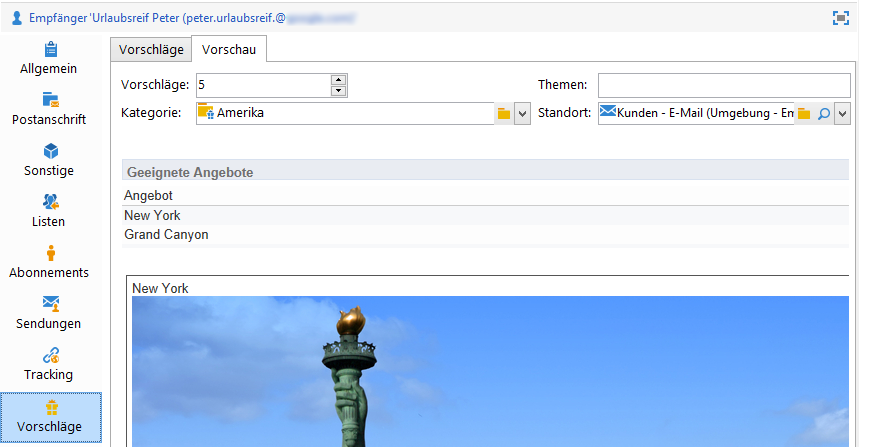

**Verwandtes Thema**

* [Verwaltung von Angeboten und kanalübergreifende Kontrolle der Redundanz](https://helpx.adobe.com/de/campaign/kb/simplifying-campaign-management-acc.html#Manageoffersandcontrolredundancyacrosschannels)