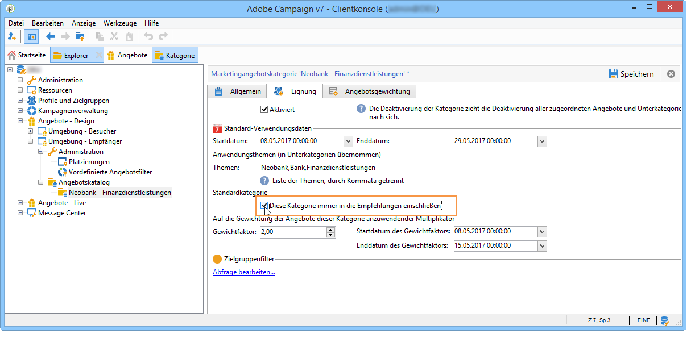

# Eignungsunabhängige Kategorien{#recommending-a-category}

Es kann vorkommen, dass für einen Empfänger aufgrund der definierten Filter und Regeln keins der vorhandenen Angebote infrage kommt. Um sicherzustellen, dass jedem Empfänger trotzdem ein Angebot unterbreitet wird, besteht die Möglichkeit, eine oder mehrere Kategorien systematisch in die Vorschläge einzubeziehen. Im Gegensatz zu den anderen Angeboten dürfen diese &quot;eignungsunabhängigen&quot; Angebote nur eine geringe Gewichtung (jedoch nicht null) aufweisen, damit sie nur dann unterbreitet werden, wenn kein höher gewichtetes Angebot infrage kommt. Außerdem darf für diese Angebote keine Unterbreitungsregel definiert werden, da dies ihre Auswahl verhindern könnte. Wenn für einen Empfänger also kein Angebot mit hoher Gewichtung infrage kommt, wird mindestens ein Angebot aus dieser Kategorie unterbreitet.

Gehen Sie wie folgt vor, um eine Kategorie immer in die Empfehlungen einzuschließen:

1. Klicken Sie im Navigationsbaum auf einen Angebotskatalog.
1. Klicken Sie im Tab **[!UICONTROL Eignung]** auf **[!UICONTROL Diese Kategorie immer in die Empfehlungen einschließen]**.
1. Klicken Sie zum Abschluss auf **[!UICONTROL Speichern]**.

   

