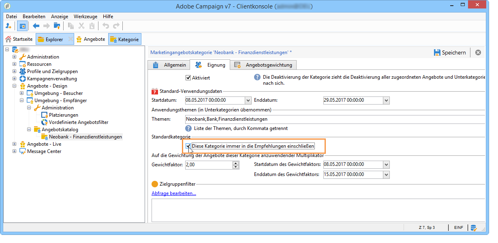

# Eignungsunabhängige Kategorien{#recommending-a-category}

Es kann sein, dass eine Empfängerin bzw. ein Empfänger nicht für alle Angebote geeignet ist. Um sicherzustellen, dass alle Empfänger einen Angebotsvorschlag erhalten, können in den Empfehlungen systematisch eine oder mehrere Angebotskategorien hinzugefügt werden. Im Gegensatz zu den Hauptangeboten müssen diese „Backup“-Angebote eine geringe Gewichtung (aber nicht null) haben, sodass sie nur berücksichtigt werden, wenn keine Angebote mit hoher Gewichtung infrage kommen. Darüber hinaus darf auf diese Angebote keine Unterbreitungsregel angewendet werden, um sicherzustellen, dass sie immer in die Empfehlungen aufgenommen werden. Wenn also für einen Vorschlag kein Angebot mit hoher Gewichtung verfügbar ist, erhält die Empfängerin bzw. der Empfänger mindestens ein Angebot aus dieser Kategorie.

Gehen Sie wie folgt vor, um eine Kategorie immer in die Empfehlungen einzuschließen:

1. Öffnen Sie den Explorer und klicken Sie in der Baumstruktur auf einen Angebotskatalog.
1. Klicken Sie im Tab **[!UICONTROL Eignung]** auf **[!UICONTROL Diese Kategorie immer in die Empfehlungen einschließen]**.
1. Klicken Sie zum Abschluss auf **[!UICONTROL Speichern]**.

   
