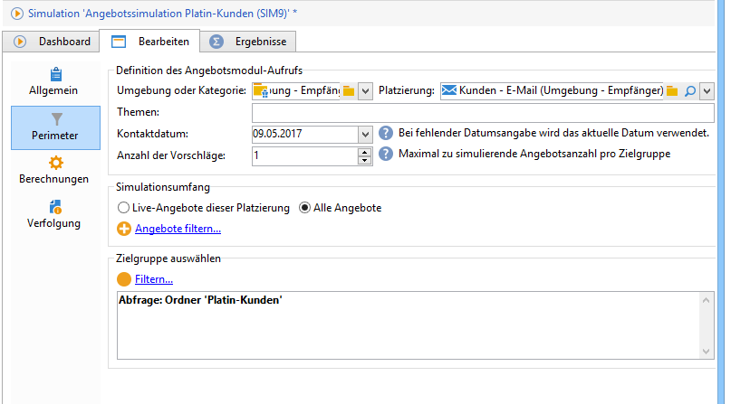
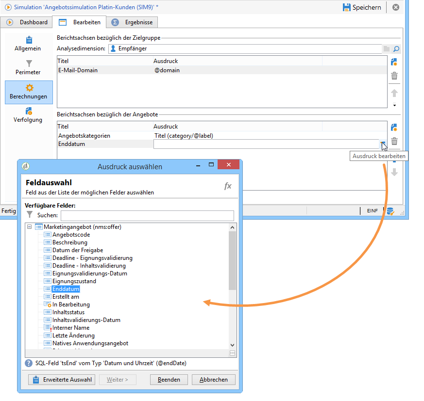

# Simulationsperimeter{#simulation-scope}

## Perimeter konfigurieren {#definition-of-the-scope}

Die Perimeterkonfiguration erfolgt im Tab **[!UICONTROL Perimeter]**.

Folgende Felder müssen zwingend ausgefüllt werden:

* Angebotsumgebung oder -kategorie
* Platzierung
* Kontaktdatum - berücksichtigt werden nur Angebote, die zum Kontaktdatum infrage kommen
* Zielgruppe

   Wenn kein Zielgruppenfilter angegeben wird, wird die gesamte Empfängertabelle in der Simulation berücksichtigt.

* Anzahl an zu simulierenden Vorschlägen pro Kontakt.

   Der Empfänger erhält genau so viele Vorschläge, wie angegeben. Bei Angabe von 5 beispielsweise erhält jede Zielperson maximal 5 Angebotsvorschläge.

   

Zur weiteren Feinabstimmung der in der Simulation zu berücksichtigenden Angebote können Themen angegeben werden. Diese müssen zuvor auf Ebene der Kategorie definiert werden.

Sie haben des Weiteren die Möglichkeit, die Simulation für alle Angebote durchzuführen oder sie auf die publizierten Angebote zu beschränken. Mithilfe diverser Filter lässt sich die Auswahl weiter eingrenzen.

>[!NOTE]
>
>Die Angabe des Kontaktdatums ist zwingend erforderlich. Dies erlaubt dem Angebotsmodul eine erste Filterung aus der Gesamtheit der in der Umgebung oder Kategorie enthaltenen Angebote. Ohne Kontaktdatum endet die Simulation mit einem Fehler.

## Berichtsachsen hinzufügen {#adding-reporting-axes}

Im Tab **[!UICONTROL Berechnungen]** können Sie auf die Zielgruppe oder direkt auf die Angebote bezogene Berichtsachsen hinzufügen, um die Analyse der Simulation zu bereichern.

Klicken Sie hierfür auf die Schaltfläche **[!UICONTROL Hinzufügen]** und wählen Sie in der Spalte die Felder aus, die die gewünschten Werte enthalten. Die neuen Achsen werden zur Berechnung der Simulation herangezogen und erscheinen im Analysebericht. Weitere Informationen hierzu finden Sie im Abschnitt [Verfolgung](../../interaction/using/simulation-tracking.md).

