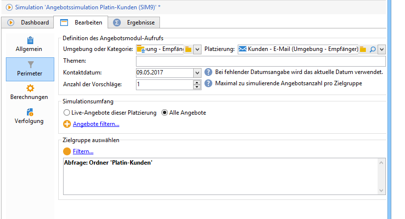
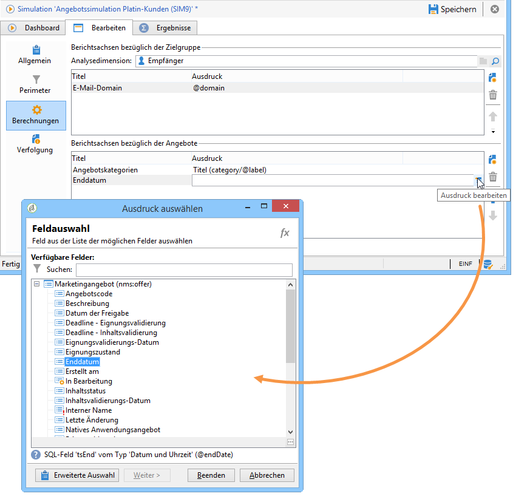

# Simulationsumfang{#simulation-scope}

## Perimeter konfigurieren {#definition-of-the-scope}

Die Perimeterkonfiguration erfolgt im Tab **[!UICONTROL Perimeter]**.

Folgende Felder müssen zwingend ausgefüllt werden:

* Angebotsumgebung oder -kategorie
* Platzierung
* Kontaktdatum. Angebote, die am Kontaktdatum nicht infrage kommen, werden nicht berücksichtigt.
* Zielpopulation.

  Wenn kein Zielgruppenfilter angegeben wird, wird die gesamte Empfängertabelle in der Simulation berücksichtigt.

* Anzahl an zu simulierenden Vorschlägen pro Kontakt.

  Der Empfänger erhält so viele Vorschläge. Wenn Sie beispielsweise 5 eingeben, erhält jeder Empfänger maximal 5 Angebotsvorschläge.

  

Zur weiteren Feinabstimmung der in der Simulation zu berücksichtigenden Angebote können Themen angegeben werden. Diese müssen zuvor auf Ebene der Kategorie definiert werden.

Sie können die Simulation auch für alle Angebote oder nur für die Online-Angebote durchführen. Einige Filter ermöglichen es Ihnen, Ihre Auswahl bei Bedarf zu ändern.

>[!NOTE]
>
>Sie müssen ein Kontaktdatum angeben. Auf diese Weise kann das Interaction-Modul die Angebote in der ausgewählten Umgebung oder Kategorie sortieren. Wenn kein Datum konfiguriert ist, gibt die Simulation einen Fehler aus.

## Berichtsachsen hinzufügen {#adding-reporting-axes}

Im Tab **[!UICONTROL Berechnungen]** können Sie auf die Zielgruppe oder direkt auf die Angebote bezogene Berichtsachsen hinzufügen, um die Analyse der Simulation zu bereichern.

Klicken Sie dazu auf die Schaltfläche **[!UICONTROL Hinzufügen]** und wählen Sie die entsprechenden Felder aus. Achsen werden für die Berechnung der Simulation verwendet und werden im Analysebericht angezeigt. Weitere Informationen hierzu finden Sie im Abschnitt [Simulationsverfolgung](../../interaction/using/simulation-tracking.md).

