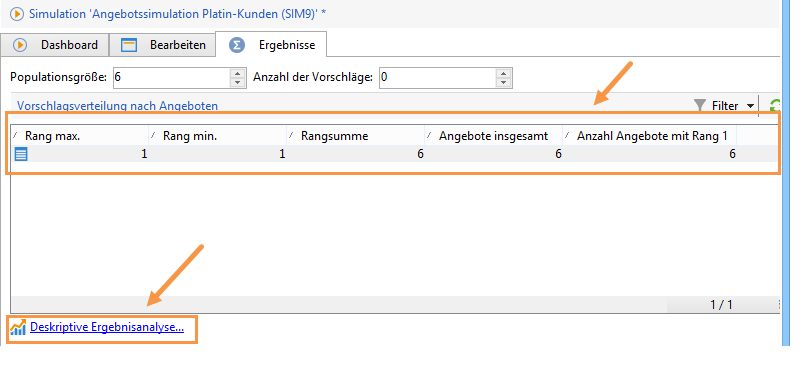
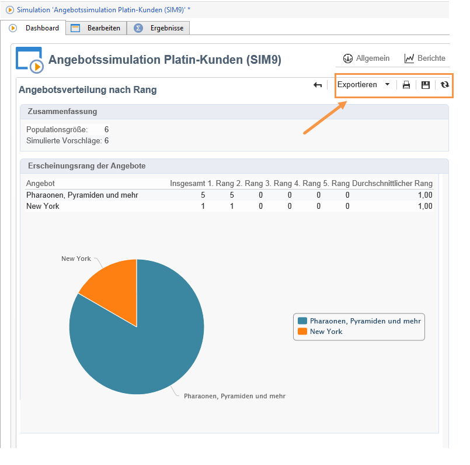

# Verfolgung{#simulation-tracking}

Nach Abschluss der Simulation wird automatisch ein **[!UICONTROL Ergebnis]**-Tab hinzugefügt, der Ihnen eine genaue Analyse ermöglicht. Im Berichte-Tab des Dashboard wird der Bericht **[!UICONTROL Angebotsverteilung nach Rang]** angezeigt.

Das Simulationsergebnis zeigt die Verteilung der Vorschläge nach Rang und Zielgruppe. Falls angegeben, werden auch die zusätzlichen Berichtsachsen in diesem Tab angezeigt.

Sie haben die Möglichkeit, die Ergebnisse zu speichern und sie in Form eines deskriptiven Analyseberichts zu exportieren. Klicken Sie hierfür auf den entsprechenden Link im Ergebnisfenster.

Weiterführende Informationen zur beschreibenden Analyse können Sie [diesem Abschnitt](../../reporting/using/about-descriptive-analysis.md) entnehmen.

Des Weiteren bietet eine Pivot-Tabelle eine schnelle Übersicht über die Angebotsverteilung je Rang. Wie alle Berichte in Adobe Campaign kann auch dieser exportiert, gedruckt, archiviert oder im Webbrowser angezeigt werden.

Weiterführende Informationen hierzu finden Sie in [diesem Abschnitt](../../reporting/using/actions-on-reports.md).

