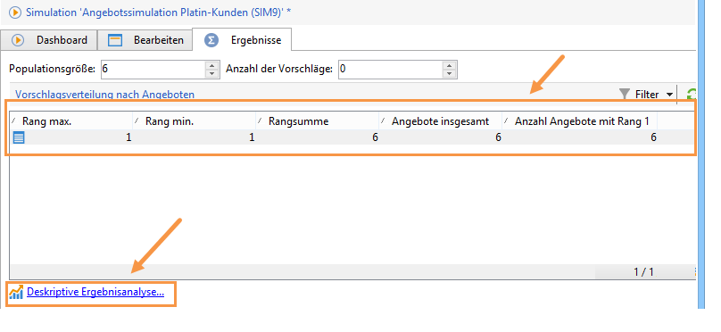
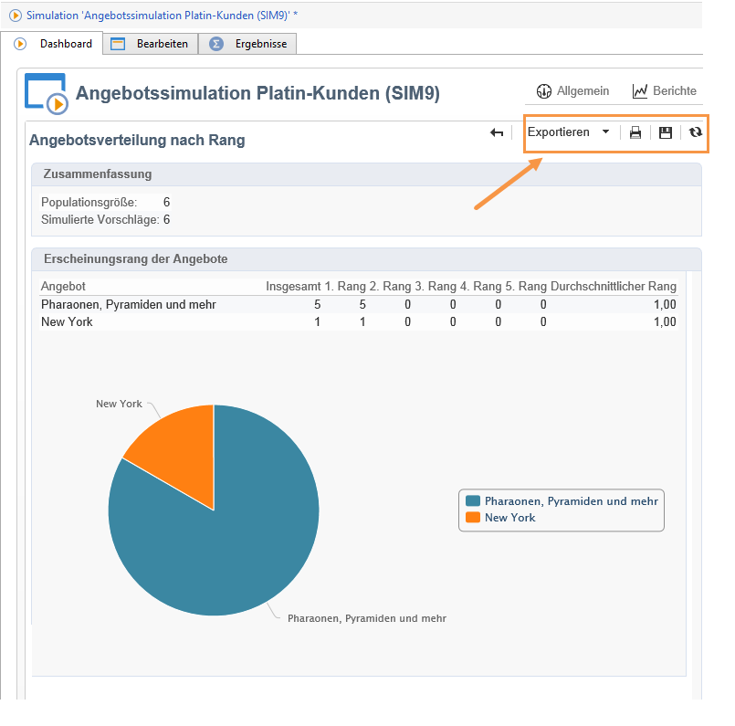

# Simulationsverfolgung{#simulation-tracking}

Nach Abschluss der Simulation wird automatisch ein **[!UICONTROL Ergebnis]**-Tab hinzugefügt, der Ihnen eine genaue Analyse ermöglicht. Im Berichte-Tab des Dashboard wird der Bericht **[!UICONTROL Angebotsaufschlüsselung nach Rang]** angezeigt.

Das Simulationsergebnis zeigt die Aufschlüsselung der Vorschläge nach Rang und Zielgruppe. Berichtsachsen werden ebenfalls berücksichtigt und in dieser Registerkarte angezeigt.

Sie haben die Möglichkeit, die Ergebnisse zu speichern und sie in Form einer deskriptiven Analyse zu exportieren. Klicken Sie hierzu auf den entsprechenden Link im Ergebnisfenster.

Weitere Informationen zur deskriptiven Analyse finden Sie in [diesem Abschnitt](../../reporting/using/about-descriptive-analysis.md).

Eine Pivot-Tabelle bietet eine schnelle Ansicht der Angebotsaufschlüsselungen pro Ranking. Wie alle Berichte in Adobe Campaign kann auch dieser exportiert, gedruckt, archiviert oder in einem Webbrowser angezeigt werden.

Weiterführende Informationen hierzu finden Sie in [diesem Abschnitt](../../reporting/using/actions-on-reports.md).

