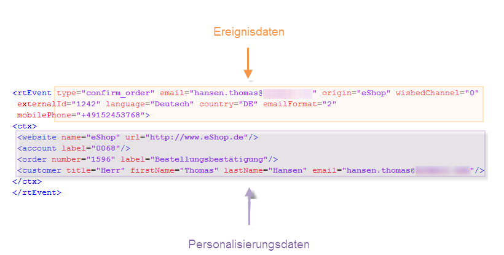

# Über die Ereignisverarbeitung{#about-event-processing}

Im Zusammenhang mit dem Transaktionsnachrichtenversand wird von einem externen Informationssystem ein Ereignis generiert und über die Methoden **[!UICONTROL PushEvent]** und **[!UICONTROL PushEvents]** an Adobe Campaign gesendet (siehe [Ereignisbeschreibung](../../message-center/using/event-description.md)). Es enthält Daten, die mit dem Ereignis verknüpft sind, wie z. B. den Typ (z. B. Bestellbestätigung oder Kontoerstellung auf einer Website), die E-Mail-Adresse oder die Mobiltelefonnummer sowie weitere Informationen, mit denen Sie die Transaktionsnachricht vor dem Versand anreichern und personalisieren können. Das können Kundenkontaktdaten, die Sprache der Nachricht oder das E-Mail-Format sein.

Beispiel für Ereignisdaten:

Die Verarbeitung von Transaktionsnachrichten-Ereignissen findet in folgenden Etappen statt:

1. Ereignisabruf,
1. Weiterleitung des Ereignisses zu einer Nachrichtenvorlage,
1. Anreicherung des Ereignisses mit Personalisierungsdaten,
1. Versand der Transaktionsnachrichten,
1. Recycling der Ereignisse, deren zugeordneter Versand fehlgeschlagen ist (mithilfe eines Adobe-Campaign-Workflows möglich).

## Ereignisstatus {#event-statuses}

Im **Ereignisverlauf** unter **[!UICONTROL Message Center]** > **[!UICONTROL Ereignisverlauf]** werden alle verarbeiteten Ereignisse in einer gemeinsamen Übersicht zusammengefasst. Sie können entweder nach Ereignistyp oder nach **Status** kategorisiert werden. Folgende Status existieren:

* **Ausstehend**:

   * Ereignis, das kurz zuvor eingetreten ist, das jedoch noch nicht verarbeitet wurde. Die Spalte **[!UICONTROL Fehleranzahl]** zeigt den Wert 0. Es wurde noch keine E-Mail-Vorlage zugeordnet.
   * Ereignis, das verarbeitet wurde, bei dessen Bestätigung jedoch Fehler aufgetreten sind. Die Spalte **[!UICONTROL Fehleranzahl]** zeigt einen Wert ungleich 0 an. In der Spalte **[!UICONTROL Verarbeitung geplant für]** kann das Datum des nächsten Verarbeitungsversuchs abgelesen werden.

* **Versand ausstehend**: Ereignis, das verarbeitet und dem eine Versandvorlage zugeordnet wurde. Die E-Mail ist versandbereit und der Standard-Versandprozess wird angewendet. Details können direkt im Versand eingesehen werden. Weiterführende Informationen hierzu finden Sie im [Delivery](../../delivery/using/about-message-tracking.md)-Handbuch.
* **Gesendet**, **Ignoriert** und **Versandfehler**: Versandstatus, die vom **updateEventsStatus**-Workflow abgerufen werden. Details können direkt im entsprechenden Versand eingesehen werden.
* **Ereignis wurde nicht berücksichtigt**: Die Message-Center-Routing-Phase ist fehlgeschlagen. Beispielsweise konnte Adobe Campaign die dem Ereignis entsprechende E-Mail-Vorlage nicht finden.
* **Ereignis ist abgelaufen**: Die maximale Anzahl an Versandversuchen wurde erreicht. Das Ereignis wird als nichtig angesehen.
