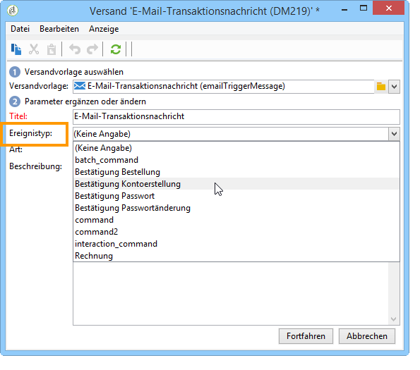

# Ereignisverarbeitung {#about-event-processing}

Im Zusammenhang mit dem Transaktionsnachrichtenversand wird von einem externen Informationssystem ein Ereignis generiert und über die Methoden **[!UICONTROL PushEvent]** und **[!UICONTROL PushEvents]** an Adobe Campaign gesendet (siehe [Ereignisbeschreibung](../../message-center/using/event-description.md)).

Dieses Ereignis enthält Daten, die mit dem Ereignis verknüpft sind, darunter etwa dessen [Typ](../../message-center/using/creating-event-types.md) (Bestellbestätigung, Kontoerstellung auf einer Website usw.), dessen E-Mail-Adresse oder Mobiltelefonnummer sowie weitere Informationen, mit denen Sie die Transaktionsnachricht vor dem Versand anreichern und personalisieren können (Kundenkontaktdaten, Sprache der Nachricht, E-Mail-Format usw.).

Beispiel für Ereignisdaten:

## Schritte zur Ereignisverarbeitung {#event-processing}

Um Transaktionsnachrichten-Ereignisse zu verarbeiten, werden die folgenden Schritte auf der/den Ausführungsinstanz(en) ausgeführt:

1. [Ereignisabruf](#event-collection)
1. [Weiterleitung des Ereignisses zu einer Nachrichtenvorlage](#routing-towards-a-template)
1. Anreicherung des Ereignisses mit Personalisierungsdaten
1. [Versandausführung](../../message-center/using/delivery-execution.md)
1. [Recycling von Ereignissen](#event-recycling), bei denen der mit ihnen verknüpfte Versand fehlgeschlagen ist (über einen Adobe Campaign-Workflow)

Sobald alle oben genannten Schritte auf der Ausführungsinstanz ausgeführt wurden, erhält jeder Zielkontakt eine personalisierte Nachricht.

>[!NOTE]
>
>Näheres zu Instanzen für Transaktionsnachrichten finden Sie unter [Transaktionsnachrichten-Architektur](../../message-center/using/transactional-messaging-architecture.md).

## Ereignisabruf {#event-collection}

Die vom Informationssystem erzeugten Ereignisse können auf zwei Weisen abgerufen werden:

* Nutzung von SOAP-Methoden, die die Ereignisse Adobe Campaign zuführen: Die PushEvent-Methode ermöglicht den Versand eines Ereignisses, die PushEvents-Methode den Versand mehrerer Ereignisse auf einmal. Weiterführende Informationen hierzu finden Sie unter [Ereignisbeschreibung](../../message-center/using/event-description.md).

* Ausführung eines Workflows, der den Abruf der Ereignisse über einen Dateiimport oder ein SQL-Gateway ermöglicht (mit der Option [Federated Data Access](../../installation/using/about-fda.md)).

Nach dem Abruf werden die Ereignisse von den technischen Workflows auf die Echtzeit- und Batch-Warteschlangen der Ausführungsinstanzen verteilt, bis sie mit einer Nachrichtenvorlage verknüpft werden.

>[!NOTE]
>
>Auf den Ausführungsinstanzen dürfen die Ordner **[!UICONTROL Echtzeit-Ereignisse]** oder **[!UICONTROL Batch-Ereignisse]** nicht als Ansichten festgelegt werden, da dies zu Problemen mit Zugriffsrechten führen könnte. Weitere Informationen zum Festlegen eines Ordners als Ansicht finden Sie in [diesem Abschnitt](../../platform/using/access-management-folders.md).

## Weiterleitung zu Vorlagen {#routing-towards-a-template}

Nach der Veröffentlichung der Nachrichtenvorlage auf den Ausführungsinstanzen werden automatisch zwei Vorlagen erstellt: eine, die mit einem Echtzeit-Ereignis verknüpft wird, und eine, die mit einem Batch-Ereignis verknüpft wird.

Beim Routing-Schritt wird ein Ereignis mit der entsprechenden Nachrichtenvorlage verknüpft. Dies erfolgt basierend auf:

* dem in den Eigenschaften des Ereignisses angegebenen Ereignistyp:

  

* dem in den Eigenschaften der Nachrichtenvorlage angegebenen Ereignistyp:

  

Standardmäßig erfolgt das Routing auf Basis folgender Informationen:

* dem Ereignistyp
* dem verwendeten Kanal (standardmäßig: E-Mail)
* der auf dem Veröffentlichungsdatum basierenden letzten Versandvorlage

## Ereignisstatus {#event-statuses}

Im **Ereignisverlauf** unter **[!UICONTROL Message Center]** > **[!UICONTROL Ereignisverlauf]** werden alle verarbeiteten Ereignisse in einer gemeinsamen Übersicht zusammengefasst. Sie können entweder nach Ereignistyp oder nach **Status** kategorisiert werden. Folgende Status existieren:

* **Ausstehend**: Bei dem Ereignis kann es sich um Folgendes handeln:

   * Ereignis, das kurz zuvor eingetreten ist, jedoch noch nicht verarbeitet wurde. Die Spalte **[!UICONTROL Fehleranzahl]** zeigt den Wert 0. Es wurde noch keine E-Mail-Vorlage zugeordnet.
   * Ereignis, das verarbeitet wurde, bei dessen Bestätigung jedoch Fehler aufgetreten sind. Die Spalte **[!UICONTROL Fehleranzahl]** zeigt einen Wert ungleich 0 an. In der Spalte **[!UICONTROL Verarbeitung geplant für]** kann das Datum des nächsten Verarbeitungsversuchs abgelesen werden.

* **Versand ausstehend**: Ereignis, das verarbeitet und dem eine Versandvorlage zugeordnet wurde. Die E-Mail ist versandbereit und der Standard-Versandprozess wird angewendet. Details können direkt im Versand eingesehen werden.
* **Gesendet**, **Ignoriert** und **Versandfehler**: Versandstatus, die vom Workflow **updateEventsStatus** abgerufen werden. Details können direkt im entsprechenden Versand eingesehen werden.
* **Ereignis wurde nicht berücksichtigt**: Die Routing-Phase der Transaktionsnachricht ist fehlgeschlagen. Ein Beispiel hierfür wäre, dass Adobe Campaign die E-Mail, die als Vorlage für das Ereignis dient, nicht finden konnte.
* **Ereignis ist abgelaufen**: Die maximale Anzahl an Versandversuchen wurde erreicht. Das Ereignis wird als nichtig angesehen.

## Ereignis-Recycling {#event-recycling}

Wenn der Versand einer Nachricht über einen bestimmten Kanal fehlschlägt, kann Adobe Campaign über einen anderen Kanal einen erneuten Versandversuch starten. Wenn beispielsweise der Versand einer Nachricht über den SMS-Kanal fehlschlägt, wird die Nachricht über den E-Mail-Kanal erneut versandt.

Konfigurieren Sie hierzu einen Workflow, der alle Ereignisse mit **Versandfehler** neu erstellt und ihnen einen sich vom ersten Kanal unterscheidenden Kanal zuordnet.

>[!CAUTION]
>
>Dieser Schritt kann nur mithilfe eines Workflows durchgeführt werden und sollte daher erfahrenen Benutzern vorbehalten bleiben. Wenden Sie sich für weitere Informationen hierzu an Ihren Adobe-Kundenbetreuer.