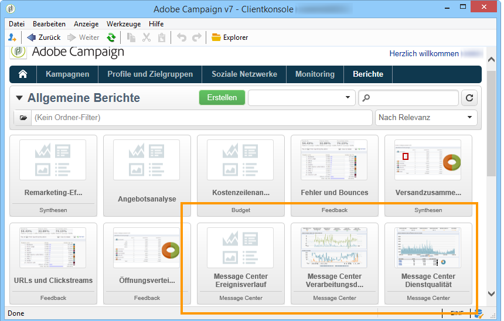

# Über Transaktionsnachrichten-Berichte{#about-transactional-messaging-reports}

Adobe Campaign bietet verschiedene Berichte, die die Überwachung der Aktivitäten und der reibungslosen Funktionsweise der Ausführungsinstanzen erlauben. Die **[!UICONTROL Message-Center-Berichte]** sind über den gleichnamigen Tab der Kontrollinstanz zugänglich.

