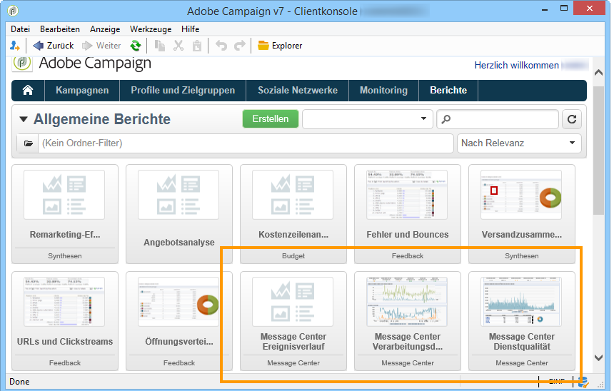

# Zugreifen auf Berichte zu Transaktionsnachrichten {#about-transactional-messaging-reports}

Adobe Campaign bietet verschiedene Berichte, mit deren Hilfe Sie die Aktivitäten der Ausführungsinstanzen steuern sowie ihre reibungslose Ausführung gewährleisten können.

Der Zugriff auf diese Message Center-Berichte erfolgt über den Tab **[!UICONTROL Berichte]** der **Kontrollinstanz**.

