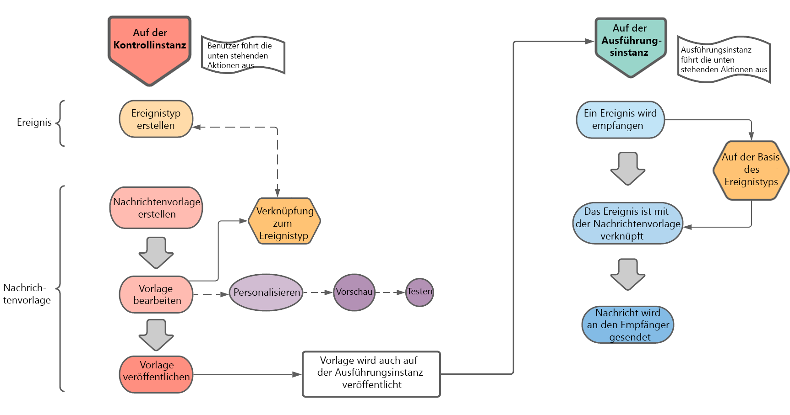

# Erste Schritte mit Transaktionsnachrichten {#about-transactional-messaging}

## Übersicht {#overview}

Der **Transaktionsnachrichtenversand** (Message Center) ist ein Campaign-Modul zur Verwaltung von Benachrichtigungen bei benutzerspezifischen Triggern. Diese werden von Ereignissen generiert, die von einem externen Informationssystem gesendet werden.

Bei einer Transaktionsnachricht handelt es sich um eine individuell zugeschnittene, eindeutige Mitteilung, die beispielsweise über eine Website in Echtzeit übermittelt wird. Sie wird erwartet, weil sie wichtige Informationen enthält, die der Empfänger überprüfen oder bestätigen möchte.

Transaktionsnachrichten zeichnen sich durch Skalierbarkeit aus und sind rund um die Uhr verfügbar.

* **Wann wird diese Nachricht gesendet?** Da diese Nachricht wichtige Informationen enthält, erwartet der Benutzer, dass sie in Echtzeit gesendet wird. Folglich muss die Verzögerung zwischen der Auslösung des Ereignisses und dem Eintreffen der Nachricht sehr kurz sein.

* **Warum ist das wichtig?** Im Allgemeinen hat eine Transaktionsnachricht hohe Öffnungsraten. Sie sollte daher sorgfältig gestaltet werden, da sie einen starken Einfluss auf das Kundenverhalten und die Kundenbeziehung im Allgemeinen haben kann.

* **Beispiel?** Es kann sich um eine Begrüßungsnachricht nach der Erstellung eines Kontos, eine Bestätigung, dass eine Bestellung versandt wurde, eine Rechnung, eine Nachricht zur Bestätigung einer Passwortänderung, eine Benachrichtigung nach dem Besuch einer Website durch einen Kunden, eine Kommunikation bezüglich der Nichtverfügbarkeit eines Produkts, einen Kontoauszug usw. handeln.

>[!IMPORTANT]
>
>Für Transaktionsnachrichten ist eine spezifische Lizenz erforderlich. Prüfen Sie diesbezüglich Ihren Lizenzvertrag.

<!--Before starting with transactional messaging, make sure you read the corresponding [best practices and limitations]().-->

## Funktionsweise von Transaktionsnachrichten {#transactional-messaging-operating-principle}

Das Transaktionsnachrichtenmodul von Adobe Campaign ist in ein Informationssystem integriert, das Ereignisse zurückgibt, die in personalisierte Transaktionsnachrichten umgewandelt werden. Diese Nachrichten können einzeln oder in Batches per E-Mail, SMS oder Push-Benachrichtigungen gesendet werden.

Grundlage dieser Funktion ist eine spezielle Architektur, bei der die **Ausführungsinstanz** von der **Kontrollinstanz** getrennt ist. Durch diese Unterteilung wird eine höhere Verfügbarkeit sowie eine bessere Lastverwaltung gewährleistet. Weiterführende Informationen hierzu finden Sie unter [Transaktionsnachrichten-Architektur](../../message-center/using/transactional-messaging-architecture.md).

>[!NOTE]
>
>Um neue Benutzer für in Adobe Cloud gehostete Message Center-Ausführungsinstanzen zu erstellen, kontaktieren Sie die [Adobe-Kundenunterstützung](https://helpx.adobe.com/de/enterprise/admin-guide.html/enterprise/using/support-for-experience-cloud.ug.html). Benutzer von Message Center benötigen spezifische Berechtigungen für den Zugriff auf die Ordner für **[!UICONTROL Echtzeit-Ereignisse (nmsRtEvent)]**.

Der gesamte Prozess der Transaktionsnachrichten kann wie folgt beschrieben werden:

Angenommen, Sie sind eine Firma mit einer Website, auf der Ihre Kunden Produkte kaufen können.

Mit Adobe Campaign können Sie eine Benachrichtigungs-E-Mail an Kunden senden, die ihrem Warenkorb Produkte hinzugefügt haben. Wenn ein Kunde Ihre Website verlässt, ohne seine Einkäufe zu tätigen (externes Ereignis, das ein Campaign-Ereignis auslöst), wird automatisch eine Warenkorbabbruchs-E-Mail an ihn gesendet (Versand einer Transaktionsnachricht).

Die wichtigsten Schritte für die Einrichtung sind nachfolgend in [diesem Abschnitt](#key-steps) beschrieben.

>[!NOTE]
>
>In Adobe Campaign hat die Verarbeitung von Transaktionsnachrichten Priorität vor allen anderen Sendungen.

## Die wichtigsten Schritte {#key-steps}

Die wichtigsten Schritte beim Erstellen und Verwalten personalisierter Transaktionsnachrichten in Adobe Campaign sind im Folgenden zusammengefasst.

### Auf der Kontrollinstanz durchzuführende Schritte

Führen Sie auf der **Kontrollinstanz** die folgenden Aktionen aus:

1. [Erstellen Sie einen Ereignistyp](../../message-center/using/creating-event-types.md).
1. [Erstellen und konzipieren Sie die Nachrichtenvorlage](../../message-center/using/creating-the-message-template.md). Bei diesem Schritt müssen Sie ein Ereignis mit Ihrer Nachricht verknüpfen.
1. [Testen Sie die Nachricht](../../message-center/using/testing-message-templates.md).
1. [Veröffentlichen Sie die Nachrichtenvorlage](../../message-center/using/publishing-message-templates.md).

>[!NOTE]
>
>Die oben genannten Schritte werden allesamt auf der **Kontrollinstanz** ausgeführt. Das Veröffentlichen der Vorlage auf der Kontrollinstanz hat zur Folge, dass sie auch auf allen **Ausführungsinstanzen** veröffentlicht wird. Näheres zu Instanzen für Transaktionsnachrichten finden Sie unter [Transaktionsnachrichten-Architektur](../../message-center/using/transactional-messaging-architecture.md).

### Ereignisverarbeitung auf der Ausführungsinstanz

Nachdem Sie die Transaktionsnachrichtenvorlage erstellt und veröffentlicht haben und ein entsprechendes Ereignis ausgelöst wurde, werden die folgenden Hauptschritte auf der **Ausführungsinstanz** ausgeführt:

1. Wenn das Ereignis vom externen Informationssystem generiert wird, werden die relevanten Daten über die Methoden **PushEvent** und **PushEvents** an Campaign gesendet. Näheres hierzu finden Sie unter [Ereignisabruf](../../message-center/using/about-event-processing.md#event-collection).
1. Das Ereignis wird der entsprechenden Nachrichtenvorlage zugeordnet. Siehe [Weiterleitung zu Vorlagen](../../message-center/using/about-event-processing.md#routing-towards-a-template).
1. Nach Abschluss der Anreicherung wird der Versand durchgeführt. Näheres hierzu finden Sie unter [Versandausführung](../../message-center/using/delivery-execution.md). Jeder Zielkontakt erhält eine personalisierte Nachricht.

## Verwandte Themen {#related-topics}

* [Erste Schritte mit Kommunikationskanälen](../../delivery/using/communication-channels.md)
* [Wichtigste Schritte bei der Versanderstellung](../../delivery/using/steps-about-delivery-creation-steps.md)
* [Transaktionsnachrichten-Architektur](../../message-center/using/transactional-messaging-architecture.md)
* [Zugreifen auf Berichte zu Transaktionsnachrichten](../../message-center/using/about-transactional-messaging-reports.md)
