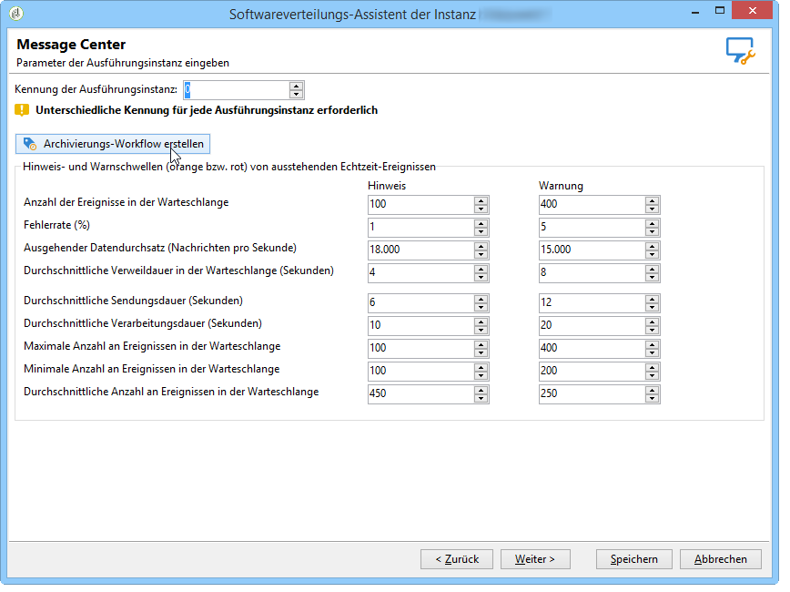

# Zusätzliche Konfigurationen {#mc-additional-configurations}


## Schwellenwerte überwachen {#monitoring-thresholds}

Sie können die Hinweis- und Warnschwellen der Kennzahlen konfigurieren (orange bzw. rot), die in den Berichten **Message Center Dienstqualität** und **Message Center Verarbeitungsdauer** angezeigt werden (siehe [Zugreifen auf Berichte zu Transaktionsnachrichten](../../message-center/using/about-transactional-messaging-reports.md)).

Gehen Sie dazu wie folgt vor:

1. Öffnen Sie den Bereitstellungassistenten auf der **Ausführungsinstanz**.

1. Navigieren Sie zur Seite **[!UICONTROL Message Center]**.

1. Verwenden Sie die Pfeile, um die Schwellenwerte zu ändern.

   

>[!NOTE]
>
>Die Anzahl der in der Warteschlange ausstehenden Ereignisse wird im [Systemindikatoren](../../production/using/monitoring-processes.md#system-indicators) auf der Adobe Campaign-Prozessüberwachungsseite. Weitere Informationen zum Softwareverteilungs-Assistenten finden Sie unter [diesem Abschnitt](../../installation/using/deploying-an-instance.md#deployment-wizard).

## Ereignisse bereinigen {#purging-events}

Die Dauer der Speicherung der Ereignisse in der Datenbank kann über den [Bereitstellungsassistenten](../../production/using/database-cleanup-workflow.md#deployment-wizard) konfiguriert werden.

Die Bereinigung der Ereignisse wird automatisch vom [Datenbankbereinigungs-Workflow](../../production/using/database-cleanup-workflow.md) durchgeführt. Gelöscht werden dabei die in den Ausführungsinstanzen empfangenen und gespeicherten Ereignisse sowie die in der Kontrollinstanz archivierten Ereignisse.

Um die Bereinigungsparameter zu ändern, nutzen Sie die aufsteigenden und absteigenden Pfeile.

Bereinigungsparameter in Kontrollinstanzen:


Bereinigungsparamter in Ausführungsinstanzen:


Weiterführende Informationen zum Datenbankbereinigungs-Workflow finden Sie in [diesem Abschnitt](../../production/using/database-cleanup-workflow.md).


## Technische Workflows {#technical-workflows}

Die technischen Workflows für Message Center sind teils in der Kontrollinstanz, teils in der oder den Ausführungsinstanz(en) enthalten.

Vor Freigabe der Transaktionsnachrichten-Vorlagen muss sichergestellt werden, dass die mit Transaktionsnachrichten in Verbindung stehenden technischen Workflows (Message Center) der Kontrollinstanz und der verschiedenen Ausführungsinstanzen erstellt und gestartet sind.

### Workflows der Kontrollinstanz {#control-instance-workflows}

In der Kontrollinstanz müssen Sie, unabhängig davon, ob Sie eine oder mehrere Ausführungsinstanzen registriert haben, für jedes externe **[!UICONTROL Message Center Ausführungs-Instanz]**-Konto einen Archivierungs-Workflow erstellen. Klicken Sie auf die Schaltfläche **[!UICONTROL Archivierungs-Workflow erstellen]**, um den Workflow zu erstellen und zu starten.


Diese Workflows können Sie dann über den Ordner **Administration > Betreibung > Message Center** aufrufen. Nach der Erstellung werden die Archivierungs-Workflows automatisch gestartet.

<!--**Minimal architecture**

Once the control and execution modules are installed on the same instance, you must create the archiving workflow using the deployment wizard. Click the **[!UICONTROL Create the archiving workflow]** button to create and start the workflow.

-->

### Workflows der Ausführungsinstanz {#execution-instance-workflows}

Der Zugriff auf die Transaktionsnachrichten-spezifischen, technischen Workflows erfolgt in der oder den Ausführungsinstanz(en) im Knoten **Administration > Betreibung > Message Center**. Stellen Sie sicher, dass alle Workflows gestartet wurden. Folgende Workflows stehen zur Verfügung:

* **[!UICONTROL Verarbeitung der Batch-Ereignisse]** (interner Name **[!UICONTROL batchEventsProcessing]**): teilt die Batch-Ereignisse einer Warteschlange zu, bis sie einer Nachrichtenvorlage zugeordnet werden.
* **[!UICONTROL Echtzeitereignisse verarbeiten]** (interner Name **[!UICONTROL rtEventsProcessing]**): Mit diesem Workflow schlüsseln Sie Echtzeitereignisse in einer Warteschlange auf, bevor sie mit einer Nachrichtenvorlage verknüpft werden.
* **[!UICONTROL Update des Ereignisstatus]** (interner Name **[!UICONTROL updateEventStatus]**): ordnet jedem Ereignis einen Status zu.

  Folgende Status sind möglich:

   * **[!UICONTROL Ausstehend]**: Das Ereignis befindet sich in der Warteschlange und wurde noch keiner Nachrichtenvorlage zugeteilt.
   * **[!UICONTROL Versand ausstehend]**: Das Ereignis befindet sich in der Warteschlange, wurde einer Nachrichtenvorlage zugeordnet und wird vom Versand verarbeitet.
   * **[!UICONTROL Gesendet]**: Dieser Status wird aus den Versandlogs übernommen. Er bedeutet, dass die Nachricht gesendet wurde.
   * **[!UICONTROL Vom Versand ignoriert]**: Der Versand konnte nicht erfolgen, z. B. aufgrund einer Quarantäne (Status wird den Versandlogs entnommen).
   * **[!UICONTROL Versandfehler]**: Der Versand ist fehlgeschlagen (Status wird den Versandlogs entnommen).
   * **[!UICONTROL Ereignis wurde nicht berücksichtigt]**: Das Ereignis konnte keiner Vorlage zugeordnet werden. Das Ereignis wird nicht erneut verarbeitet.

### Zeitplan des Archivierungs-Workflows

Vermeiden Sie es, den Zeitplan des **Archivierungs-Workflows** zu ändern, der auf der Kontrollinstanz ausgeführt wird. Andernfalls gehen möglicherweise einige Tracking-Daten verloren, die aus der Ausführungsinstanz abgerufen werden.

Wenn Sie den Zeitplan des Archivierungs-Workflows ändern, müssen Sie auch den **Tracking-Workflow** auf der Ausführungsinstanz ändern, damit er mit dem Zeitplan des Archivierungs-Workflows auf der Kontrollinstanz übereinstimmt.

## Multibranding konfigurieren {#configuring-multibranding}

In diesem Abschnitt wird eine Lösung beschrieben, mit der Tracking- und Mirrorseiten-URLs einer jeden Marke für Transaktionsnachrichten in Adobe Campaign konfiguriert werden können.

### Voraussetzungen {#prerequisites}

* Alle Hosts müssen der Konfigurationsdatei der Instanz (`config-<instance>.xml`) hinzugefügt werden.
* Jeder Marke muss eine Sub-Domain zugewiesen werden.
* Wenn das Webtracking auf HTTPS-Seiten erfolgt, müssen Sie für alle Marken über ein HTTPS-Zertifikat verfügen.

Für Multibranding müssen Sie sowohl die Ausführungsinstanzen als auch die Kontrollinstanzen konfigurieren.

### Ausführungsinstanz {#execution-instance}

Gehen Sie auf den Ausführungsinstanzen wie folgt vor:

1. Erstellen Sie für jede Marke ein externes Konto.

   >[!NOTE]
   >
   >Näheres dazu, wie Sie ein externes Konto vom Typ Ausführungsinstanz erstellen, finden Sie in [diesem Abschnitt](../../message-center/using/configuring-instances.md#control-instance).

1. Erweitern Sie das Schema nms:extAccount, um die Tracking-URL hinzuzufügen:

   ```
   <attribute advanced="true" desc="URL of the tracking servers" label="Tracking server URL"
   length="100" name="trackingURL" type="string"/>
   ```

   >[!NOTE]
   >
   >Näheres dazu, wie Sie ein vorhandenes Schema erweitern, finden Sie im Abschnitt [Erweitern eines Schemas](../../configuration/using/extending-a-schema.md).

1. Passen Sie das Formular nms:extAccount an:

   ```
   <container label="Message domain branding" type="frame">
        <static type="help"> These parameters are used to override the DNS alias and addresses used during message delivery. When not populated, the values of the 'NmsServer_MirrorPageUrl' and 'NmsEmail_DefaultErrorAddr' options are used.</static>
        <input xpath="@mirrorURL"/>
        <input xpath="@trackingURL"/>
        <input img="nms:sendemail.png" menuId="deliveryMenuBuilder" type="scriptEdit">
               xpath="errorAddress"/>
      </container>
   ```

1. Passen Sie die Optionen NmsTracking_OpenFormula und NmsTracking_ClickFormula so an, dass das externe Konto anstelle einer globalen Option verwendet wird.

   Ersetzen Sie zu diesem Zweck:

   ```
   <%@ include option='NmsTracking_ServerUrl' %>
   ```

   durch:

   ```
   <%@ value object="provider" xpath="@trackingURL" %>
   ```

   >[!IMPORTANT]
   >
   >Diese Änderungen könnten beim Upgrade Konflikte verursachen. Möglicherweise müssen Sie diese Formeln manuell in ihre neue Version einbinden.

### Kontrollinstanz {#control-instance}

Auf der Kontrollinstanz müssen Sie Versandvorlagen und externe Konten miteinander verknüpfen.

Gehen Sie dazu wie folgt vor:

1. Erstellen Sie auf der ](#execution-instance)Ausführungsinstanz[ für jede Marke ein externes Konto mit demselben internen Namen (Schritt 1).

1. Erstellen Sie für jede Marke eine Standard-Versandvorlage.

   >[!NOTE]
   >
   >    Näheres dazu, wie Sie eine Versandvorlage erstellen, finden Sie in [diesem Abschnitt](../../delivery/using/creating-a-delivery-template.md#creating-a-new-template).

1. Konfigurieren Sie in den **[!UICONTROL Eigenschaften]** der Versandvorlage das Routing zum externen Konto der Marke.
