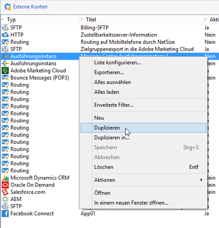
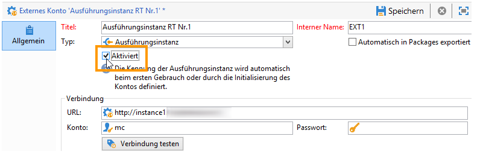
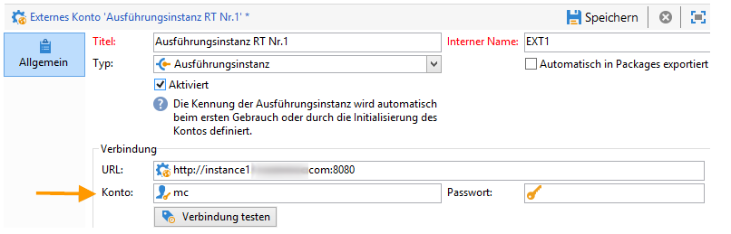
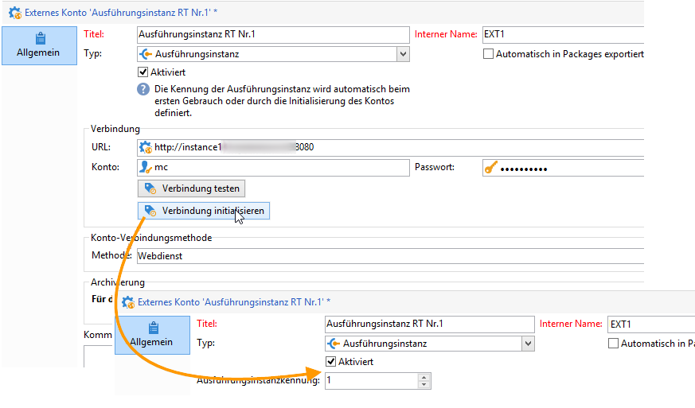
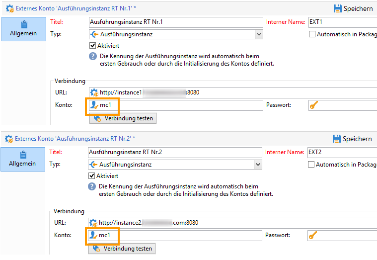
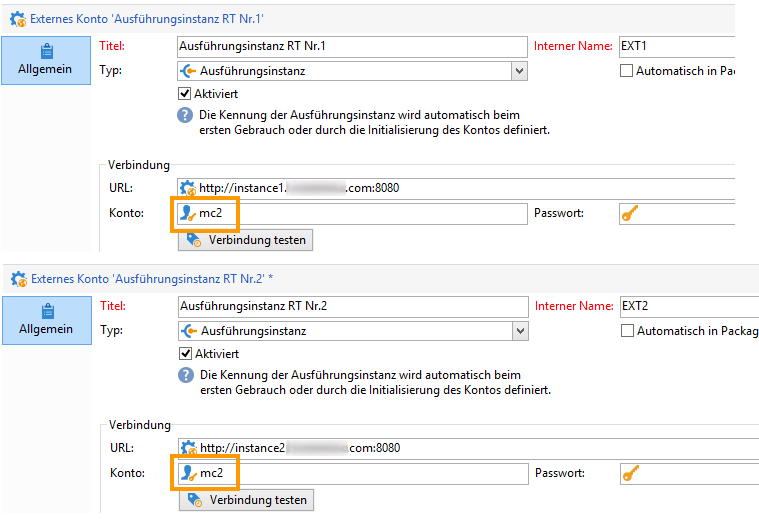

# Instanzen konfigurieren {#creating-a-shared-connection}

Um die Funktionen für Transaktionsnachrichten zu nutzen, müssen Sie die Kontroll- und Ausführungsinstanzen konfigurieren. Sie können Folgendes verwenden:
* [Eine Kontrollinstanz, die mit einer oder mehreren Ausführungsinstanzen ](#control-instance) verknüpft ist
* [Mehrere ](#using-several-control-instances) Kontrollinstanzen, die mit mehreren Ausführungsinstanzen verknüpft sind

>[!IMPORTANT]
>
>Die Schemaerweiterungen haben sich auf die Ressourcen ausgewirkt, die von [technischen Workflows des Message-Center-Moduls](../../message-center/using/additional-configurations.md#technical-workflows) in Kontroll- oder Ausführungsinstanzen verwendet werden, und müssen in den anderen vom Transaktionsnachrichtenmodul verwendeten Instanzen dupliziert werden.

Außerdem müssen Sie die Ausführungsinstanz(en) angeben und mit der/den Kontrollinstanz(en) verbinden.

Alle Schritte, die zum Konfigurieren und Verbinden der Kontroll- und Ausführungsinstanzen erforderlich sind, werden in diesem Abschnitt beschrieben.

>[!IMPORTANT]
>
>Die Kontroll- und die Ausführungsinstanz(en) müssen auf unterschiedlichen Computern installiert werden. Sie können aber nicht auf derselben Campaign-Instanz ausgeführt werden.

## Kontrollinstanz {#control-instance} konfigurieren

Um die Kontrollinstanz mit den Ausführungsinstanzen zu verbinden, müssen Sie zunächst ein **[!UICONTROL Ausführungsinstanz]** externes Konto **in der Kontrollinstanz** erstellen und konfigurieren. Daher können Transaktionsnachrichten-Vorlagen nach [publish](../../message-center/using/publishing-message-templates.md#template-publication) in den Ausführungsinstanzen bereitgestellt werden.

Wenn Sie mehrere Ausführungsinstanzen verwenden, müssen Sie so viele externe Konten wie Ausführungsinstanzen erstellen.

>[!NOTE]
>
>Wenn Ausführungsinstanzen von mehreren Kontrollinstanzen verwendet werden, können die Daten nach Ordner und Operator unterteilt werden. Weitere Informationen hierzu finden Sie unter [Mehrere Kontrollinstanzen verwenden](#using-several-control-instances).

### Externes Konto erstellen

>[!NOTE]
>
>Die folgenden Schritte müssen **auf der Kontrollinstanz** ausgeführt werden.

Gehen Sie wie folgt vor, um ein externes Konto vom Typ **[!UICONTROL Ausführungsinstanz]** zu erstellen:

1. Gehen Sie in den Knoten **[!UICONTROL Administration > Plattform > Externe Konten]** des Explorers.
1. Klicken Sie mit der rechten Maustaste auf eins der standardmäßig mit Adobe Campaign gelieferten externen Konten vom Typ Ausführungsinstanz und wählen Sie im Kontextmenü **[!UICONTROL Duplizieren]** aus .

   

1. Ändern Sie bei Bedarf den Titel des Kontos.

   

1. Kreuzen Sie die Option **[!UICONTROL Aktiviert]** an, um das Konto in Betrieb zu nehmen.

   

1. Geben Sie die Adresse des Servers an, auf dem die Ausführungsinstanz installiert ist.

   

1. Das Konto muss dem Message Center Agent entsprechen, der im Benutzerordner definiert wurde. Standardmäßig handelt es sich um das Konto **[!UICONTROL mc]** .

   

1. Geben Sie das im entsprechenden Profil definierte Passwort an.

   >[!NOTE]
   >
   >Um zu vermeiden, bei jeder Verbindung mit der Instanz ein Passwort angeben zu müssen, können Sie die IP-Adresse der Kontrollinstanz in der Ausführungsinstanz angeben. Weitere Informationen hierzu finden Sie unter [Ausführungsinstanz(en)](#execution-instance) konfigurieren.

1. Geben Sie die von der Ausführungsinstanz zu verwendende Verbindungsmethode an. Die Ausführungsinstanz leitet die abgerufenen Daten an die Kontrollinstanz weiter, um die Transaktionsnachrichten- und Ereignisverläufe anzureichern.

   

   Der Datenabruf erfolgt entweder über einen Webdienst, der einen HTTP/HTTPS-Zugriff verwendet, oder über das Modul Federated Data Access (FDA).

   >[!NOTE]
   >
   >Beachten Sie, dass bei Verwendung von FDA über HTTP nur Ausführungsinstanzen mit einer PostgreSQL-Datenbank unterstützt werden. MSSQL- oder Oracle-Datenbanken werden nicht unterstützt.

   Die zweite Methode (FDA) wird empfohlen, wenn die Kontrollinstanz direkten Zugriff auf die Datenbank der Ausführungsinstanzen hat. Wenn nicht, wählen Sie den Webdienstzugriff aus. Das anzugebende FDA-Konto entspricht der Verbindung zu den Datenbanken der verschiedenen Ausführungsinstanzen, die in der Kontrollinstanz erstellt wurden.

   

   Lesen Sie den Abschnitt [Zugriff auf eine externe Datenbank](../../installation/using/about-fda.md), um mehr Informationen über den Federated Data Access (FDA) zu erhalten.

1. Klicken Sie auf **[!UICONTROL Verbindung testen]**, um zu überprüfen, ob die Verbindung zwischen Kontrollinstanz und Ausführungsinstanz hergestellt werden kann.

   

Wiederholen Sie diese Schritte bei Verwendung mehrerer Ausführungsinstanzen, um so viele externe Konten wie Ausführungsinstanzen zu erstellen.

### Ausführungsinstanzen identifizieren {#identifying-execution-instances}

Jede Ausführungsinstanz muss mit einer eindeutigen Kennung verknüpft sein, um den Verlauf jeder Ausführungsinstanz bei der Anzeige in der Kontrollinstanz zu unterscheiden.

Diese Kennung kann jeder Ausführungsinstanz **manuell** zugeordnet werden. In diesem Fall muss dieser Schritt **für jede Ausführungsinstanz** ausgeführt werden. Verwenden Sie dazu den Softwareverteilungs-Assistenten wie unten beschrieben:

1. Öffnen Sie den Softwareverteilungs-Assistenten in einer Ausführungsinstanz.
1. Gehen Sie zum Fenster **[!UICONTROL Message Center]** .
1. Weisen Sie der Instanz die ausgewählte Kennung zu.

   

1. Wiederholen Sie die obigen Schritte für jede Ausführungsinstanz.

Die Kennung kann auch **automatisch** zugeordnet werden. Gehen Sie dazu zur **Kontrollinstanz** und klicken Sie auf die Schaltfläche **[!UICONTROL Verbindung initialisieren]** .

## Ausführungsinstanz(en) {#execution-instance} konfigurieren

>[!NOTE]
>
>Die folgenden Schritte müssen **für die Ausführungsinstanz(en)** ausgeführt werden.

Gehen Sie wie folgt vor, um die Ausführungsinstanz(en) mit der Kontrollinstanz zu verbinden.

Damit die Kontrollinstanz eine Verbindung zur Ausführungsinstanz herstellen kann, ohne ein Passwort angeben zu müssen, geben Sie einfach die IP-Adresse der Kontrollinstanz im Abschnitt &quot;Zugriffsberechtigungen&quot; im **Message Center** ein. Leere Passwörter sind jedoch standardmäßig nicht erlaubt.

Um ein leeres Passwort zu verwenden, wechseln Sie zu den Ausführungsinstanzen und definieren Sie eine Sicherheitszone, die auf die IP-Adresse des Informationssystems beschränkt ist, das die Ereignisse bereitstellt. Diese Sicherheitszone muss leere Passwörter zulassen und `<identifier> / <password>`-Typverbindungen akzeptieren. Weiterführende Informationen hierzu finden Sie in [diesem Abschnitt](../../installation/using/security-zones.md).

>[!NOTE]
>
>Wenn Ausführungsinstanzen von mehreren Kontrollinstanzen verwendet werden, können die Daten nach Ordner und Operator unterteilt werden. Weitere Informationen hierzu finden Sie unter [Mehrere Kontrollinstanzen verwenden](#using-several-control-instances).

1. Wechseln Sie in einer Ausführungsinstanz zum Benutzerordner ( **[!UICONTROL Administration > Zugriffe > Benutzer]** ).
1. Wählen Sie den **Message Center Agent** aus.

   

1. Gehen Sie in den Tab **[!UICONTROL Bearbeiten]**, klicken Sie auf **[!UICONTROL Zugriffsberechtigungen]** und anschließend auf den Link **[!UICONTROL Zugriffsparameter bearbeiten...]**.

   

1. Klicken Sie im Fenster **[!UICONTROL Zugriffsparameter]** auf den Link **[!UICONTROL Maske vertrauenswürdiger IPs hinzufügen]** und fügen Sie die IP der Kontrollinstanz hinzu.

   

Wiederholen Sie diese Schritte bei Verwendung mehrerer Ausführungsinstanzen für jede Ausführungsinstanz.

## Mehrere Kontrollinstanzen {#using-several-control-instances} verwenden

Mehrere Kontrollinstanzen können einen Ausführungscluster gemeinsam nutzen. Die für diesen Architekturtyp erforderlichen Konfigurationen werden im Folgenden dargestellt.

Angenommen, Ihr Unternehmen verwaltet zwei Marken, von denen jede über eine eigene Kontrollinstanz verfügt: **Kontrolle 1** und **Kontrolle 2**. Außerdem werden zwei Ausführungsinstanzen verwendet. Sie müssen für jede Kontrollinstanz einen anderen Message Center-Operator eingeben: einen **mc1** -Operator für die **Control 1**-Instanz und einen **mc2** -Operator für die **Control 2**-Instanz.

Erstellen Sie im Baum aller Ausführungsinstanzen einen Ordner pro Operator (**Ordner 1** und **Ordner 2**) und beschränken Sie den Datenzugriff der einzelnen Operatoren auf den jeweiligen Ordner.

### Kontrollinstanzen {#configuring-control-instances} konfigurieren

>[!NOTE]
>
>Die folgenden Schritte müssen **für die Kontrollinstanzen** ausgeführt werden.

1. Erstellen Sie in der Kontrollinstanz **Kontrolle 1** ein externes Konto pro Ausführungsinstanz und geben Sie den **mc1**-Operator in jedes externe Konto ein. Anschließend wird der Operator **mc1** für alle Ausführungsinstanzen erstellt (siehe [Ausführungsinstanzen konfigurieren](#configuring-execution-instances)).

   

1. Erstellen Sie in der Kontrollinstanz **Kontrolle 2** ein externes Konto pro Ausführungsinstanz und geben Sie den **mc2**-Operator in jedes externe Konto ein. Anschließend wird der Operator **mc2** für alle Ausführungsinstanzen erstellt (siehe [Ausführungsinstanzen konfigurieren](#configuring-execution-instances)).

   

   >[!NOTE]
   >
   >Weiterführende Informationen zur Konfiguration einer Kontrollinstanz finden Sie in [diesem Abschnitt](#control-instance).

### Ausführungsinstanzen {#configuring-execution-instances} konfigurieren

>[!NOTE]
>
>Die folgenden Schritte müssen **für die Ausführungsinstanzen** ausgeführt werden.

Damit mehrere Kontrollinstanzen verwendet werden können, muss diese Konfiguration auf ALLEN Ausführungsinstanzen ausgeführt werden.

1. Erstellen Sie im Knoten **[!UICONTROL Administration > Betreibung > Message Center]** einen Ordner pro Benutzer: **Ordner 1** und **Ordner 2**. Weitere Informationen zum Erstellen von Ordnern und Ansichten finden Sie auf [dieser Seite](../../platform/using/access-management-folders.md).

   

1. Erstellen Sie die Benutzer **mc1** und **mc2**, indem Sie den standardmäßig vorhandenen Message Center-Benutzer **mc** duplizieren. Die Erstellung von Benutzern wird in [diesem Abschnitt](../../platform/using/access-management-operators.md) detailliert beschrieben.

   

   >[!NOTE]
   >
   >Die Benutzer **mc1** und **mc2** müssen über die Berechtigung **[!UICONTROL Message Center Ausführung]** verfügen. Sie dürfen jedoch keinen Zugriff auf die Adobe-Campaign-Clientkonsole haben. Ein Benutzer muss stets einer Sicherheitszone zugeordnet werden. Weitere Informationen hierzu finden Sie in [diesem Abschnitt](../../installation/using/security-zones.md).

1. Kreuzen Sie für jeden Benutzer die Option **[!UICONTROL Beschränken auf Daten in den Unterordnern von]** an und wählen Sie den dem jeweiligen Benutzer entsprechenden Ordner aus (**Ordner 1** für den Benutzer **mc1** und **Order 2** für den Benutzer **mc2**).

   

1. Ordnen Sie jedem Benutzer die Lese- und Schreibberechtigungen für seinen Ordner zu. Klicken Sie hierzu mit der rechten Maustaste auf den Ordner und wählen Sie **[!UICONTROL Eigenschaften]** aus. Gehen Sie anschließend in den Tab **[!UICONTROL Sicherheit]** und fügen Sie den entsprechenden Benutzer hinzu (**mc1** für den **Ordner 1** und **mc2** für den **Ordner 2**). Stellen Sie sicher, dass die Zugriffsberechtigungen **[!UICONTROL Daten lesen/speichern]** angekreuzt sind.

   
