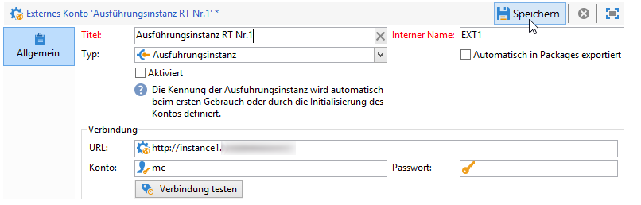
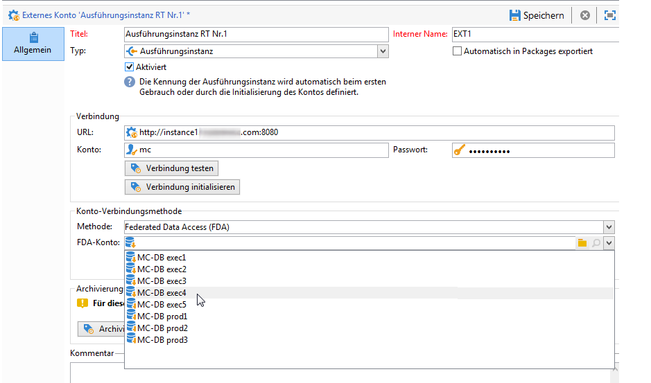
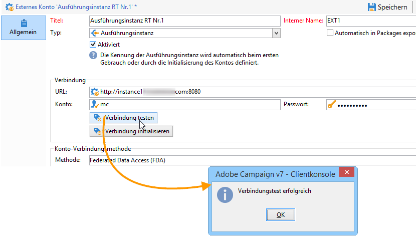
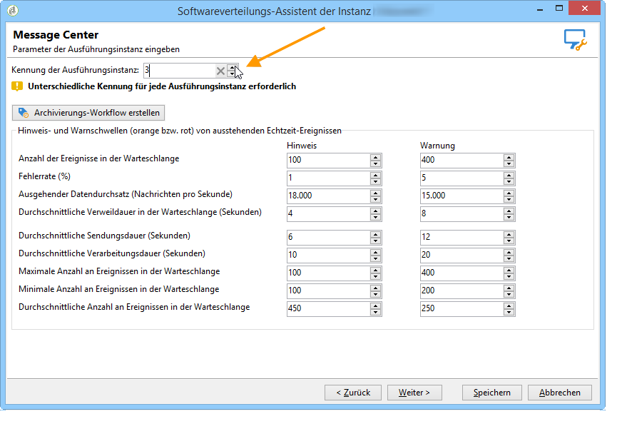
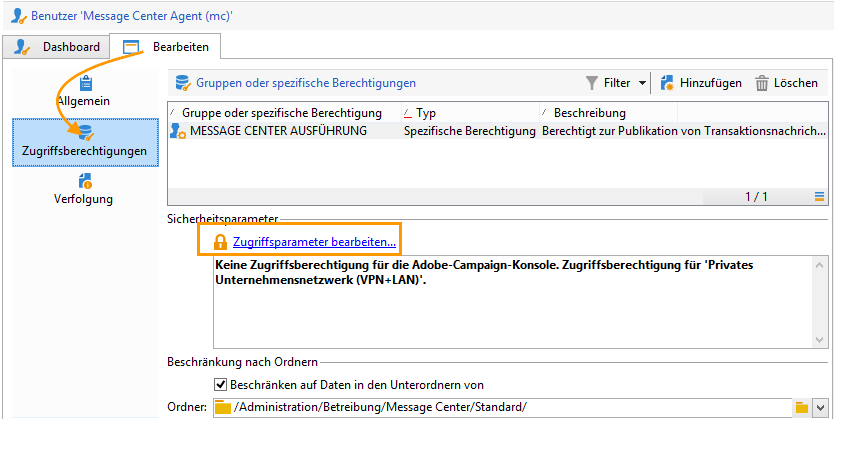
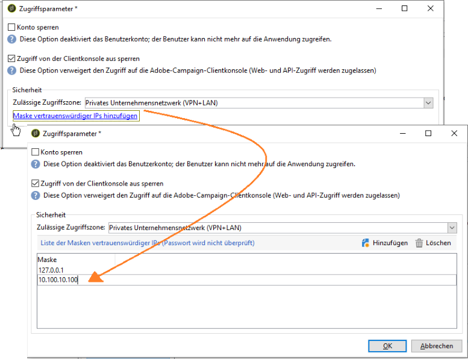

# Konfiguration von Instanzen {#creating-a-shared-connection}

Zur Nutzung der Transaktionsnachrichten-Funktionen müssen Sie die Kontroll- und Ausführungsinstanzen konfigurieren. Sie können dazu Folgendes verwenden:
* [Eine Kontrollinstanz](#control-instance), die mit einer oder mehreren Ausführungsinstanzen verknüpft ist
* [Mehrere Kontrollinstanzen](#using-several-control-instances), die mit mehreren Ausführungsinstanzen verknüpft sind

>[!IMPORTANT]
>
>Erweiterungen von Schemata, die von [technischen Workflows des Message Center-Moduls](../../message-center/using/additional-configurations.md#technical-workflows) auf Kontroll- oder Ausführungsinstanzen verwendet werden, müssen auf den anderen vom Transaktionsnachrichten-Modul verwendeten Instanzen dupliziert werden.

Außerdem müssen Sie die Ausführungsinstanz(en) angeben und mit der/den Kontrollinstanz(en) verbinden.

Alle Schritte für die Konfiguration und Verbindung der Kontroll- und Ausführungsinstanzen erforderlichen Schritte werden im vorliegenden Abschnitt beschrieben.

>[!IMPORTANT]
>
>Die Kontroll- und die Ausführungsinstanz(en) müssen auf unterschiedlichen Computern installiert werden. Sie können nicht auf derselben Campaign-Instanz ausgeführt werden.

## Kontrollinstanz konfigurieren {#control-instance}

Um die Kontrollinstanz mit den Ausführungsinstanzen zu verbinden, müssen Sie zunächst ein externes Konto vom Typ **[!UICONTROL Ausführungsinstanz]** **auf der Kontrollinstanz** erstellen und konfigurieren. Auf diese Weise ist es möglich, Transaktionsnachrichtenvorlagen nach ihrer [Veröffentlichung](../../message-center/using/publishing-message-templates.md#template-publication) auf den Ausführungsinstanzen bereitzustellen.

Wenn Sie mehrere Ausführungsinstanzen verwenden, müssen Sie so viele externe Konten erstellen, wie Sie Ausführungsinstanzen haben.

>[!NOTE]
>
>Wenn Ausführungsinstanzen von mehreren Kontrollinstanzen verwendet werden, können die Daten nach Ordner und Benutzer unterteilt werden. Weiterführende Informationen hierzu finden Sie unter [Mehrere Kontrollinstanzen verwenden](#using-several-control-instances).

### Externes Konto erstellen

>[!NOTE]
>
>Die folgenden Schritte müssen **auf der Kontrollinstanz** ausgeführt werden.

Gehen Sie wie folgt vor, um ein externes Konto vom Typ **[!UICONTROL Ausführungsinstanz]** zu erstellen:

1. Gehen Sie in den Knoten **[!UICONTROL Administration > Plattform > Externe Konten]** des Explorers.
1. Klicken Sie mit der rechten Maustaste auf eins der standardmäßig mit Adobe Campaign gelieferten externen Konten vom Typ Ausführungsinstanz und wählen Sie im Kontextmenü **[!UICONTROL Duplizieren]** aus .

   

1. Ändern Sie bei Bedarf den Titel des Kontos.

   

1. Kreuzen Sie die Option **[!UICONTROL Aktiviert]** an, um das Konto in Betrieb zu nehmen.

   

1. Geben Sie die Adresse des Servers an, auf dem die Ausführungsinstanz installiert ist.

   

1. Das Konto muss dem Message Center Agent entsprechen, der im Benutzerordner definiert wurde. Standardmäßig handelt es sich um das Konto **[!UICONTROL mc]** .

   

1. Geben Sie das im entsprechenden Profil definierte Passwort an.

   >[!NOTE]
   >
   >Um zu vermeiden, bei jeder Verbindung mit der Instanz ein Passwort angeben zu müssen, können Sie die IP-Adresse der Kontrollinstanz in der Ausführungsinstanz angeben. Weiterführende Informationen hierzu finden Sie unter [Ausführungsinstanzen konfigurieren](#execution-instance).

1. Geben Sie die von der Ausführungsinstanz zu verwendende Verbindungsmethode an. Die Ausführungsinstanz leitet die abgerufenen Daten an die Kontrollinstanz weiter, um die Transaktionsnachrichten- und Ereignisverläufe anzureichern.

   

   Der Datenabruf erfolgt entweder über einen Webdienst, der einen HTTP/HTTPS-Zugriff verwendet, oder über das Modul Federated Data Access (FDA).

   >[!NOTE]
   >
   >Beachten Sie, dass bei Verwendung von FDA über HTTP nur Ausführungsinstanzen mit einer PostgreSQL-Datenbank unterstützt werden. MSSQL- oder Oracle-Datenbanken werden nicht unterstützt.

   Die zweite Methode (FDA) wird empfohlen, wenn die Kontrollinstanz direkten Zugriff auf die Datenbank der Ausführungsinstanzen hat. Ist das nicht der Fall, wählen Sie den Web-Dienstzugriff aus. Für das FDA-Konto ist dasjenige anzugeben, das der Verbindung für die Datenbanken der verschiedenen Ausführungsinstanzen entspricht, die auf der Kontrollinstanz erstellt wurden.

   

   Weiterführende Informationen zum Federated Data Access (FDA) finden Sie in [diesem Abschnitt](../../installation/using/about-fda.md).

1. Klicken Sie auf **[!UICONTROL Verbindung testen]**, um zu überprüfen, ob die Verbindung zwischen Kontrollinstanz und Ausführungsinstanz hergestellt werden kann.

   

Wiederholen Sie diese Schritte bei Verwendung mehrerer Ausführungsinstanzen, um die gleiche Zahl an externen Konten zu erstellen, wie Sie Ausführungsinstanzen haben.

### Ausführungsinstanzen identifizieren {#identifying-execution-instances}

Jeder Ausführungsinstanz muss eine eindeutige Kennung zugewiesen werden, damit der Verlauf der einzelnen Ausführungsinstanzen bei der Anzeige auf der Kontrollinstanz unterschieden werden kann.

Diese Kennung kann den einzelnen Ausführungsinstanzen **manuell** zugeordnet werden. In diesem Fall muss dieser Schritt **für jede Ausführungsinstanz** ausgeführt werden. Verwenden Sie dazu den Bereitstellungsassistenten wie im Folgenden beschrieben:

1. Öffnen Sie den Bereitstellungassistenten auf einer Ausführungsinstanz.
1. Rufen Sie das Fenster **[!UICONTROL Message Center]** auf.
1. Weisen Sie der Instanz die ausgewählte Kennung zu.

   

1. Wiederholen Sie die obigen Schritte für jede Ausführungsinstanz.

Die Kennung kann auch **automatisch** zugeordnet werden. Rufen Sie dazu die **Kontrollinstanz** auf und klicken Sie auf die Schaltfläche **[!UICONTROL Verbindung initialisieren]**.

## Ausführungsinstanzen konfigurieren  {#execution-instance}

>[!NOTE]
>
>Die nachfolgenden Schritte müssen **auf der/den Ausführungsinstanz(en)** ausgeführt werden.

Gehen Sie wie folgt vor, um die Ausführungsinstanz(en) mit der Kontrollinstanz zu verbinden.

Damit die Kontrollinstanz eine Verbindung zur Ausführungsinstanz herstellen kann, ohne ein Passwort angeben zu müssen, geben Sie einfach die IP-Adresse der Kontrollinstanz im Abschnitt &quot;Zugriffsberechtigungen&quot; im **Message Center** ein. Leere Passwörter sind jedoch standardmäßig nicht erlaubt.

Um ein leeres Passwort zu verwenden, wechseln Sie zu den Ausführungsinstanzen und definieren Sie eine Sicherheitszone, die auf die IP-Adresse des Informationssystems beschränkt ist, das die Ereignisse bereitstellt. Diese Sicherheitszone muss leere Passwörter zulassen und `<identifier> / <password>`-Typverbindungen akzeptieren. Weiterführende Informationen hierzu finden Sie in [diesem Abschnitt](../../installation/using/security-zones.md).

>[!NOTE]
>
>Wenn Ausführungsinstanzen von mehreren Kontrollinstanzen verwendet werden, können die Daten nach Ordner und Benutzer unterteilt werden. Weiterführende Informationen hierzu finden Sie unter [Mehrere Kontrollinstanzen verwenden](#using-several-control-instances).

1. Rufen Sie auf einer Ausführungsinstanz den Benutzerordner über **[!UICONTROL Administration > Zugriffe > Benutzer]** auf.
1. Wählen Sie den **Message Center Agent** aus.

   

1. Gehen Sie in den Tab **[!UICONTROL Bearbeiten]**, klicken Sie auf **[!UICONTROL Zugriffsberechtigungen]** und anschließend auf den Link **[!UICONTROL Zugriffsparameter bearbeiten...]**.

   

1. Klicken Sie im Fenster **[!UICONTROL Zugriffsparameter]** auf den Link **[!UICONTROL Maske vertrauenswürdiger IPs hinzufügen]** und fügen Sie die IP der Kontrollinstanz hinzu.

   

Wenn Sie mehrere Ausführungsinstanzen verwenden, wiederholen Sie diese Schritte für die einzelnen Ausführungsinstanzen.

## Mehrere Kontrollinstanzen verwenden {#using-several-control-instances}

Mehrere Kontrollinstanzen können einen Ausführungs-Cluster gemeinsam nutzen. Die für diesen Architekturtyp erforderlichen Konfigurationen werden im Folgenden dargestellt.

Nehmen wir an, Ihr Unternehmen verwaltet zwei Marken mit jeweils einer eigenen Kontrollinstanz: **Kontrolle 1** und **Kontrolle 2**. Außerdem gehen wir in diesem Beispiel von zwei Ausführungsinstanzen aus. Entsprechend müssen Sie für jede Kontrollinstanz einen eigenen Message Center-Benutzer eingeben: einen **mc1**-Benutzer für die Instanz **Kontrolle 1** und einen **mc2**-Benutzer für die Instanz **Kontrolle 2**.

Erstellen Sie im Baum aller Ausführungsinstanzen einen Ordner pro Benutzer (**Ordner 1** und **Ordner 2**) und beschränken Sie den Datenzugriff der einzelnen Benutzer auf den jeweiligen Ordner.

### Kontrollinstanzen konfigurieren {#configuring-control-instances}

>[!NOTE]
>
>Die nachfolgenden Schritte müssen **auf den Kontrollinstanzen** ausgeführt werden.

1. Erstellen Sie auf der Kontrollinstanz **Kontrolle 1** für jede Ausführungsinstanz ein externes Konto und geben Sie den **mc1**-Benutzer in die einzelnen externen Konten ein. Anschließend wird der **mc1**-Benutzer für alle Ausführungsinstanzen erstellt (siehe [Ausführungsinstanzen konfigurieren](#configuring-execution-instances)).

   

1. Erstellen Sie auf der Kontrollinstanz **Kontrolle 2** für jede Ausführungsinstanz ein externes Konto und geben Sie den **mc2**-Benutzer in die einzelnen externen Konten ein. Anschließend wird der **mc2**-Benutzer für alle Ausführungsinstanzen erstellt (siehe [Ausführungsinstanzen konfigurieren](#configuring-execution-instances)).

   

   >[!NOTE]
   >
   >Weiterführende Informationen dazu, wie Sie eine Kontrollinstanz konfigurieren, finden Sie in [diesem Abschnitt](#control-instance).

### Ausführungsinstanzen konfigurieren {#configuring-execution-instances}

>[!NOTE]
>
>Die nachfolgenden Schritte müssen **auf den Ausführungsinstanzen** ausgeführt werden.

Damit mehrere Kontrollinstanzen verwendet werden können, muss diese Konfiguration auf ALLEN Ausführungsinstanzen ausgeführt werden.

1. Erstellen Sie im Knoten **[!UICONTROL Administration > Betreibung > Message Center]** einen Ordner pro Benutzer: **Ordner 1** und **Ordner 2**. Weitere Informationen zum Erstellen von Ordnern und Ansichten finden Sie auf [dieser Seite](../../platform/using/access-management-folders.md).

   

1. Erstellen Sie die Benutzer **mc1** und **mc2**, indem Sie den standardmäßig vorhandenen Message Center-Benutzer **mc** duplizieren. Die Erstellung von Benutzern wird in [diesem Abschnitt](../../platform/using/access-management-operators.md) detailliert beschrieben.

   

   >[!NOTE]
   >
   >Die Benutzer **mc1** und **mc2** müssen über die Berechtigung **[!UICONTROL Message-Center-Ausführung]** verfügen. Sie dürfen jedoch keinen Zugriff auf die Adobe Campaign-Client-Konsole haben. Ein Benutzer muss stets einer Sicherheitszone zugeordnet werden. Weiterführende Informationen hierzu finden Sie in [diesem Abschnitt](../../installation/using/security-zones.md).

1. Kreuzen Sie für jeden Benutzer die Option **[!UICONTROL Beschränken auf Daten in den Unterordnern von]** an und wählen Sie den dem jeweiligen Benutzer entsprechenden Ordner aus (**Ordner 1** für den Benutzer **mc1** und **Order 2** für den Benutzer **mc2**).

   

1. Weisen Sie jedem Benutzer Lese- und Schreibberechtigungen für seinen Ordner zu. Klicken Sie dazu mit der rechten Maustaste auf den Ordner und wählen Sie **[!UICONTROL Eigenschaften]**. Wählen Sie dann die **[!UICONTROL Sicherheit]** und fügen Sie den entsprechenden Operator hinzu (**mc1** für **Ordner 1** und **mc2** für **Ordner 2**). Stellen Sie sicher, dass die Zugriffsberechtigungen **[!UICONTROL Daten lesen/speichern]** ausgewählt sind.

   
