# Geteilte Verbindung erstellen{#creating-a-shared-connection}

>[!IMPORTANT]
>
>* Erweiterungen von Schemata, die von [technischen Workflows des Message-Center-Moduls](../../message-center/using/technical-workflows.md) in Kontroll- oder Ausführungsinstanzen verwendet werden, müssen in den anderen vom Transaktionsnachrichten-Modul von Adobe Campaign verwendeten Instanzen dupliziert werden.
>* Die Kontroll- und die Ausführungsinstanz(en) müssen auf unterschiedlichen Computern installiert werden. Sie können aber nicht auf derselben Campaign-Instanz ausgeführt werden.

>

## Kontrollinstanz konfigurieren {#control-instance}

Im Falle einer verteilten Architektur müssen in der Kontrollinstanz die ihr zugeordneten Ausführungsinstanzen angegeben und mit dieser verbunden werden. Die in der Kontrollinstanz erstellten Transaktionsnachrichten-Vorlagen werden in den Ausführungsinstanzen eingesetzt. Die Verbindung zwischen Kontrollinstanz und Ausführungsinstanzen wird über externe Konten vom Typ **[!UICONTROL Ausführungsinstanz]** konfiguriert. Für jede Ausführungsinstanz muss ein externes Konto erstellt werden.

>[!NOTE]
>
>Wenn Ausführungsinstanzen von mehreren Kontrollinstanzen verwendet werden, können die Daten nach Ordner und Operator unterteilt werden. Weitere Informationen hierzu finden Sie unter [Mehrere Kontrollinstanzen verwenden](#using-several-control-instances).

Gehen Sie wie folgt vor, um ein externes Konto vom Typ Ausführungsinstanz zu erstellen:

1. Gehen Sie in den Knoten **[!UICONTROL Administration > Plattform > Externe Konten]** des Explorers.
1. Klicken Sie mit der rechten Maustaste auf eins der standardmäßig mit Adobe Campaign gelieferten externen Konten vom Typ Ausführungsinstanz und wählen Sie im Kontextmenü **[!UICONTROL Duplizieren]** aus .

   

1. Ändern Sie bei Bedarf den Titel des Kontos.

   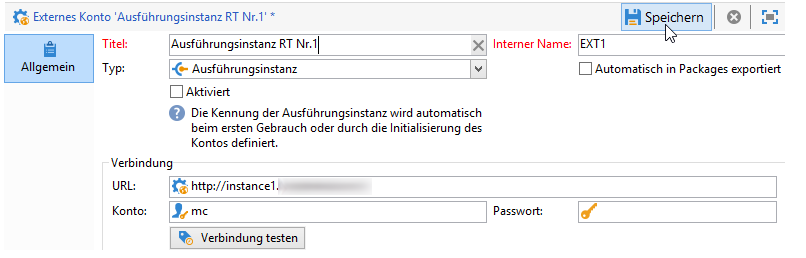

1. Kreuzen Sie die Option **[!UICONTROL Aktiviert]** an, um das Konto in Betrieb zu nehmen.

   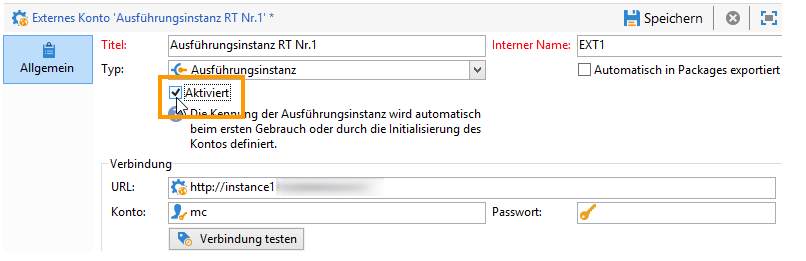

1. Geben Sie die Adresse des Servers an, auf dem die Ausführungsinstanz installiert ist.

   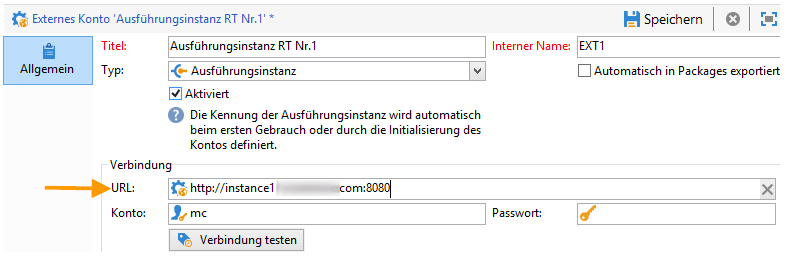

1. Das Konto muss dem Message Center Agent entsprechen, der im Benutzerordner definiert wurde. Standardmäßig handelt es sich um das Konto **[!UICONTROL mc]** .

   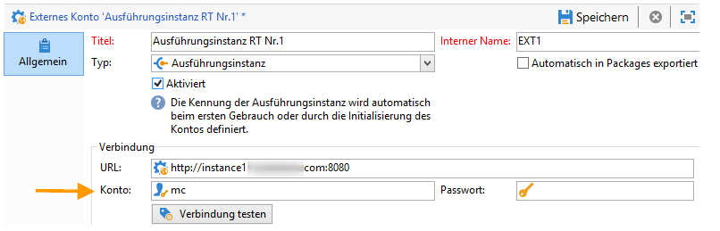

1. Geben Sie das im entsprechenden Profil definierte Passwort an.

   >[!NOTE]
   >
   >Um zu vermeiden, bei jeder Verbindung mit der Instanz ein Passwort angeben zu müssen, können Sie die IP-Adresse der Kontrollinstanz in der Ausführungsinstanz angeben. Weitere Informationen hierzu finden Sie unter [Ausführungsinstanz](#execution-instance).

1. Geben Sie die von der Ausführungsinstanz zu verwendende Verbindungsmethode an.

   Die Ausführungsinstanz leitet die abgerufenen Daten an die Kontrollinstanz weiter, um die Transaktionsnachrichten- und Ereignisverläufe anzureichern.

   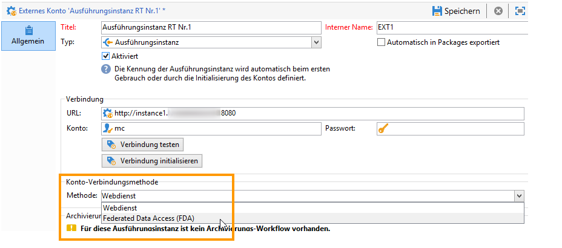

   Der Datenabruf erfolgt entweder über einen Webdienst, der einen HTTP/HTTPS-Zugriff verwendet, oder über das Modul Federated Data Access (FDA).

   >[!NOTE]
   >
   >Beachten Sie, dass bei Verwendung von FDA über HTTP nur Ausführungsinstanzen mit einer PostgreSQL-Datenbank unterstützt werden. MSSQL- oder Oracle-Datenbanken werden nicht unterstützt.

   Letztere Methode wird empfohlen, wenn die Kontrollinstanz direkten Zugriff auf die Datenbanken der Ausführungsinstanzen haben kann. Sollte dies nicht der Fall sein, wählen Sie den Webdienst-Zugriff. Das anzugebene FDA-Konto entspricht der in der Kontrollinstanz erstellten Verbindung zu den Datenbanken der unterschiedlichen Ausführungsinstanzen.

   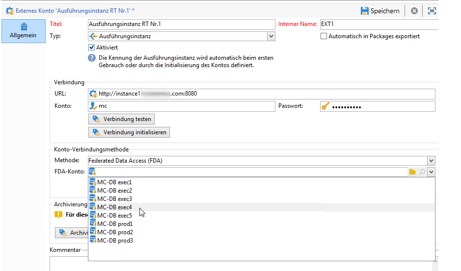

   Lesen Sie den Abschnitt [Zugriff auf eine externe Datenbank](../../installation/using/about-fda.md), um mehr Informationen über den Federated Data Access (FDA) zu erhalten.

1. Klicken Sie auf **[!UICONTROL Verbindung testen]**, um zu überprüfen, ob die Verbindung zwischen Kontrollinstanz und Ausführungsinstanz hergestellt werden kann.

   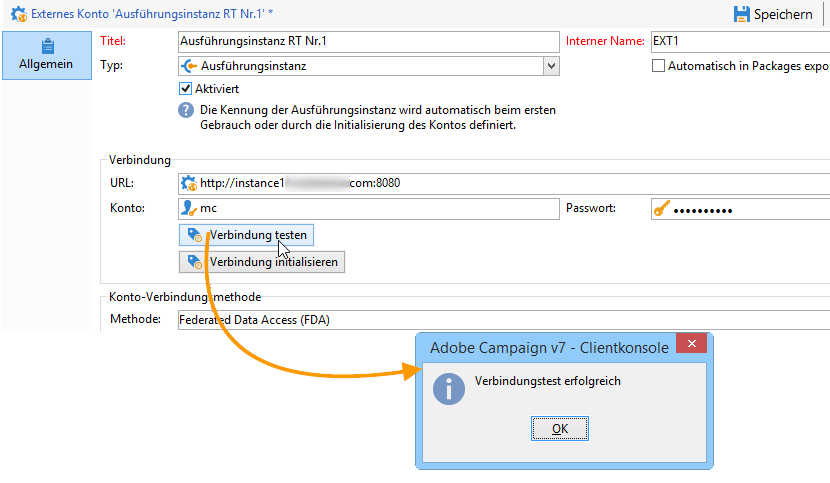

1. Jede Ausführungsinstanz muss mit einer Kennung verknüpft sein. Diese Kennung kann für jede Ausführungsinstanz manuell mithilfe des Software-Verteilungs-Assistenten (siehe [Identifizieren von Ausführungsinstanzen](../../message-center/using/identifying-execution-instances.md)) oder automatisch durch Klicken auf die Schaltfläche **Verbindung initialisieren** in der Kontrollinstanz zugewiesen werden.

   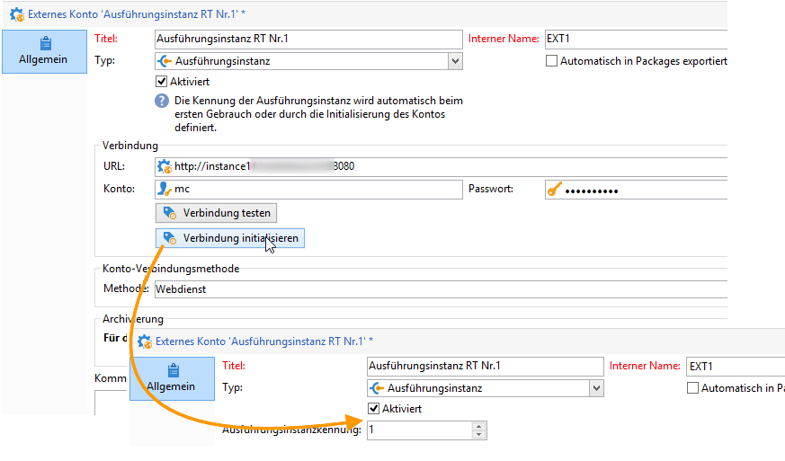

## Ausführungsinstanz konfigurieren {#execution-instance}

Damit die Kontrollinstanz eine Verbindung zur Ausführungsinstanz herstellen kann, ohne ein Passwort angeben zu müssen, geben Sie einfach die IP-Adresse der Kontrollinstanz im Abschnitt „Zugriffsberechtigungen“ von **Message Center** ein. Leere Passwörter sind jedoch standardmäßig nicht erlaubt.

Um ein leeres Passwort zu verwenden, wechseln Sie zu den Ausführungsinstanzen und definieren Sie eine Sicherheitszone, die auf die IP-Adresse des Informationssystems beschränkt ist, das die Ereignisse bereitstellt. Diese Sicherheitszone muss leere Passwörter zulassen und `<identifier> / <password>`-Typverbindungen akzeptieren. Weiterführende Informationen hierzu finden Sie in [diesem Abschnitt](../../installation/using/configuring-campaign-server.md#defining-security-zones).

>[!NOTE]
>
>Wenn Ausführungsinstanzen von mehreren Kontrollinstanzen verwendet werden, können die Daten nach Ordner und Operator unterteilt werden. Weitere Informationen hierzu finden Sie unter [Mehrere Kontrollinstanzen verwenden](#using-several-control-instances).

1. Gehen Sie in den Benutzerordner im Explorer der Ausführungsinstanz (**[!UICONTROL Administration > Zugriffe > Benutzer]** ).
1. Wählen Sie den **Message Center Agent** aus.

   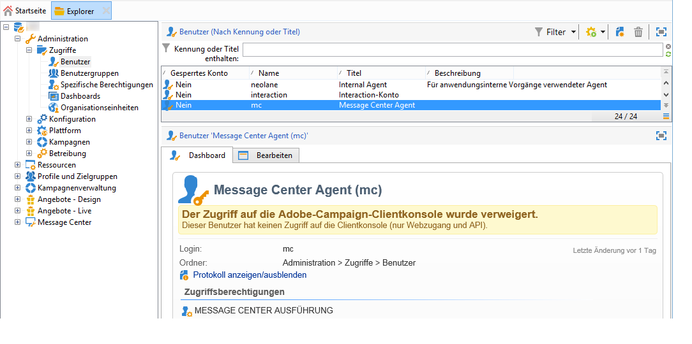

1. Gehen Sie in den Tab **[!UICONTROL Bearbeiten]**, klicken Sie auf **[!UICONTROL Zugriffsberechtigungen]** und anschließend auf den Link **[!UICONTROL Zugriffsparameter bearbeiten...]**.

   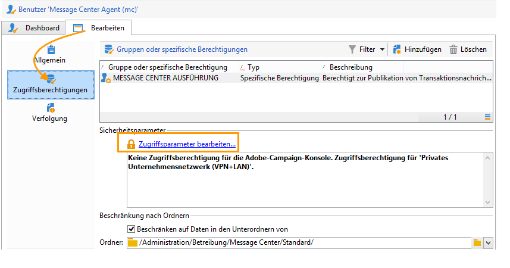

1. Klicken Sie im Fenster **[!UICONTROL Zugriffsparameter]** auf den Link **[!UICONTROL Maske vertrauenswürdiger IPs hinzufügen]** und fügen Sie die IP der Kontrollinstanz hinzu.

   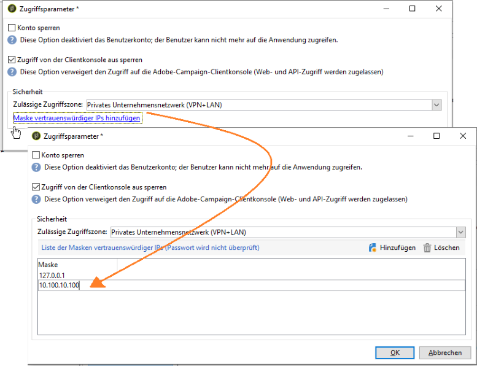

## Mehrere Kontrollinstanzen verwenden {#using-several-control-instances}

Mehrere Kontrollinstanzen können einen Ausführungscluster gemeinsam nutzen. Die für diesen Architekturtyp erforderlichen Konfigurationen werden im Folgenden dargestellt.

Nehmen wir beispielsweise an, dass Ihr Unternehmen zwei Marken verwaltet, von denen jede über eine eigene Kontrollinstanz verfügt: **Kontrolle 1** und **Kontrolle 2**. Außerdem werden zwei Ausführungsinstanzen verwendet. Sie müssen für jede Kontrollinstanz einen anderen Message Center-Operator eingeben: einen **mc1**-Operator für die Instanz **Kontrolle 1** und einen **mc2**-Operator für die Instanz **Kontrolle 2**.

Erstellen Sie im Baum aller Ausführungsinstanzen einen Ordner pro Operator (**Ordner 1** und **Ordner 2**) und beschränken Sie den Datenzugriff der einzelnen Operatoren auf den jeweiligen Ordner.

### Konfiguration der Kontrollinstanzen {#configuring-control-instances}

1. Erstellen Sie in der Kontrollinstanz **Kontrolle 1** ein externes Konto pro Ausführungsinstanz und geben Sie den **mc1**-Operator in jedes externe Konto ein. Anschließend wird der **mc1**-Operator für alle Ausführungsinstanzen erstellt (siehe [Ausführungsinstanzen konfigurieren](#configuring-execution-instances)).

   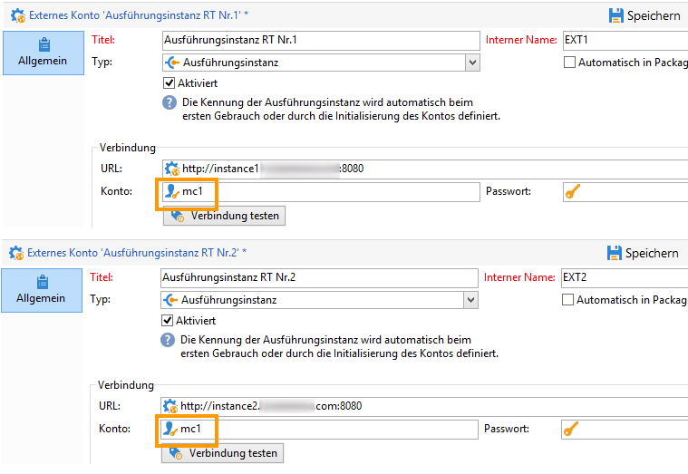

1. Erstellen Sie in der Kontrollinstanz **Kontrolle 2** ein externes Konto pro Ausführungsinstanz und geben Sie den **mc2**-Operator in jedes externe Konto ein. Anschließend wird der **mc2**-Operator für alle Ausführungsinstanzen erstellt (siehe [Ausführungsinstanzen konfigurieren](#configuring-execution-instances)).

   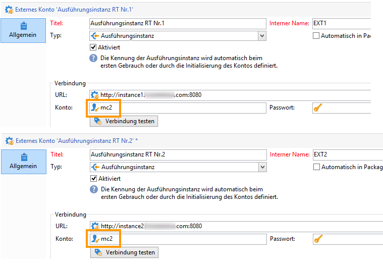

   >[!NOTE]
   >
   >Weitere Informationen zur Konfiguration von Kontrollinstanzen finden Sie unter [Kontrollinstanz konfigurieren](#control-instance).

### Ausführungsinstanzen konfigurieren {#configuring-execution-instances}

Damit mehrere Kontrollinstanzen verwendet werden können, muss diese Konfiguration auf ALLEN Ausführungsinstanzen ausgeführt werden.

1. Erstellen Sie einen Ordner pro Benutzer im Knoten **[!UICONTROL Administration > Betreibung > Message Center]**: **Ordner 1** und **Ordner 2**. Die Erstellung von Ordnern und Ansichten wird im [Platform](../../platform/using/access-management.md#folders-and-views)-Handbuch beschrieben.

   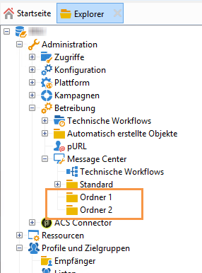

1. Erstellen Sie die Benutzer **mc1** und **mc2**, indem Sie den standardmäßig vorhandenen Message Center-Benutzer **mc** duplizieren. Die Erstellung von Benutzern wird in [diesem Abschnitt](../../platform/using/access-management.md#operators) detailliert beschrieben.

   

   >[!NOTE]
   >
   >Die Benutzer **mc1** und **mc2** müssen über die Berechtigung **[!UICONTROL Message Center Ausführung]** verfügen. Sie dürfen jedoch keinen Zugriff auf die Adobe-Campaign-Clientkonsole haben. Ein Benutzer muss stets einer Sicherheitszone zugeordnet werden. Weitere Informationen hierzu finden Sie in [diesem Abschnitt](../../installation/using/configuring-campaign-server.md#defining-security-zones).

1. Kreuzen Sie für jeden Benutzer die Option **[!UICONTROL Beschränken auf Daten in den Unterordnern von]** an und wählen Sie den dem jeweiligen Benutzer entsprechenden Ordner aus (**Ordner 1** für den Benutzer **mc1** und **Order 2** für den Benutzer **mc2**).

   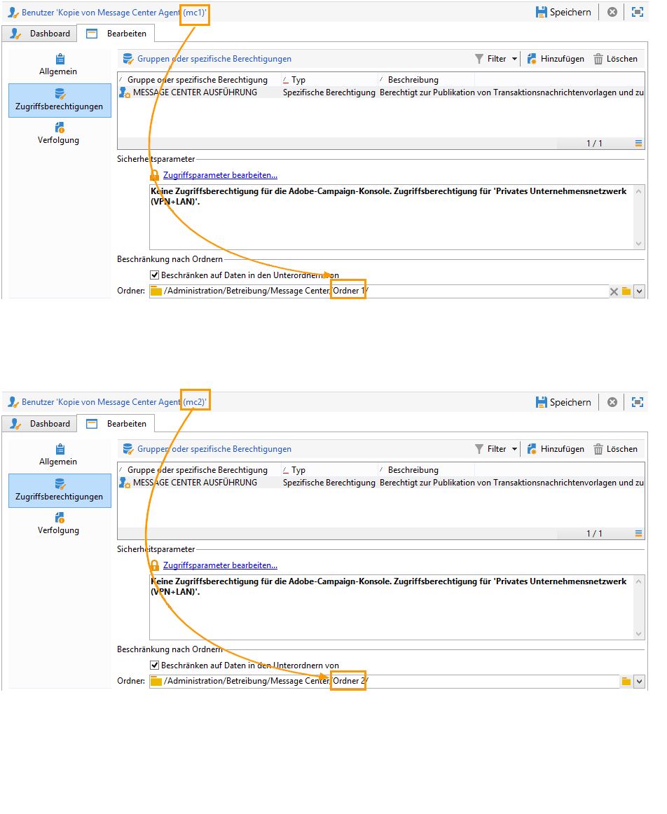

1. Ordnen Sie jedem Benutzer die Lese- und Schreibberechtigungen für seinen Ordner zu. Klicken Sie hierzu mit der rechten Maustaste auf den Ordner und wählen Sie **[!UICONTROL Eigenschaften]** aus. Gehen Sie anschließend in den Tab **[!UICONTROL Sicherheit]** und fügen Sie den entsprechenden Benutzer hinzu (**mc1** für den **Ordner 1** und **mc2** für den **Ordner 2**). Stellen Sie sicher, dass die Zugriffsberechtigungen **[!UICONTROL Daten lesen/speichern]** angekreuzt sind.

   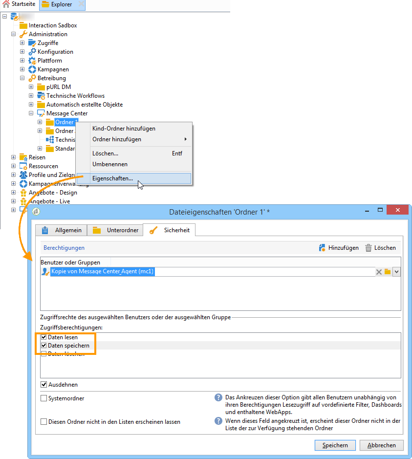

