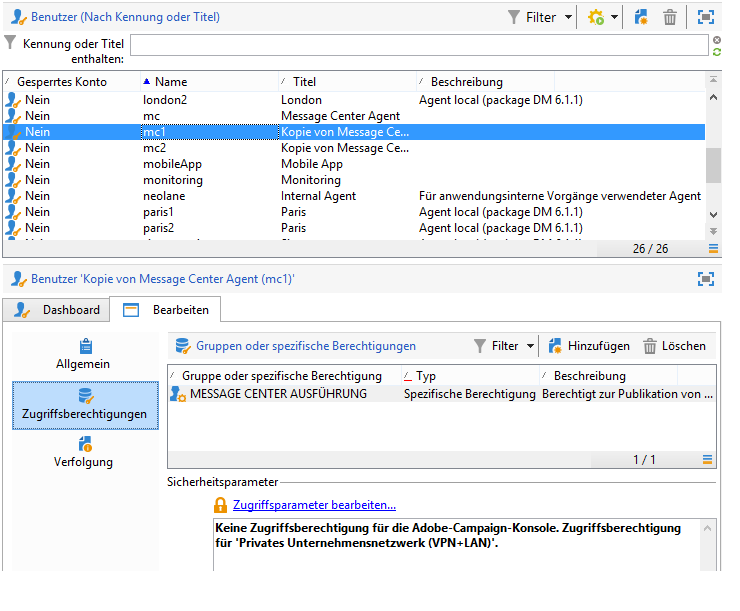

# Geteilte Verbindung erstellen{#creating-a-shared-connection}

>[!CAUTION]
>
>* Erweiterungen von Schemata, die von [technischen Workflows des Message-Center-Moduls](../../message-center/using/technical-workflows.md) in Kontroll- oder Ausführungsinstanzen verwendet werden, müssen in den anderen vom Transaktionsnachrichten-Modul von Adobe Campaign verwendeten Instanzen dupliziert werden.
>* Die Kontroll- und die Ausführungsinstanz(en) müssen auf unterschiedlichen Computern installiert werden. Sie können aber nicht auf derselben Campaign-Instanz ausgeführt werden.
>

## Kontrollinstanz konfigurieren {#control-instance}

Wenn Sie über eine aufgeschlüsselte Architektur verfügen, müssen Sie die mit der Steuerelementinstanz verknüpften Ausführungsinstanzen angeben und sie verbinden. Transaktionsnachrichtenvorlagen werden in den Ausführungsinstanzen bereitgestellt. Die Verbindung zwischen der Kontrollinstanz und den Ausführungsinstanzen wird durch Konfigurieren des **[!UICONTROL Execution instance]** Typs &quot;Externe Konten&quot;erstellt. Sie müssen so viele externe Konten wie Ausführungsinstanzen erstellen.

>[!NOTE]
>
>Wenn Ausführungsinstanzen von mehreren Kontrollinstanzen verwendet werden, können die Daten durch Ordner und Operator dividiert werden. Weitere Informationen hierzu finden Sie unter [Verwenden mehrerer Steuerinstanzen](#using-several-control-instances).

Gehen Sie wie folgt vor, um ein externes Konto vom Typ Ausführungsinstanz zu erstellen:

1. Wechseln Sie zum **[!UICONTROL Administration > Platform > External accounts]** Ordner.
1. Select one of the execution instance type external accounts provided out-of-the-box with Adobe Campaign, right-click and choose **[!UICONTROL Duplicate]** .

   

1. Ändern Sie bei Bedarf den Titel des Kontos.

   

1. Select the **[!UICONTROL Enabled]** option to make the external account operational.

   

1. Geben Sie die Adresse des Servers an, auf dem die Ausführungsinstanz installiert ist.

   

1. Das Konto muss dem Message Center Agent entsprechen, der im Benutzerordner definiert wurde. Standardmäßig handelt es sich um das Konto **[!UICONTROL mc]** .

   

1. Geben Sie das im entsprechenden Profil definierte Passwort an.

   >[!NOTE]
   >
   >Um zu vermeiden, dass bei jeder Anmeldung bei der Instanz ein Kennwort eingegeben wird, können Sie die IP-Adresse der Kontrollinstanz in der Ausführungsinstanz angeben. For more on this, refer to [Execution instance](#execution-instance).

1. Geben Sie die von der Ausführungsinstanz zu verwendende Verbindungsmethode an.

   Die Ausführungsinstanz leitet die abgerufenen Daten an die Kontrollinstanz weiter, um die Transaktionsnachrichten- und Ereignisverläufe anzureichern.

   

   Der Datenabruf erfolgt entweder über einen Webdienst, der einen HTTP/HTTPS-Zugriff verwendet, oder über das Modul Federated Data Access (FDA).

   >[!NOTE]
   >
   >Beachten Sie, dass bei Verwendung von FDA über HTTP nur Ausführungsinstanzen mit einer Postgres-Datenbank unterstützt werden. MSSQL- oder Oracle-Datenbanken werden nicht unterstützt.

   Letztere Methode wird empfohlen, wenn die Kontrollinstanz direkten Zugriff auf die Datenbanken der Ausführungsinstanzen haben kann. Sollte dies nicht der Fall sein, wählen Sie den Webdienst-Zugriff. Das anzugebene FDA-Konto entspricht der in der Kontrollinstanz erstellten Verbindung zu den Datenbanken der unterschiedlichen Ausführungsinstanzen.

   

   Lesen Sie den Abschnitt [Zugriff auf eine externe Datenbank](../../platform/using/about-fda.md), um mehr Informationen über den Federated Data Access (FDA) zu erhalten.

1. Click **[!UICONTROL Test the connection]** to make sure the control instance and the execution instance are linked up.

   

1. Jede Ausführungsinstanz muss mit einem Bezeichner verknüpft sein. Dieser Bezeichner kann für jede Ausführungsinstanz manuell mithilfe des Bereitstellungsassistenten (siehe [Identifizieren von Ausführungsinstanzen](../../message-center/using/identifying-execution-instances.md)) oder automatisch durch Klicken auf die Schaltfläche Verbindung **initialisieren** in der Kontrollinstanz zugewiesen werden.

   

## Ausführungsinstanz konfigurieren {#execution-instance}

Damit die Kontrollinstanz eine Verbindung zur Ausführungsinstanz herstellen kann, ohne ein Kennwort angeben zu müssen, geben Sie einfach die IP-Adresse der Kontrollinstanz im Abschnitt **Message Center** -Zugriffsrechte ein. Leere Kennwörter sind jedoch standardmäßig verboten.

Um ein leeres Kennwort zu verwenden, wechseln Sie zu den Ausführungsinstanzen und definieren Sie eine Sicherheitszone, die auf die IP-Adresse des Informationssystems beschränkt ist, das die Ereignisse bereitstellt. Diese Sicherheitszone muss leere Kennwörter zulassen und `<identifier> / <password>` Typverbindungen akzeptieren. Weiterführende Informationen hierzu finden Sie in [diesem Abschnitt](../../installation/using/configuring-campaign-server.md#defining-security-zones).

>[!NOTE]
>
>Wenn Ausführungsinstanzen von mehreren Kontrollinstanzen verwendet werden, können die Daten durch Ordner und Operator dividiert werden. Weitere Informationen hierzu finden Sie unter [Verwenden mehrerer Steuerinstanzen](#using-several-control-instances).

1. Wechseln Sie zum Ordner &quot;operator&quot;in der Ausführungsinstanz ( **[!UICONTROL Administration > Access management > Operators]** ).
1. Wählen Sie den **Nachrichtencenter** -Agenten.

   

1. Wählen Sie die **[!UICONTROL Edit]** Registerkarte aus, klicken Sie auf **[!UICONTROL Access rights]** und dann auf den **[!UICONTROL Edit the access parameters...]** Link.

   

1. Klicken Sie im **[!UICONTROL Access settings]** Fenster auf den **[!UICONTROL Add a trusted IP mask]** Link und fügen Sie die IP-Adresse der Steuerelementinstanz hinzu.

   

## Mehrere Kontrollinstanzen verwenden {#using-several-control-instances}

Mehrere Kontrollinstanzen können einen Ausführungscluster gemeinsam nutzen. Die für diesen Architekturtyp erforderlichen Konfigurationen werden im Folgenden dargestellt.

Wenn Ihr Unternehmen beispielsweise zwei Marken verwaltet, von denen jede über eine eigene Kontrollinstanz verfügt: **Strg+1** und **Strg+2**. Außerdem werden zwei Ausführungsinstanzen verwendet. Sie müssen für jede Kontrollinstanz einen anderen Message Center-Operator eingeben: einen **mc1** -Operator für die **Control 1** -Instanz und einen **mc2** -Operator für die **Control 2** -Instanz.

Erstellen Sie in der Struktur aller Ausführungsinstanzen einen Ordner pro Operator (**Ordner 1** und **Ordner 2**) und beschränken Sie den Datenzugriff der einzelnen Operatoren auf ihren Ordner.

### Konfiguration der Kontrollinstanzen {#configuring-control-instances}

1. Erstellen Sie in der **Control 1** -Steuerelementinstanz ein externes Konto pro Ausführungsinstanz und geben Sie den **mc1** -Operator in jedes externe Konto ein. Anschließend wird der **mc1** -Operator für alle Ausführungsinstanzen erstellt (siehe [Konfigurieren von Ausführungsinstanzen](#configuring-execution-instances)).

   

1. Erstellen Sie in der **Control 2** -Steuerelementinstanz ein externes Konto pro Ausführungsinstanz und geben Sie den **mc2** -Operator in jedes externe Konto ein. Anschließend wird der **mc2** -Operator für alle Ausführungsinstanzen erstellt (siehe [Konfigurieren von Ausführungsinstanzen](#configuring-execution-instances)).

   

   >[!NOTE]
   >
   >For more on configuring a control instance, refer to [Control instance](#control-instance).

### Ausführungsinstanzen konfigurieren {#configuring-execution-instances}

Damit mehrere Kontrollinstanzen verwendet werden können, muss diese Konfiguration auf ALLEN Ausführungsinstanzen ausgeführt werden.

1. Erstellen Sie einen Ordner pro Operator im **[!UICONTROL Administration > Production > Message Center]** Knoten: **Ordner 1** und **Ordner 2**. Weitere Informationen zum Erstellen von Ordnern und Ansichten finden Sie unter [Plattform](../../platform/using/access-management.md#folders-and-views).

   

1. Erstellen Sie die Benutzer **mc1** und **mc2**, indem Sie den standardmäßig vorhandenen Message Center-Benutzer **mc** duplizieren. Die Erstellung von Benutzern wird in [diesem Abschnitt](../../platform/using/access-management.md#operators) detailliert beschrieben.

   

   >[!NOTE]
   >
   >**mc1** - und **mc2** -Operatoren müssen über **[!UICONTROL Message Center execution]** Rechte verfügen und können nicht auf die Adobe Campaign-Client-Konsole zugreifen. Ein Operator muss immer mit einer Sicherheitszone verknüpft sein. Weiterführende Informationen hierzu finden Sie in [diesem Abschnitt](../../installation/using/configuring-campaign-server.md#defining-security-zones).

1. For each operator, check the **[!UICONTROL Restrict to information found in sub-folders of]** box, and select the relevant folder (**Folder 1** for the **mc1** operator and **Folder 2** for the **mc2** operator).

   

1. Weisen Sie jedem Bediener Lese- und Schreibberechtigungen für seinen Ordner zu. Klicken Sie dazu mit der rechten Maustaste auf den Ordner und wählen Sie **[!UICONTROL Properties]** . Wählen Sie dann die **[!UICONTROL Security]** Registerkarte und fügen Sie den entsprechenden Operator hinzu (**mc1** für **Ordner 1** und **mc2** für **Ordner 2**). Vergewissern Sie sich, dass die **[!UICONTROL Read/Write data]** Kästchen markiert sind.

   

