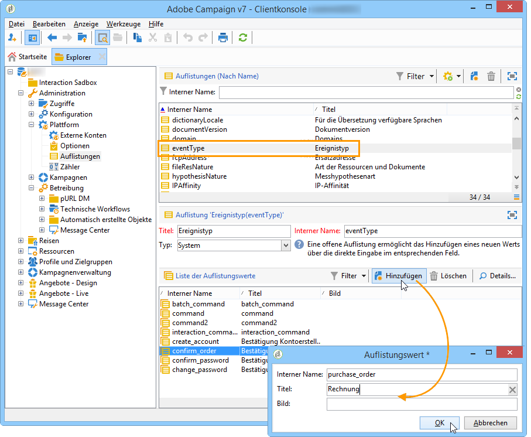

# Ereignistypen erstellen{#creating-event-types}

Die von Adobe Campaign zu verarbeitenden Ereignistypen müssen in der Kontrollinstanz erstellt werden. Gehen Sie hierzu in den Knoten **[!UICONTROL Administration > Plattform > Auflistungen]** des Navigationsbaums. Jedem Ereignistyp muss ein Wert in der Auflistung **[!UICONTROL eventType]** entsprechen. Es kann sich hierbei zum Beispiel um eine Bestellbestätigung, eine Passwortänderung oder den Versand einer Bestellung handeln.

Nähere Informationen erhalten Sie im Abschnitt [Auflistungsverwaltung](../../platform/using/managing-enumerations.md).

Melden Sie sich nach der Erstellung der Auflistungswerte von Ihrer Instanz ab und wieder an, damit die Änderungen berücksichtigt werden.
