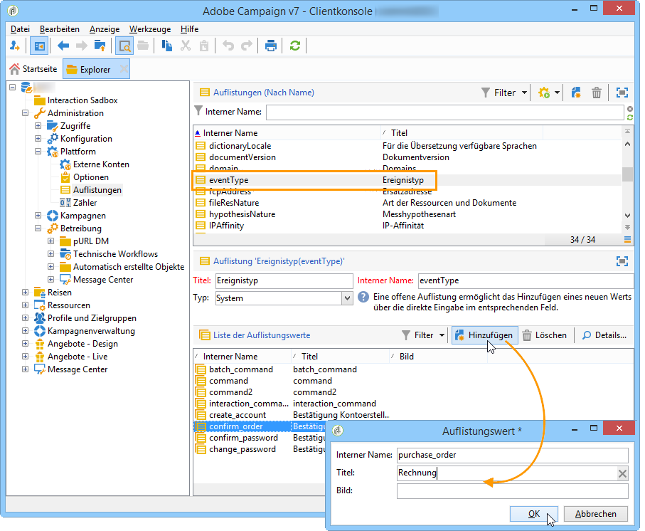

# Ereignistypen erstellen {#creating-event-types}

Um sicherzustellen, dass die einzelnen Ereignisse in eine personalisierte Nachricht umgewandelt werden können, müssen Sie zunächst **Ereignistypen** erstellen.

Wählen Sie dazu beim [Erstellen einer Nachrichtenvorlage](../../message-center/using/creating-the-message-template.md) den für die zu versendende Nachricht passenden Ereignistyp aus.

>[!IMPORTANT]
>
>Um in Nachrichtenvorlagen Ereignistypen verwenden zu können, müssen Sie diese zunächst erstellen.

Gehen Sie wie folgt vor, um Ereignistypen für die Verarbeitung in Adobe Campaign zu erstellen:

1. Melden Sie sich bei der **Kontrollinstanz** an.

1. Rufen Sie im Navigationsbaum den Ordner **[!UICONTROL Administration > Plattform > Aufzählungen]** auf.

1. Wählen Sie **[!UICONTROL Ereignistyp]** aus der Liste aus.

1. Klicken Sie auf **[!UICONTROL Hinzufügen]**, um einen Aufzählungswert zu erstellen. Hierbei kann es sich um eine Bestellbestätigung, eine Passwortänderung, eine Änderung des Bestellversands usw. handeln.

   

   >[!IMPORTANT]
   >
   >Jeder Ereignistyp muss mit einem Wert in der Aufzählung **[!UICONTROL Ereignistyp]** übereinstimmen.

1. Melden Sie sich nach der Erstellung der Auflistungswerte von Ihrer Instanz ab und wieder an, damit die Änderungen berücksichtigt werden.

>[!NOTE]
>
>Weitere Informationen zum **Arbeiten mit Auflistungen** finden Sie in der [Dokumentation zu Adobe Campaign v8 (Konsole)](https://experienceleague.adobe.com/de/docs/campaign/campaign-v8/config/settings/enumerations){target=_blank}.

