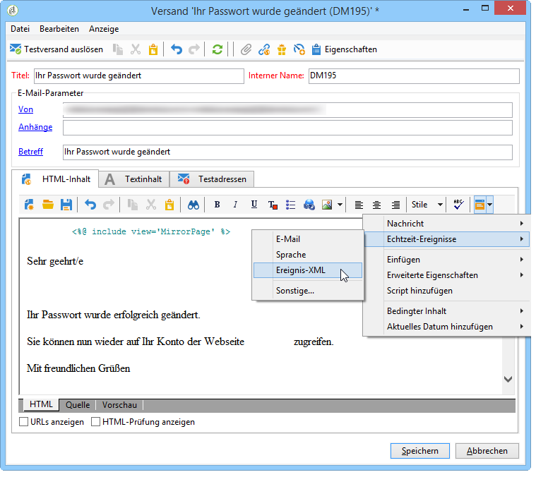
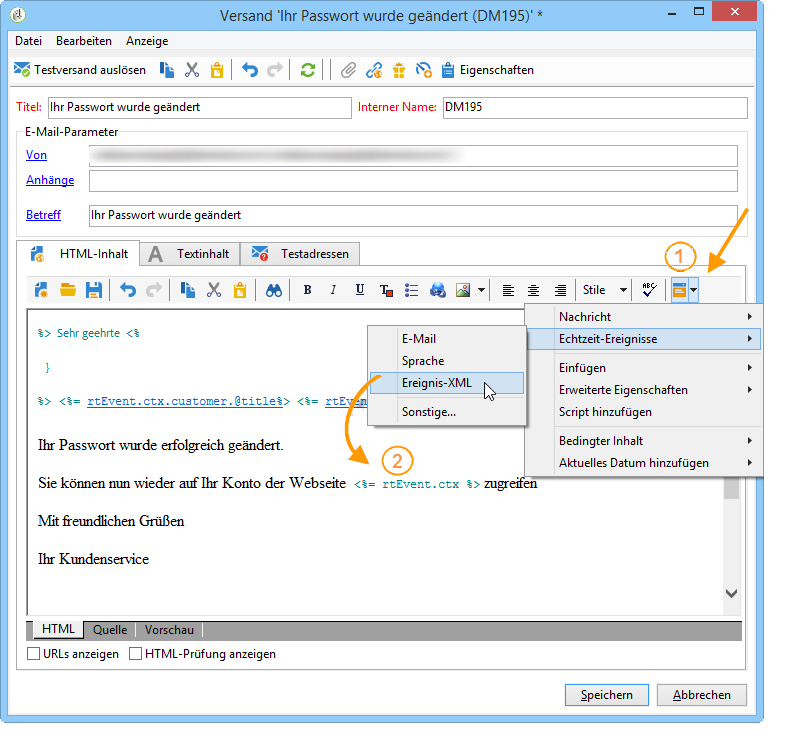
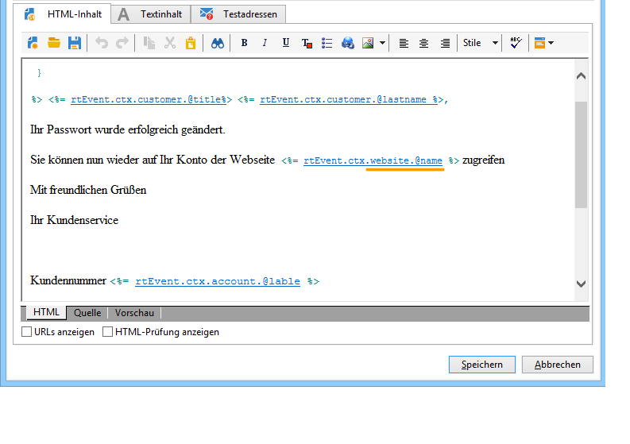

# Nachrichteninhalt erstellen{#creating-message-content}

Die Erstellung des Inhalts einer Transaktionsnachricht erfolgt nach dem gleichen Prinzip wie für einen klassischen Versand in Adobe Campaign. Für einen E-Mail-Versand können Sie zum Beispiel einen Inhalt im HTML- oder im Textformat erstellen und Anhänge hinzufügen oder den Betreff des Versands personalisieren. Mehr Informationen erhalten Sie im Kapitel [E-Mail-Versand](../../delivery/using/about-email-channel.md) des entsprechenden Handbuchs.

>[!CAUTION]
>
>In Nachrichten enthaltene Bilder müssen öffentlich zugänglich sein. Adobe Campaign verfügt über keinen Mechanismus zum Online-Stellen der Bilder für Transaktionsnachrichten.\
>Im Gegensatz zu JSSP oder webApp bietet `<%=` keine standardmäßige Escape-Funktion.
>
>In diesem Fall müssen Sie alle Daten, die aus dem Ereignis stammen, ordnungsgemäß maskieren. Dieses Escape-Sequenz hängt davon ab, wie dieses Feld verwendet wird. Verwenden Sie beispielsweise innerhalb einer URL encodeURIComponent. Für eine Anzeige im HTML-Code, können Sie escapeXMLString verwenden.

Integrieren Sie nach der Erstellung des Inhalts die Ereignisinformationen in den Nachrichten-Textkörper, um die Nachricht zu personalisieren. Verwenden Sie hierzu die zur Verfügung stehenden Personalisierungsfelder.

* Alle Personalisierungsfelder stammen aus den Nutzdaten.
* Es ist möglich, in einer Transaktionsnachricht auf einen oder mehrere Gestaltungsbausteine zu verweisen. Der Bausteininhalt wird während der Publikation in der Ausführungsinstanz zum Versandinhalt hinzugefügt.

Gehen Sie wie folgt vor, um Personalisierungsfelder in einen E-Mail-Nachrichteninhalt einzufügen:

1. Klicken Sie in der Nachrichtenvorlage auf den Tab, der dem E-Mail-Format entspricht (HMTL oder Text).
1. Verfassen Sie den Inhalt der Nachricht.
1. Fügen Sie das Personalisierungsfeld mithilfe des Menüs **[!UICONTROL Echtzeit-Ereignisse > Ereignis-XML]** ein.

   

1. Ergänzen Sie das Feld unter Einhaltung folgender Syntax: .**Elementname**.@**Attributname**. Beispiel:

   

