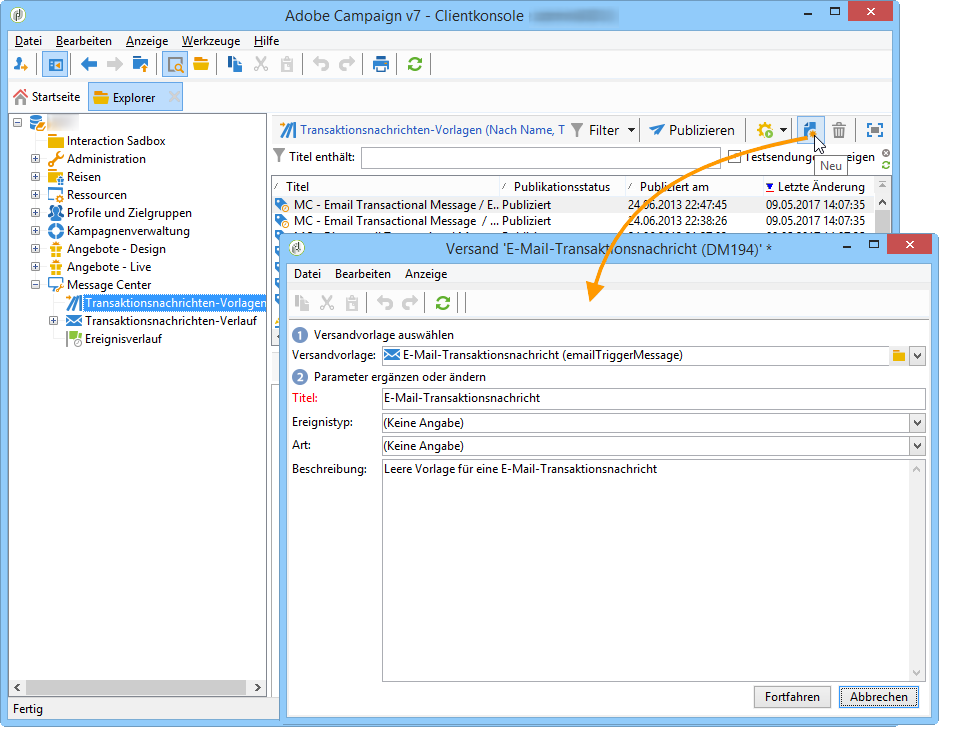
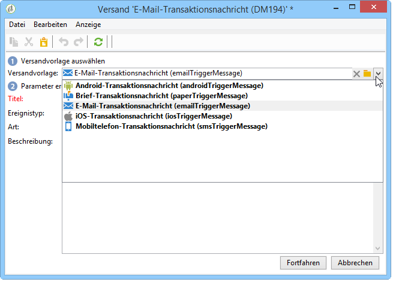
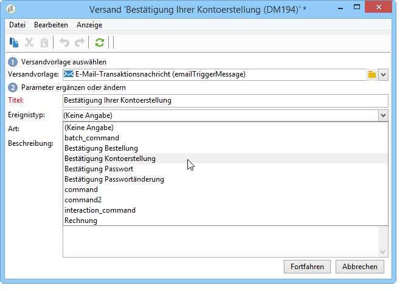

# Nachrichtenvorlagen erstellen{#creating-the-message-template}

1. Wechseln Sie zum **[!UICONTROL Message Center >Transactional message templates]** Ordner in der Adobe Campaign-Struktur.
1. In the list of transactional message templates, right-click and select **[!UICONTROL New]** in the drop-down menu or click the **[!UICONTROL New]** button above the list of transactional message templates.

   

1. Wählen Sie im Versand-Assistenten die Versandvorlage aus, die dem gewünschten Kommunikationskanal entspricht.

   

1. Ändern Sie bei Bedarf den Titel.
1. Wählen Sie den Ereignistyp aus, der der zu sendenden Nachricht entspricht.

   

   Ereignistypen müssen zuvor in der Konsole erstellt werden. For more on this, refer to [Creating event types](../../message-center/using/creating-event-types.md).

   >[!NOTE]
   >
   >Ein Ereignistyp sollte nie mit mehr als einer Vorlage verknüpft werden.

1. Enter a nature and a description, then click **[!UICONTROL Continue]** to create the message body (refer to [Creating message content](../../message-center/using/creating-message-content.md)).

   

