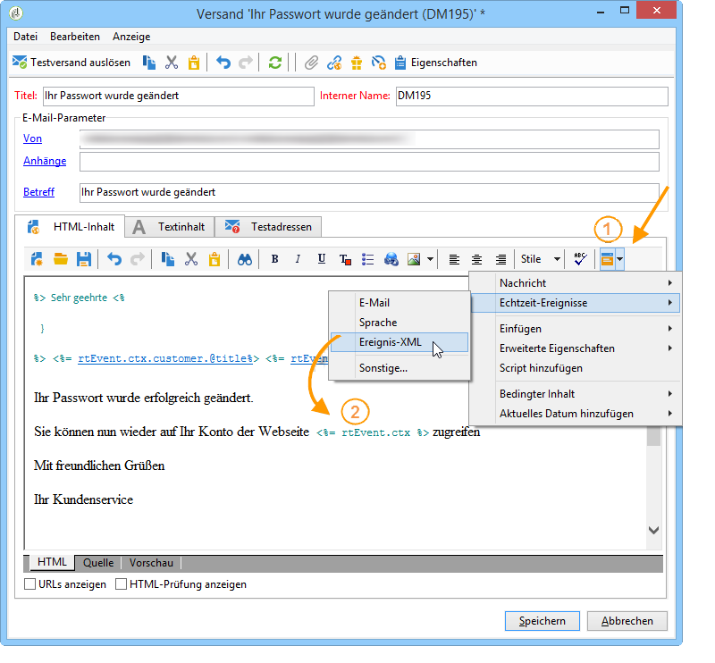

# Konzipieren von Transaktionsnachrichtenvorlagen {#creating-the-message-template}

Um sicherzustellen, dass alle Ereignisse in eine personalisierte Nachricht umgewandelt werden können, müssen Sie für die einzelnen Ereignistypen jeweils eine Nachrichtenvorlage erstellen.

>[!IMPORTANT]
>
>Zunächst müssen Ereignistypen erstellt werden. Weiterführende Informationen hierzu finden Sie unter [Ereignistypen erstellen](../../message-center/using/creating-event-types.md).

Transaktionsnachrichtenvorlagen enthalten die für die Personalisierung der Transaktionsnachricht erforderlichen Informationen. Sie können Vorlagen auch verwenden, um die Vorschau der Nachricht zu testen und einen Testversand an Testadressen zu senden, bevor Sie sie an die endgültige Zielgruppe versenden. Weiterführende Informationen hierzu finden Sie unter [Testen von Transaktionsnachrichtenvorlagen](../../message-center/using/testing-message-templates.md).

## Nachrichtenvorlage erstellen {#creating-message-template}

1. Wechseln Sie zum Knoten **[!UICONTROL Message Center > Transaktionsnachrichten-Vorlagen]** im Adobe Campaign-Navigationsbaum.

1. Klicken Sie mit der rechten Maustaste in die Liste der Vorlagen und wählen Sie **[!UICONTROL Neu]** im Kontextmenü aus oder klicken Sie direkt auf die Schaltfläche **[!UICONTROL Neu]** oberhalb der Liste.

   

1. Wählen Sie im Versand-Assistenten die Versandvorlage aus, die dem gewünschten Kommunikationskanal entspricht.

   

1. Ändern Sie bei Bedarf den Titel.

1. Wählen Sie den Ereignistyp aus, der der zu sendenden Nachricht entspricht.

   

   Ereignistypen müssen zuvor in der Konsole erstellt werden. Weiterführende Informationen hierzu finden Sie unter [Ereignistypen erstellen](../../message-center/using/creating-event-types.md).

   >[!IMPORTANT]
   >
   >Ein Ereignistyp kann nicht mit mehr als einer Vorlage verknüpft werden.

1. Geben Sie die Art sowie eine Beschreibung der Vorlage an und klicken Sie auf **[!UICONTROL Fortfahren]**, um den Nachrichteninhalt zu erstellen (siehe [Nachrichteninhalt erstellen](#creating-message-content)).

   

## Nachrichteninhalt erstellen {#creating-message-content}

Die Erstellung des Inhalts einer Transaktionsnachricht erfolgt nach dem gleichen Prinzip wie bei einem klassischen Versand in Adobe Campaign. Für einen E-Mail-Versand können Sie zum Beispiel einen Inhalt im HTML- oder Textformat erstellen und Anhänge hinzufügen oder den Betreff des Versands personalisieren. Weiterführende Informationen hierzu finden Sie im Kapitel zum [ E-Mail-Versand](../../delivery/using/about-email-channel.md).

>[!IMPORTANT]
>
>In Nachrichten enthaltene Bilder müssen öffentlich zugänglich sein. Adobe Campaign verfügt über keinen Mechanismus zum Online-Stellen der Bilder für Transaktionsnachrichten.\
>Im Gegensatz zu JSSP oder webApp bietet `<%=` keine standardmäßige Escape-Funktion.
>
>In diesem Fall müssen Sie alle Daten, die aus dem Ereignis stammen, ordnungsgemäß maskieren. Dieses Escape-Sequenz hängt davon ab, wie dieses Feld verwendet wird. Verwenden Sie beispielsweise innerhalb einer URL encodeURIComponent. Für eine Anzeige im HTML-Code, können Sie escapeXMLString verwenden.

Integrieren Sie nach der Erstellung des Inhalts die Ereignisinformationen in den Nachrichten-Textkörper, um die Nachricht zu personalisieren. Verwenden Sie hierzu die zur Verfügung stehenden Personalisierungsfelder.

* Alle Personalisierungsfelder stammen aus der Payload.
* Es ist möglich, in einer Transaktionsnachricht auf einen oder mehrere Gestaltungsbausteine zu verweisen. Der Bausteininhalt wird während der Veröffentlichung in der Ausführungsinstanz zum Versandinhalt hinzugefügt.

Gehen Sie wie folgt vor, um Personalisierungsfelder in einen E-Mail-Nachrichteninhalt einzufügen:

1. Klicken Sie in der Nachrichtenvorlage auf den Tab, der dem E-Mail-Format entspricht (HTML oder Text).

1. Verfassen Sie den Inhalt der Nachricht.

1. Fügen Sie das Personalisierungsfeld über das Menü **[!UICONTROL Echtzeit-Ereignisse > Ereignis-XML]** ein.

   

1. Ergänzen Sie das Feld unter Einhaltung folgender Syntax: .**Elementname**.@**Attributname**. Beispiel:

   

1. Speichern Sie Ihren Inhalt.

Sie können Ihre Nachricht jetzt [testen](../../message-center/using/testing-message-templates.md).
