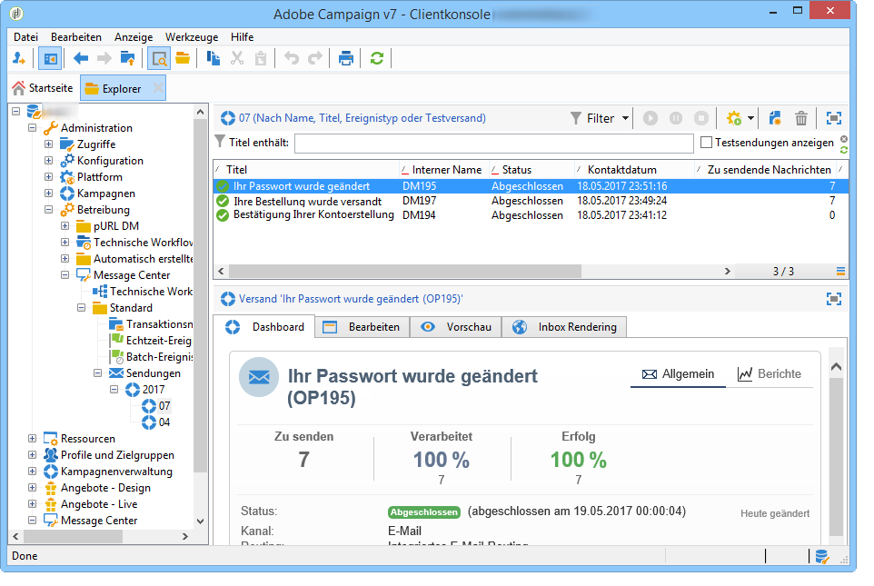
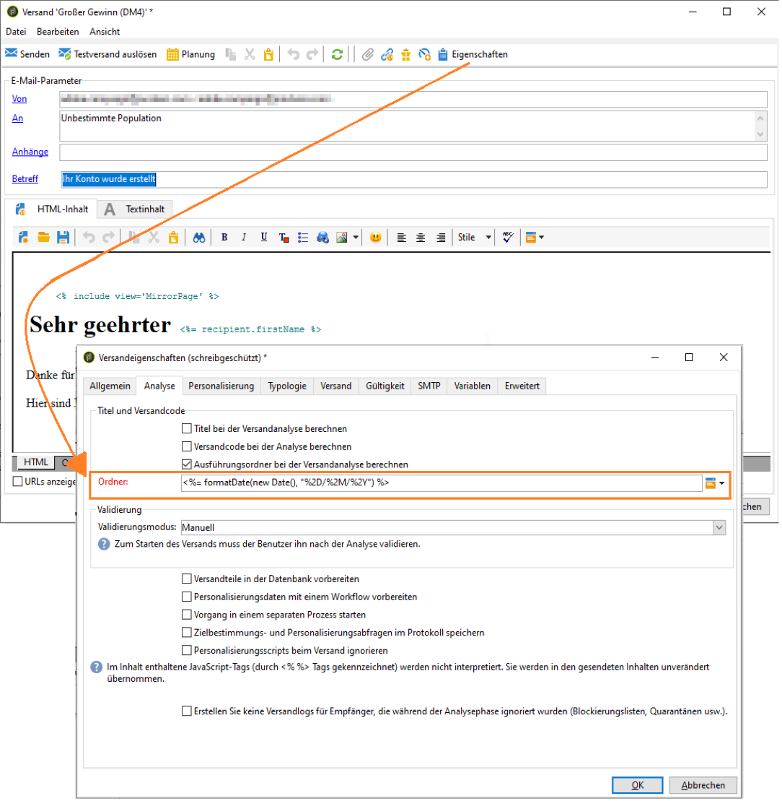

# Transaktionsnachrichten-Versand{#delivery-execution}

>[!NOTE]
>
>Im MTA hat die Verarbeitung von Transaktionsnachrichten Priorität vor allen anderen Sendungen.

Sobald die Anreicherung abgeschlossen ist und eine Versandvorlage mit dem Ereignis verknüpft wurde, erfolgt der Versand in der Ausführungsinstanz. Alle Sendungen werden im Ordner **[!UICONTROL Administration > Betreibung > Message Center > Standard > Sendungen]** gruppiert.

Sie werden standardmäßig in Unterordnern nach Versandmonat gruppiert.

Diese Gruppierung kann in den Eigenschaften der jeweiligen Nachrichtenvorlage wie im folgenden Beispiel geändert werden:

>[!NOTE]
>
>Bei gehosteten oder hybriden Installationen können nach einem Upgrade auf den Enhanced MTA auch alle Transaktionsmeldungen mit dem Adobe Campaign Enhanced MTA gesendet werden, um die Zustellbarkeit, den Durchsatz und die Bearbeitung von Bounces zu verbessern. Alle Folgen sind dieselben wie bei standardmäßigen Marketing-Nachrichten und werden im Dokument [Adobe Campaign Enhanced MTA](https://helpx.adobe.com/campaign/kb/acc-campaign-enhanced-mta.html) beschrieben.