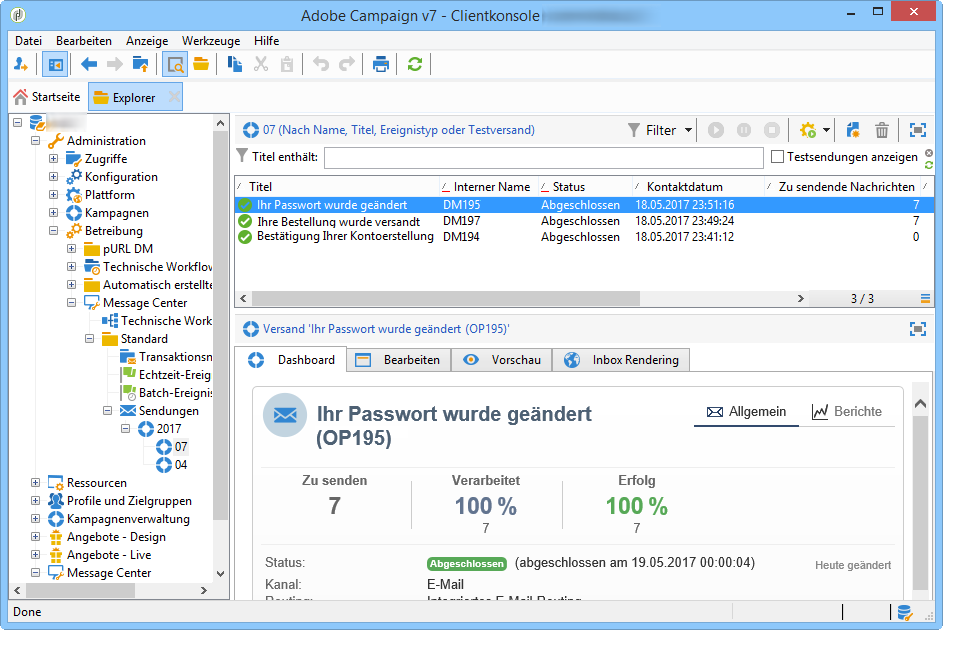
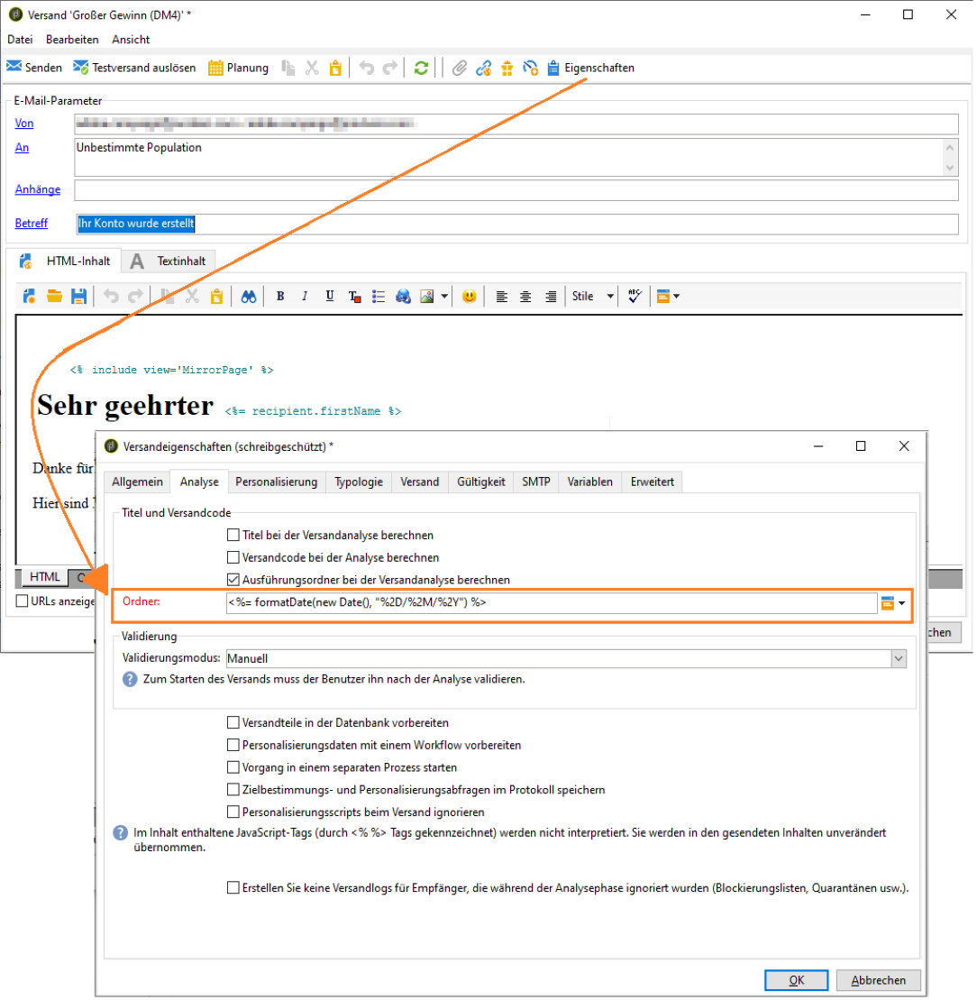

# Versandausführung {#delivery-execution}

## Senden von Transaktionsnachrichten {#transactional-message-send}

Sobald der Schritt der Anreicherung abgeschlossen ist und eine Versandvorlage mit dem Ereignis verknüpft wurde, erfolgt der Versand in der Ausführungsinstanz.

>[!NOTE]
>
>Im MTA hat die Verarbeitung von Transaktionsnachrichten Priorität vor allen anderen Sendungen.

Alle Sendungen werden im Ordner **[!UICONTROL Administration > Betreibung > Message Center > Standard > Sendungen]** gruppiert.

Sie werden standardmäßig in Unterordner nach Versandmonat unterteilt. Diese Gruppierung kann in den Eigenschaften der jeweiligen Nachrichtenvorlage wie im folgenden Beispiel geändert werden:

>[!NOTE]
>
>Bei gehosteten oder hybriden Installationen können nach einem Upgrade auf den [Enhanced MTA](../../delivery/using/sending-with-enhanced-mta.md) auch alle Transaktionsnachrichten mit dem Adobe Campaign Enhanced MTA gesendet werden, um die Zustellbarkeit, den Durchsatz und die Bearbeitung von Bounces zu verbessern. Alle Auswirkungen sind dieselben wie bei standardmäßigen Marketing-Nachrichten.

## Überwachung der Transaktionsnachrichten {#transactional-message-monitoring}

Zur Überwachung Ihrer Transaktionsnachrichten können Sie die [Versandlogs](https://experienceleague.adobe.com/de/docs/campaign/campaign-v8/send/monitor/delivery-dashboard#delivery-logs-and-history){target="_blank"} einsehen.

Die von der Ausführungsinstanz gesendeten Transaktionsnachrichten werden durch einen technischen Workflow (**[!UICONTROL Message Center-Ausführungsinstanz]**), der stündlich ausgeführt wird, wieder synchronisiert und in die Kontrollinstanz transferiert.

>[!NOTE]
>
>Die Sendungen sammeln die Ereignisse wöchentlich auf der Grundlage der neuesten Ereignisaktualisierung, und nicht am Erstellungsdatum des Ereignisses. Daher kann sich beim Extrahieren von Transaktionsnachrichten-Versandlogs in der Kontrollinstanz die mit jeder Versandlog-Kennung verknüpfte Versandkennung im Laufe der Zeit ändern, wenn das Log aktualisiert wird (z. B. wenn für das Ereignis ein eingehender Bounce empfangen wird).

<!--
The transactional deliveries sent from the execution instance are synchronized back to the control instance as follows.

Let's take a [delivery template](../../message-center/using/introduction.md) labelled *Template_1*.

1. An event corresponding to *Template_1* is received on the execution instance.
1. The **Processing real time events** (rtEventsProcessing) workflow processes the event and searches for an existing delivery for the current month.

    >[!NOTE]
    >
    >If not found, a new delivery is created and the event is assigned to the new delivery.

1. The transactional email is sent and the delivery status changes to **[!UICONTROL Sent]**.
1. The **Message Center execution instance** (mcSync_mcExec) workflow retrieves the delivery logs from the execution instance and updates the delivery logs on the control instance.
1. The control instance searches for an existing delivery for week 40 (2020-09-28_Template_1).

    >[!NOTE]
    >
    >If not found, a new delivery is created.

1. The week after, an inbound bounce is received for the event.
1. The status of the event changes to **[!UICONTROL Delivery failed]**.
1. The **Message Center execution instance** (mcSync_mcExec) workflow retrieves the delivery logs from the execution instance and searches for a delivery for week 41 (2020-10-05_Template_1) to update the delivery logs. The delivery logs are then linked to a new delivery for the current week.

To summarize, the deliveries weekly accumulate the events based on the latest event update, and not on the event creation date.

Therefore, when extracting transactional messaging delivery logs from the control instance, the delivery ID associated with each delivery log ID changes every week.

-->

Näheres zum Thema Überwachung der Aktivitäten und Ausführung der Ausführungsinstanz(en) finden Sie unter [Berichte zu Transaktionsnachrichten](../../message-center/using/about-transactional-messaging-reports.md).
