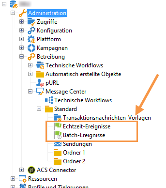

# Ereignisabruf{#event-collection}

Die vom Informationssystem erzeugten Ereignisse können auf zwei Weisen abgerufen werden:

* Durch Aufrufe der SOAP-Methoden können Sie Ereignis in Adobe Campaign verschieben: Mit der PushEvent-Methode können Sie ein Ereignis gleichzeitig senden. Mit der PushEvents-Methode können Sie mehrere gleichzeitig senden. Siehe [Ereignisbeschreibung](../../message-center/using/event-description.md).
* Creating a workflow lets you recover events by importing files or via an SQL gateway (with the **Federated Data Access** option).

Nach dem Abruf werden die Ereignisse von den technischen Workflows auf die Echtzeit- und Batch-Warteschlangen der Instanzen verteilt, bis sie einer Nachrichtenvorlage zugeordnet werden.

