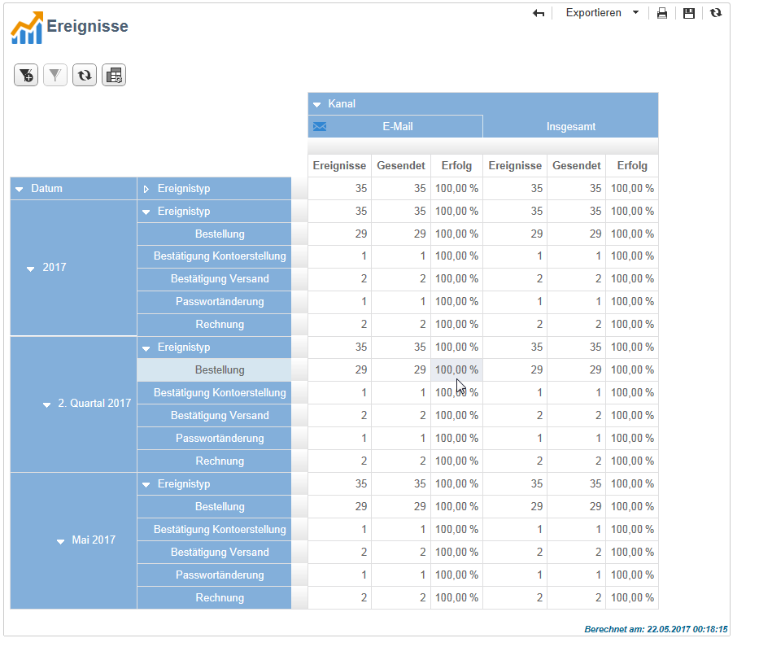

# Ereignisverlauf{#history-of-message-center-events}

The **[!UICONTROL History of Message Center events]** report provides you with an overview of the Message Center activity, i.e. the number of events processed and delivered as transactional messages.

Beim Öffnen des Berichts entsprechen die standardmäßig angezeigten Daten der Rate der erfolgreich gesendeten Transaktionsnachrichten. Sie können die unterschiedlichen Knoten aufklappen, um weitere Ebenen anzuzeigen. Fahren Sie mit dem Mauszeiger über eine Ebene, um sie hervorzuheben.

Sie können die für jeden Ereignistyp spezifischen Daten pro Zeitraum anzeigen. Die **[!UICONTROL Events]** Spalte entspricht der Anzahl der Ereignisse, die pro Kontrollinstanz empfangen wurden. Die Anzahl der Ereignisse, die in personalisierte Transaktionsnachrichten umgewandelt werden, wird in der **[!UICONTROL Sent]** Spalte detailliert beschrieben.

Der **[!UICONTROL History of Message Center events]** Bericht ist ein Bericht zum Pivot-Tabellentyp. For more on this, refer to the [Analyzing populations](../../reporting/using/about-descriptive-analysis.md) section.
