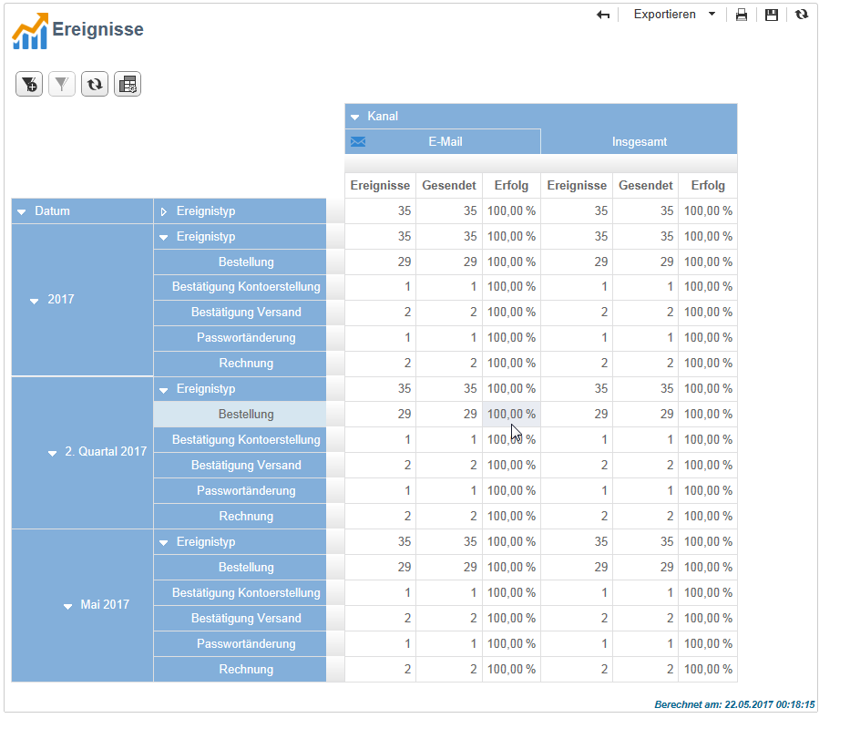

# Message Center-Ereignisverlauf{#history-of-message-center-events}

Der Bericht **[!UICONTROL Ereignisverlauf]** bietet eine Übersicht über die Message-Center-Aktivitäten, d. h. die Anzahl der verarbeiteten Ereignisse und der versendeten Transaktionsnachrichten.

Wenn der Bericht geöffnet wird, entsprechen die standardmäßig angezeigten Informationen der Rate der erfolgreich gesendeten Transaktionsnachrichten. Um weitere Ebenen anzuzeigen, können Sie die verschiedenen Knoten öffnen und den Cursor auf der entsprechenden Ebene platzieren, um sie auszuwählen.

Sie haben zudem die Möglichkeit, für jeden Zeitraum die Daten jedes Ereignisses zu visualisieren. Die Spalte **[!UICONTROL Ereignisse]** entspricht der Anzahl von der Kontrollinstanz empfangenen Ereignisse. In der Spalte **[!UICONTROL Gesendet]** werden die als Reaktion auf die Ereignisse gesendeten personalisierten Transaktionsnachrichten berechnet.

Der Bericht **[!UICONTROL Ereignisverlauf]** ist eine Pivot-Tabelle. Nähere Informationen hierzu erhalten Sie im Abschnitt [Populationen analysieren](../../reporting/using/about-descriptive-analysis.md).
