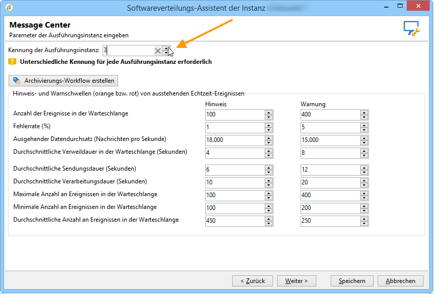

# Ausführungsinstanzen identifizieren{#identifying-execution-instances}

Jeder Instanz muss eine eindeutige Kennung zugewiesen werden, um den Verlauf der einzelnen Ausführungsinstanzen zu unterscheiden, wenn Sie sie in der Kontrollinstanz anzeigen. Dieser Schritt ist obligatorisch, auch wenn Ihre Kontroll- und Ausführungsinstanzen auf demselben Gerät installiert sind. Diese Kennung kann für jede Ausführungsinstanz manuell (über den Softwareverteilungs-Assistenten) oder automatisch zugewiesen werden, indem Sie in der Kontrollinstanz auf die Schaltfläche **Verbindung initialisieren** klicken (siehe [Kontrollinstanz](../../message-center/using/creating-a-shared-connection.md#control-instance)).

Um die Kennung manuell zuzuordnen, starten Sie den Softwareverteilungs-Assistenten in jeder Ausführungsinstanz und tragen Sie im Fenster **[!UICONTROL Message Center]** der Instanz eine Kennung Ihrer Wahl ein.

