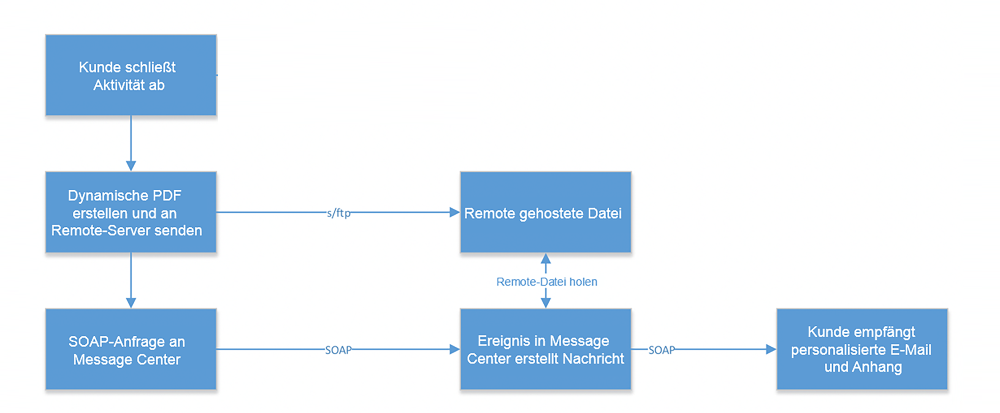

# Umsetzung{#implementation}

In diesem Diagramm sind die für dieses Anwendungsbeispiel benötigten Schritte zu sehen.



Erstellen Sie zunächst Ihren Anhang. Lesen Sie dazu diesen [Artikel](../../delivery/using/attaching-files.md#attach-a-personalized-file). Damit können Sie die Dateien an eine E-Mail anhängen, selbst wenn sie nicht in der Ausführungsinstanz gehostet werden.

Sie können E-Mails über einen SOAP-Meldungsauslöser senden. Weitere Informationen zu SOAP-Anforderungen finden Sie unter [Ereignisbeschreibung](../../message-center/using/event-description.md). Im SOAP-Aufruf gibt es einen URL-Parameter (attachmentURL).

Klicken Sie beim Entwerfen Ihrer E-Mail auf **[!UICONTROL Attachment]** . Geben Sie im **[!UICONTROL Attachment definition]** Bildschirm den Parameter SOAP-Anlage ein:

```
<%= rtEvent.ctx.attachementUrl %>
```

Bei der Verarbeitung/Auslieferung der Nachricht ruft das System die Datei vom Remote-Speicherort (Drittpartei-Server) ab und hängt sie an die jeweilige Nachricht an.

Da es sich bei diesem Parameter um eine Variable handeln kann, sollte sie die über den SOAP-Aufruf gesendete vollständige Remote-URL-Variable Ihrer Datei akzeptieren.


