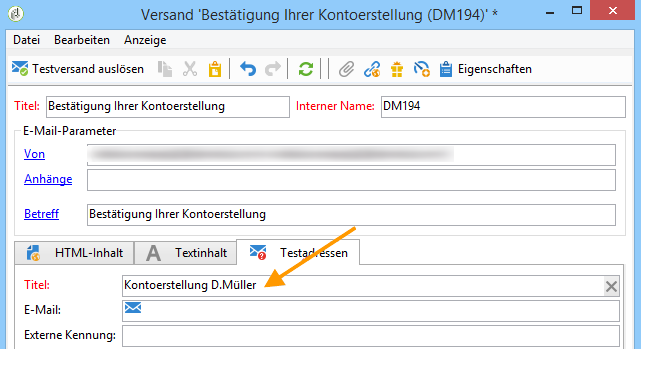
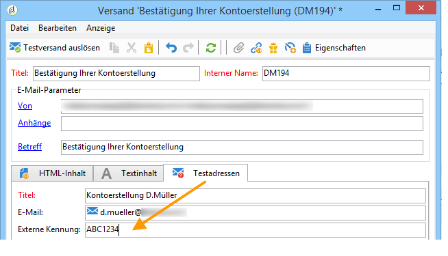

# Testadressen in Transaktionsnachrichten verwalten{#managing-seed-addresses-in-transactional-messages}

Testadressen dienen dazu, eine Nachrichtenvorschau zu erzeugen, Testsendungen auszuführen und die Personalisierung der Nachricht vor dem eigentlichen Versand per E-Mail, SMS oder Mobile Apps zu prüfen. Sie werden für jeden Versand separat erstellt und können nicht in mehreren Sendungen verwendet werden.

## Erstellen von Testadressen {#creating-a-seed-address}

1. Gehen Sie in den Tab **[!UICONTROL Testadressen]** der Transaktionsnachrichten-Vorlage.

   

1. Erfassen Sie einen Titel, um die Adresse später bei der Vorschauerstellung auswählen zu können.

   

1. Geben Sie die Testadresse an, je nach Versandkanal eine E-Mail-Adresse oder eine Mobiltelefonnummer.

   

1. Geben Sie eine externe Kennung an. Dieses optionale Feld dient dazu, einen allen Anwendungen Ihrer Webseite gemeinsamen, benutzerdefinierten Schlüssel zu vergeben (eindeutige Kennung, Name + E-Mail etc.), um Ihre Profile zu identifizieren. Wenn dieses Feld auch in der Adobe-Campaign-Datenbank vorhanden ist, haben Sie die Möglichkeit, Ereignisse mit Profilen der Datenbank abzustimmen.

   

1. Fügen Sie Testdaten ein (siehe [Personalisierungsdaten](../../message-center/using/personalization-data.md)).

   

   <!--## Creating several seed addresses {#creating-several-seed-addresses}-->
1. Klicken Sie auf den Link **[!UICONTROL Testadressen ergänzen]** und anschließend auf die Schaltfläche **[!UICONTROL Hinzufügen]**.

   

   <!--1. Follow the configuration steps for a seed address detailed in the [Creating a seed address](#creating-a-seed-address) section.-->
1. Wiederholen Sie diesen Vorgang, um beliebig viele weitere Testadressen zu erstellen.

   

Sobald die Adressen erstellt wurden, können Sie eine Vorschau der Nachricht und ihrer Personalisierung erzeugen. Siehe [Transaktionsnachrichten-Vorschau](../../message-center/using/transactional-message-preview.md).
