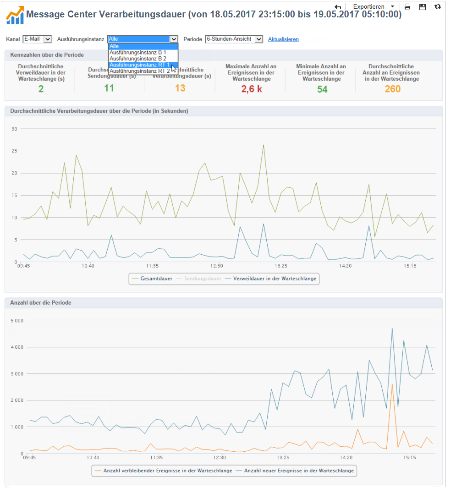

# Verarbeitungsdauer{#message-center-processing-time}

Dieser Bericht zeigt die wichtigsten Kennzahlen für die Echtzeit-Warteschlange. Der für erfahrene Benutzer bestimmte Bericht ist auch über die Rubrik **[!UICONTROL Monitoring]** der Kontrollinstanz zugänglich.

Wie auch im Bericht **[!UICONTROL Message Center Dienstqualität]** können entweder allgemeine oder auf eine bestimmte Ausführungsinstanz bezogene Statistiken angezeigt werden. Die im Bereich **[!UICONTROL Kennzahlen über die Periode]** angezeigten Kennzahlen werden entsprechend dem gewählten Zeitraum gefiltert:

* **[!UICONTROL Durchschnittliche Verweildauer in der Warteschlange (s)]**: Durchschnittliche Dauer, die erfolgreich verarbeitete Ereignisse in Message Center verbringen. Es wird nur die Verarbeitungsdauer berücksichtigt.
* **[!UICONTROL Durchschnittliche Sendungsdauer (s)]**: Durchschnittliche Dauer, die erfolgreich verarbeitete Ereignisse in Message Center verbringen. Es wird nur die Dauer des Versands durch die MTAs berücksichtigt.
* **[!UICONTROL Durchschnittliche Verarbeitungsdauer (s)]**: Durchschnittliche Dauer, die erfolgreich verarbeitete Ereignisse in Message Center verbringen. Die Berechnung berücksichtigt die Verarbeitungs- und MTA-Versanddauer.
* **[!UICONTROL Maximale Anzahl an Ereignissen in der Warteschlange]**: Maximale Anzahl der zum gleichen Zeitpunkt in der Message-Center-Warteschlange vorhandenen Ereignisse.
* **[!UICONTROL Minimale Anzahl an Ereignissen in der Warteschlange]**: Minimale Anzahl der zum gleichen Zeitpunkt in der Message-Center-Warteschlange vorhandenen Ereignisse.
* **[!UICONTROL Durchschnittliche Anzahl an Ereignissen in der Warteschlange]**: Durchschnittliche Anzahl der zum gleichen Zeitpunkt in der Message-Center-Warteschlange vorhandenen Ereignisse.

>[!NOTE]
>
>Die Hinweis- und Warnschwellen (orange bzw. rot) der Kennzahlen können im Software-Verteilungs-Assistenten von Adobe Campaign konfiguriert werden. Siehe [Überwachungsschwellen](../../message-center/using/monitoring-thresholds.md).

