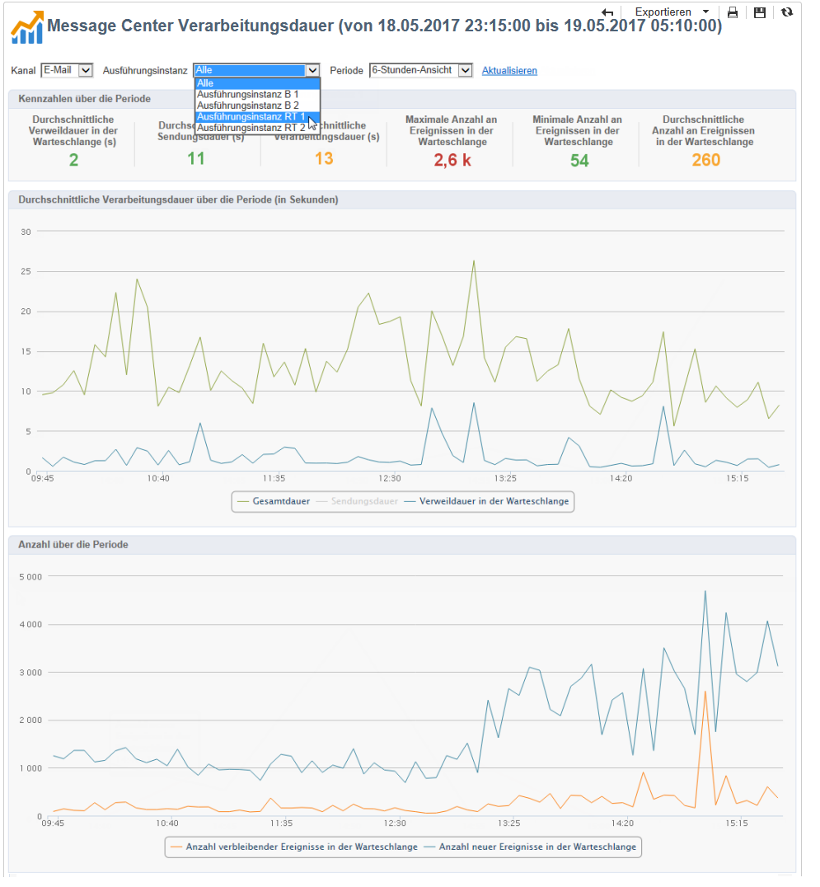

# Message Center-Verarbeitungsdauer {#message-center-processing-time}

Dieser Bericht zeigt die wichtigsten Indikatoren für die Echtzeit-Warteschlange an.

Auf diesen Bericht, der sich an technische Administratoren richtet, kann auch über den Tab **[!UICONTROL Monitoring]** der Kontrollinstanz zugegriffen werden.

Wie auch beim Bericht **[!UICONTROL Message Center Dienstqualität]** können Sie entweder die Gesamtstatistik oder die Statistiken einer bestimmten Ausführungsinstanz anzeigen. Sie können die Daten auch nach Kanal und nach einem bestimmten Zeitraum filtern.

Die im Bereich **[!UICONTROL Kennzahlen über den Zeitraum]** angezeigten Indikatoren werden für den ausgewählten Zeitraum berechnet:

* **[!UICONTROL Durchschnittliche Verweildauer in der Warteschlange]** : Durchschnittliche Dauer, die erfolgreich verarbeitete Ereignisse in Message Center verbringen. Dabei wird nur die Verarbeitungszeit berücksichtigt.
* **[!UICONTROL Durchschnittliche Sendungsdauer(en)]** : Durchschnittliche Dauer, die erfolgreich verarbeitete Ereignisse in Message Center verbringen. Es wird nur die MTA-Versandzeit berücksichtigt.
* **[!UICONTROL Durchschnittliche Verarbeitungszeit(en)]** : Durchschnittliche Zeit, die erfolgreich verarbeitete Ereignisse in Message Center verbringen. Die Berechnung berücksichtigt die Verarbeitungszeit und die MTA-Versandzeit.
* **[!UICONTROL Maximale Anzahl an Ereignissen in der Warteschlange]**: Maximale Anzahl der zum gleichen Zeitpunkt in der Message-Center-Warteschlange vorhandenen Ereignisse.
* **[!UICONTROL Minimale Anzahl an Ereignissen in der Warteschlange]**: Minimale Anzahl der zum gleichen Zeitpunkt in der Message-Center-Warteschlange vorhandenen Ereignisse.
* **[!UICONTROL Durchschnittliche Anzahl an Ereignissen in der Warteschlange]**: Durchschnittliche Anzahl der zum gleichen Zeitpunkt in der Message-Center-Warteschlange vorhandenen Ereignisse.

>[!NOTE]
>
>Die Hinweis- und Warnschwellen (orange bzw. rot) der Kennzahlen können im Bereitstellungassistenten von Adobe Campaign konfiguriert werden. Siehe [Überwachungsschwellen](../../message-center/using/additional-configurations.md#monitoring-thresholds).
