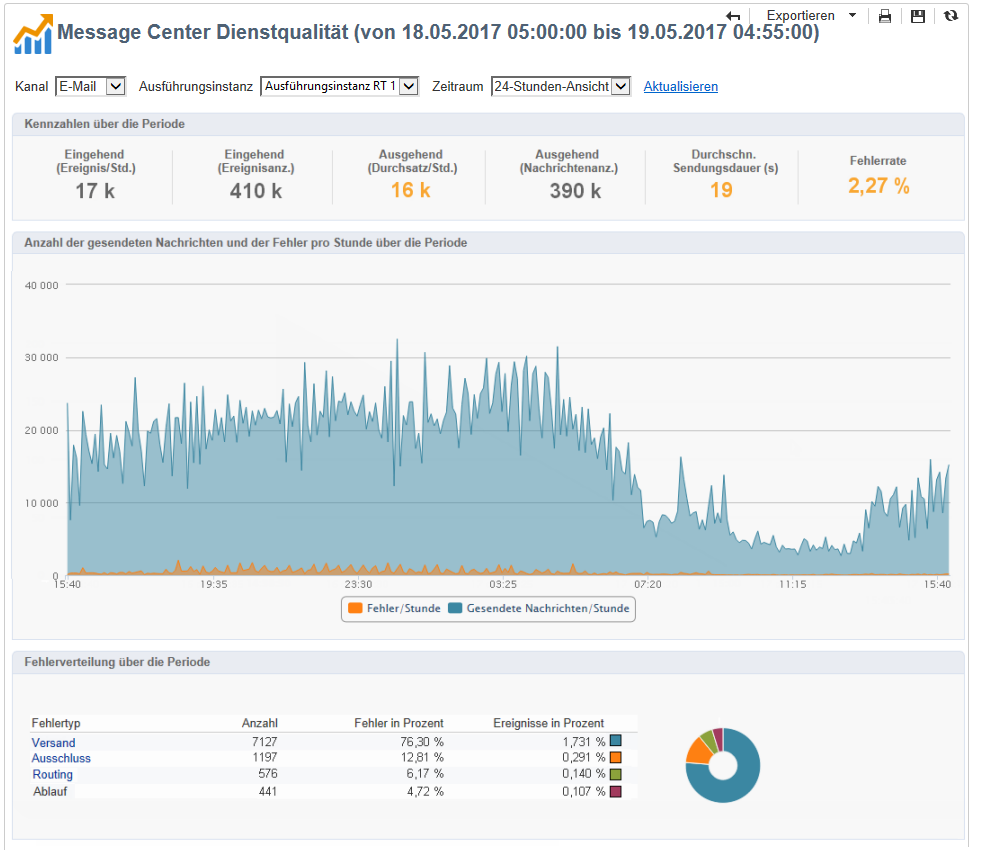

# Dienstqualität{#message-center-service-level}

Dieser Bericht enthält die Versandstatistiken der Transaktionsnachrichten sowie die Fehlerverteilung. Durch Klick auf einen Fehlertyp werden Details angezeigt. Dieser für erfahrene Benutzer bestimmte Bericht ist auch über die Rubrik **[!UICONTROL Monitoring]** der Kontrollinstanz zugänglich.

Sie können entscheiden, ob Sie in diesem Bericht allgemeine oder auf eine bestimmte Ausführungsinstanz bezogene Statistiken anzeigen möchten. Zudem ist es möglich, die Daten nach Kanal und einem Zeitraum zu filtern. Die im Bereich **[!UICONTROL Kennzahlen über die Periode]** angezeigten Kennzahlen werden entsprechend dem gewählten Zeitraum gefiltert:

* **[!UICONTROL Eingehend (Ereignis/Std.)]**: Durchschnittliche Anzahl der pro Stunde neu in die Message-Center-Warteschlange eingereihten Ereignisse.
* **[!UICONTROL Eingehend (Ereignisanz.)]**: Anzahl der neuen Ereignisse in der Warteschlange.
* **[!UICONTROL Ausgehend (Durchsatz/Std.)]**: Durschnittliche Anzahl der pro Stunde erfolgreich aus Message Center entlassenen Ereignisse (über einen Versand).
* **[!UICONTROL Ausgehend (Nachrichtenanz.)]**: Anzahl der erfolgreich aus Message Center entlassenen Nachrichten (über einen Versand).
* **[!UICONTROL Durchschnittliche Sendungsdauer (Sekunden)]**: Durchschnittliche Dauer, die erfolgreich verarbeitete Ereignisse in Message Center verbringen. Die Berechnung berücksichtigt die Verarbeitungs- und MTA-Versanddauer.
* **[!UICONTROL Fehlerrate]**: Anzahl fehlerhafter Ereignisse im Vergleich zur Anzahl der Neuzugänge in der Message-Center-Warteschlange. Folgende Fehler werden berücksichtigt: Routing-Fehler, Ereignis ist abgelaufen (zu lange in der Warteschlange verbliebenes Ereignis), Versandfehler, Vom Versand ignoriert (Quarantäne etc.).

>[!NOTE]
>
>Die Hinweis- und Warnschwellen (orange bzw. rot) der Kennzahlen können im Softwareverteilungs-Assistenten konfiguriert werden. Siehe [Überwachungsschwellen](../../message-center/using/monitoring-thresholds.md).

