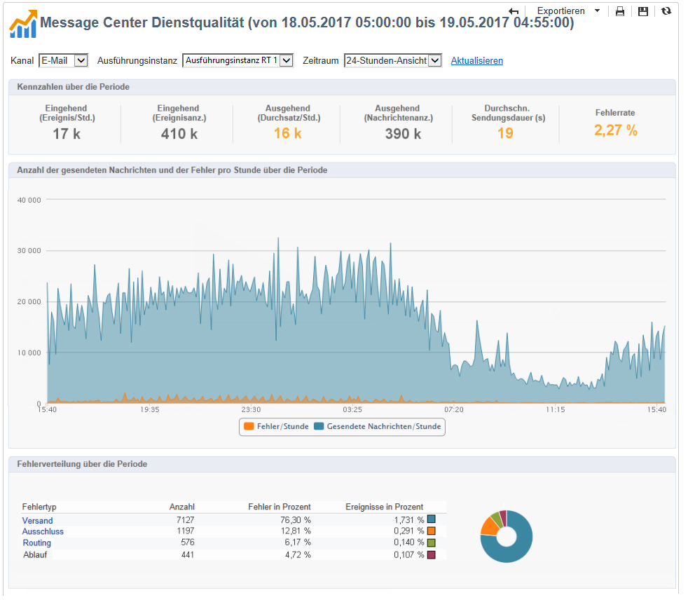

# Message Center-Dienstqualität {#message-center-service-level}

Dieser Bericht zeigt die Versandstatistiken der Transaktionsnachrichten sowie die Fehleraufschlüsselung an. Sie können auf einen Fehlertyp klicken, um dessen Details anzuzeigen.

Auf diesen Bericht, der sich an technische Administratoren richtet, kann auch über den Tab **[!UICONTROL Monitoring]** der Kontrollinstanz zugegriffen werden.

In diesem Bericht können Sie entweder die Gesamtstatistik oder die Statistiken anzeigen, die sich auf eine bestimmte Ausführungsinstanz beziehen. Sie können die Daten auch nach Kanal und nach einem bestimmten Zeitraum filtern.

Die im Bereich **[!UICONTROL Kennzahlen über den Zeitraum]** angezeigten Indikatoren werden für den ausgewählten Zeitraum berechnet:

* **[!UICONTROL Eingehend (Ereignis/Std.)]**: Durchschnittliche Anzahl der pro Stunde neu in die Message-Center-Warteschlange eingereihten Ereignisse.
* **[!UICONTROL Eingehend (Ereignisanz.)]**: Anzahl der neuen Ereignisse in der Warteschlange.
* **[!UICONTROL Ausgehend (Durchsatz/Std.)]**: Durschnittliche Anzahl der pro Stunde erfolgreich aus Message Center entlassenen Ereignisse (über einen Versand).
* **[!UICONTROL Ausgehend (Nachrichtenanz.)]**: Anzahl der erfolgreich aus Message Center entlassenen Nachrichten (über einen Versand).
* **[!UICONTROL Durchschnittliche Sendungsdauer (Sekunden)]** : Durchschnittliche Dauer, die erfolgreich verarbeitete Ereignisse in Message Center verbringen. Die Berechnung berücksichtigt die Verarbeitungszeit und die MTA-Versandzeit.
* **[!UICONTROL Fehlerrate]** : Anzahl der fehlerhaften Ereignisse im Vergleich zur Anzahl der Ereignisse, die in die Message-Center-Warteschlange eingereiht wurden. Folgende Fehler werden berücksichtigt: Routing-Fehler, Ereignis ist abgelaufen (zu lange in der Warteschlange verbliebenes Ereignis), Versandfehler, vom Versand ignoriert (Quarantäne usw.).

>[!NOTE]
>
>Die Hinweis- und Warnschwellen (orange bzw. rot) der Kennzahlen können im Bereitstellungassistenten konfiguriert werden. Siehe [Überwachungsschwellen](../../message-center/using/additional-configurations.md#monitoring-thresholds).
