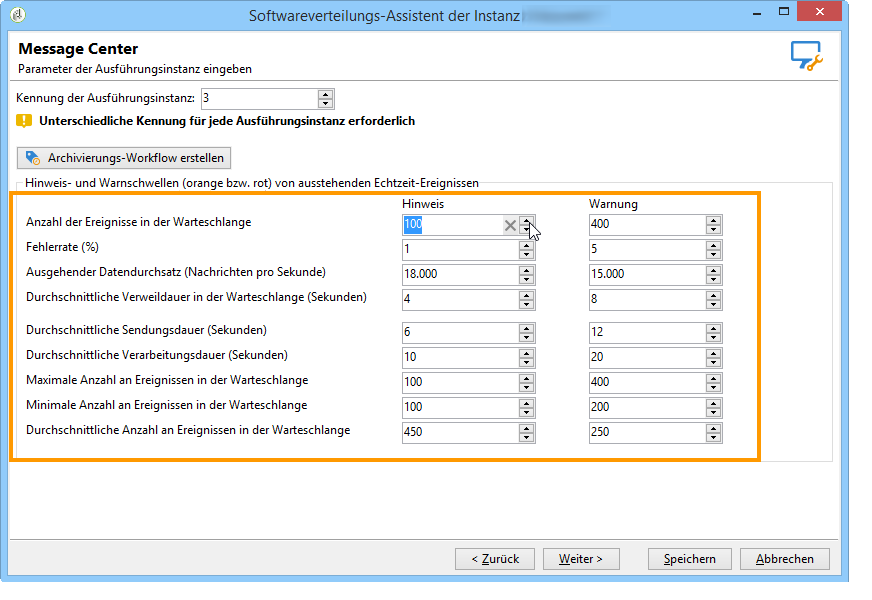

# Überwachungsschwellen{#monitoring-thresholds}

Sie können die Hinweis- und Warnschwellen der Kennzahlen konfigurieren (orange bzw. rot), die in den Berichten **Message Center Dienstqualität** und **Message Center Verarbeitungsdauer** angezeigt werden (siehe [Über Transaktionsnachrichten-Berichte](../../message-center/using/about-transactional-messaging-reports.md)). Öffnen Sie dazu den Softwareverteilungs-Assistenten der Ausführungsinstanz, wechseln Sie zur Seite **[!UICONTROL Message Center]** und verwenden Sie die Pfeile, um die Schwellenwerte zu ändern.

>[!NOTE]
>
>Die Anzahl der Ereignisse in der Warteschlange wird im Bereich [Systemindikator](../../production/using/monitoring-processes.md#system-indicators) der Prozessüberwachungsseite von Adobe Campaign angezeigt. Weiterführende Informationen zum Softwareverteilungs-Assistenten finden Sie in [diesem Abschnitt](../../installation/using/deploying-an-instance.md#deployment-wizard).

