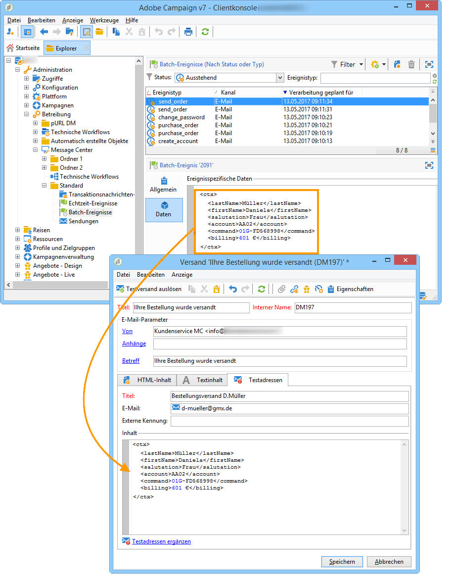
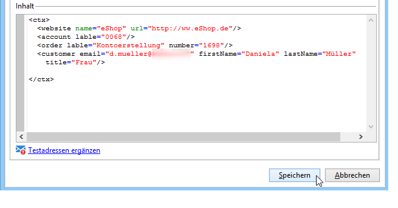

# Personalisierungsdaten{#personalization-data}

Mithilfe der im Testadressen-Tab der Nachrichtenvorlage angegebenen Daten kann die Personalisierung der Transaktionsnachrichten getestet werden, indem Sie eine Vorschau erzeugen oder einen Testversand durchführen. Mit Installation des Moduls **Zustellbarkeits-Monitoring** ermöglichen diese Daten zudem die Überprüfung der Nachrichtendarstellung bei unterschiedlichen E-Mail-Anbietern (**Inbox Rendering**, siehe hierzu [diesen Abschnitt](../../delivery/using/about-deliverability.md)).

Diese Daten dienen nur dazu, die Nachrichten vor dem eigentlichen Versand zu testen und entsprechen nicht den tatsächlich von Message Center verarbeiteten Daten. Ihre XML-Struktur muss jedoch identisch mit der des in der Ausführungsinstanz gespeicherten Ereignisses sein, wie im folgenden Beispiel:

Diese Informationen erlauben die Personalisierung des Nachrichteninhalts mithilfe von Personalisierungsfeldern (siehe hierzu den Abschnitt [Nachrichteninhalt erstellens](../../message-center/using/creating-message-content.md)).

1. Klicken Sie in der Nachrichtenvorlage auf den Tab **[!UICONTROL Testadressen]**.
1. Geben Sie im Inhalt des Ereignisses die Testinformationen im XML-Format ein.

   

