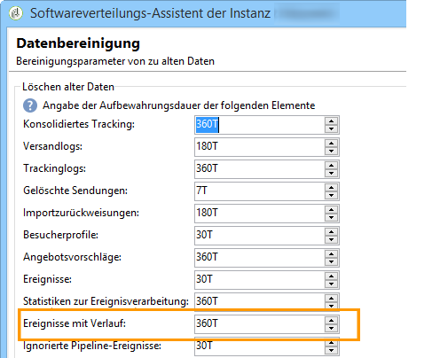
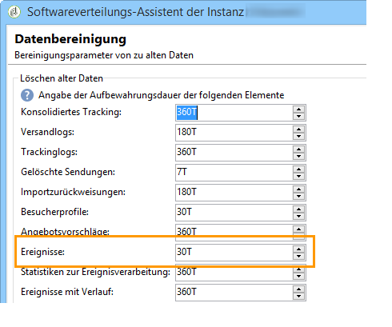

# Ereignislöschung{#purging-events}

Die Dauer der Speicherung der Ereignisse in der Datenbank kann ebenfalls über den Softwareverteilungs-Assistenten konfiguriert werden.

Die Bereinigung der Ereignisse wird automatisch vom Workflow **[!UICONTROL Datenbankbereinigung]** durchgeführt. Es handelt sich dabei um die in den Ausführungsinstanzen empfangenen und gespeicherten sowie die in der Kontrollinstanz mit Verlauf gespeicherten Ereignisse.

Um die Bereinigungsparameter zu ändern, nutzen Sie die aufsteigenden und absteigenden Pfeile.

Bereinigungsparameter in Kontrollinstanzen:

Bereinigungsparamter in Ausführungsinstanzen:

Weiterführende Informationen zum Datenbankbereinigungs-Workflows finden Sie in [diesem Abschnitt](../../production/using/database-cleanup-workflow.md).
