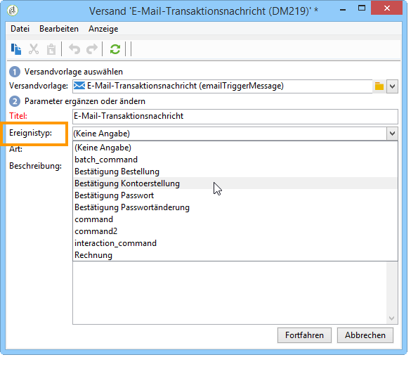

# Weiterleitung zu Vorlagen{#routing-towards-a-template}

Wenn eine Nachrichtenvorlage auf der oder den Ausführungsinstanz(en) veröffentlicht wurde, werden jeweils zwei Vorlagen automatisch erzeugt, die Echtzeit- bzw. Batch-Ereignissen zugeordnet werden. Bei der Weiterleitung des Ereignisses wird dieses der ihm entsprechenden Vorlage zugeordnet. Die Zuordnung von Ereignis und Nachrichtenvorlage hängt von dem in den Eigenschaften des Ereignisses und der Vorlage festgelegten Ereignistyp ab.

Bestimmung des Ereignistyps in den Ereigniseigenschaften:

Bestimmung des Ereignistyps in den Vorlageneigenschaften:

Standardmäßig basiert die Weiterleitung auf folgenden Informationen:

* dem Ereignistyp
* dem verwendeten Kanal (standardmäßig: E-Mail)
* der auf dem Publikationsdatum basierenden letzten Versandvorlage
