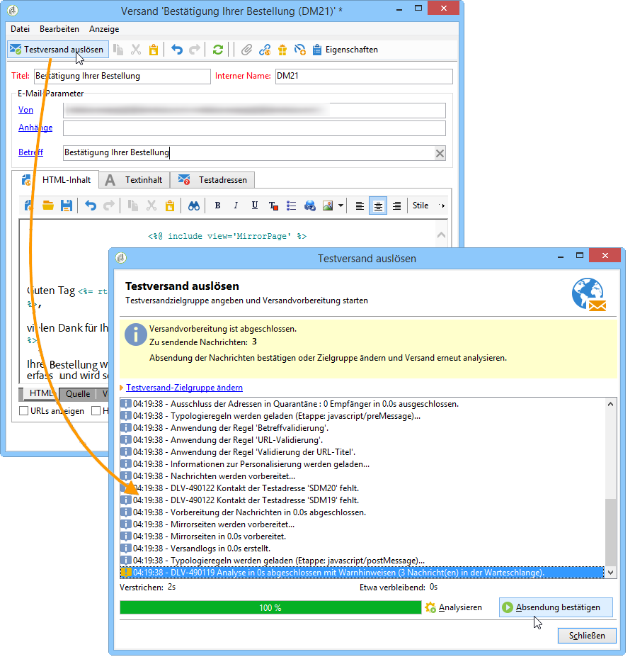
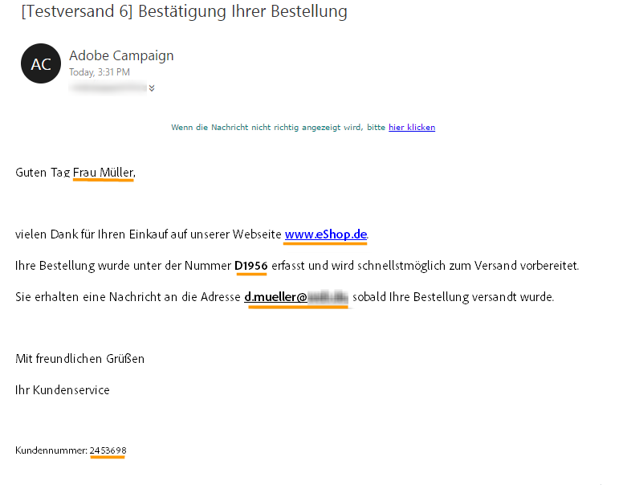
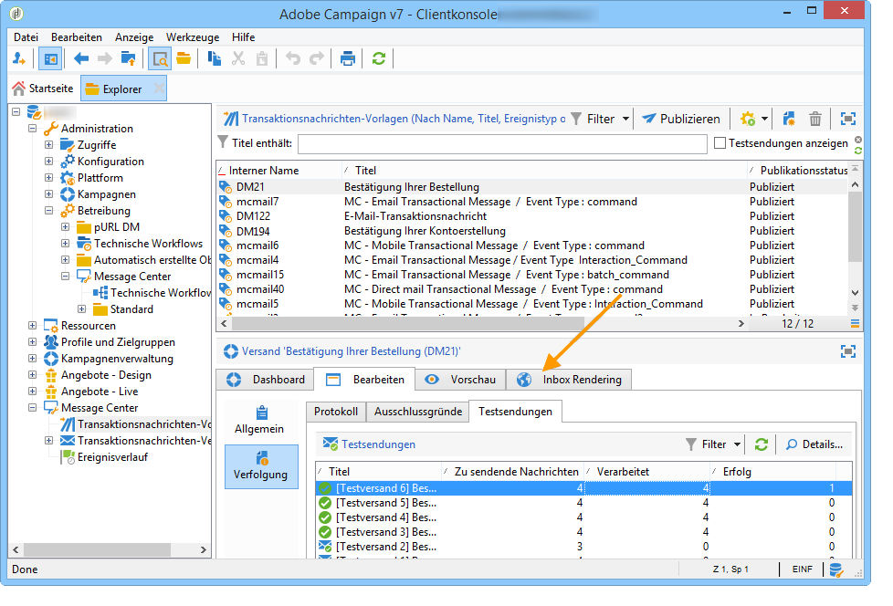

# Testversand durchführen{#sending-a-proof}

Mithilfe von Testadressen haben Sie die Möglichkeit, vor dem eigentlichen Versand einen Testversand durchzuführen.

Dieser erfolgt nach dem gleichen Prinzip wie ein klassischer Versand (siehe diesbezüglich [diesen Abschnitt](../../delivery/using/steps-validating-the-delivery.md#sending-a-proof)). Im Rahmen von Message Center erfordert ein Testversand vorab die Erstellung von

* einer oder mehreren Testadressen (siehe [Testadressen in Transaktionsnachrichten verwalten](../../message-center/using/managing-seed-addresses-in-transactional-messages.md)) mit Testdaten (siehe [Personalisierungsdaten](../../message-center/using/personalization-data.md)) und
* Nachrichteninhalt (siehe [Nachrichteninhalt erstellen](../../message-center/using/creating-message-content.md)).

Gehen Sie zur Durchführung des Testversands wie folgt vor:

1. Klicken Sie auf die Schaltfläche **[!UICONTROL Testversand]** im Versandfenster.
1. Analysieren Sie den Versand.
1. Korrigieren Sie eventuelle Fehler und bestätigen Sie den Versand.

   

1. Stellen Sie sicher, dass die Nachricht an die Testadresse geschickt wurde und der Inhalt Ihren Konfigurationen entspricht.

   

Die Testsendungen können im Tab **[!UICONTROL Verfolgung]** jeder Vorlage eingesehen werden.

