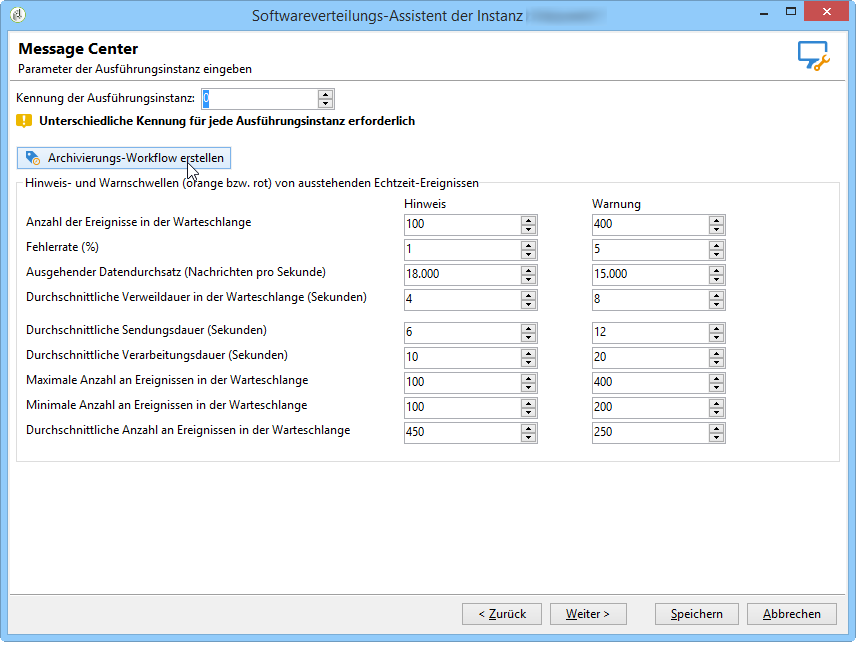

# Technische Workflows{#technical-workflows}

Die technischen Workflows für Message Center sind teils in der Kontrollinstanz, teils in der oder den Ausführungsinstanz(en) enthalten.

Vor Freigabe der Transaktionsnachrichten-Vorlagen muss sichergestellt werden, dass die mit Transaktionsnachrichten in Verbindung stehenden technischen Workflows (Message Center) der Kontrollinstanz und der verschiedenen Ausführungsinstanzen erstellt und gestartet sind.

## Workflows der Kontrollinstanz {#control-instance-workflows}

In der Kontrollinstanz müssen Sie, unabhängig davon, ob Sie eine oder mehrere Ausführungsinstanzen registriert haben, für jedes externe **[!UICONTROL Message Center Ausführungs-Instanz]**-Konto einen Archivierungs-Workflow erstellen. Klicken Sie auf die Schaltfläche **[!UICONTROL Archivierungs-Workflow erstellen]**, um den Workflow zu erstellen und zu starten.

Diese Workflows können Sie dann über den Ordner **Administration > Betreibung > Message Center** aufrufen. Nach der Erstellung werden die Archivierungs-Workflows automatisch gestartet.

<!--**Minimal architecture**

Once the control and execution modules are installed on the same instance, you must create the archiving workflow using the deployment wizard. Click the **[!UICONTROL Create the archiving workflow]** button to create and start the workflow.

-->

## Workflows der Ausführungsinstanz {#execution-instance-workflows}

Der Zugriff auf die Transaktionsnachrichten-spezifischen, technischen Workflows erfolgt in der oder den Ausführungsinstanz(en) im Knoten **Administration > Betreibung > Message Center**. Stellen Sie sicher, dass alle Workflows gestartet wurden. Folgende Workflows stehen zur Verfügung:

* **[!UICONTROL Verarbeitung der Batch-Ereignisse]** (interner Name **[!UICONTROL batchEventsProcessing]**): teilt die Batch-Ereignisse einer Warteschlange zu, bis sie einer Nachrichtenvorlage zugeordnet werden.
* **[!UICONTROL Verarbeitung der Echtzeit-Ereignisse]** (interner Name **[!UICONTROL rtEventsProcessing]**): teilt die Echtzeit-Ereignisse einer Warteschlange zu, bis sie einer Nachrichtenvorlage zugeordnet werden.
* **[!UICONTROL Update des Ereignisstatus]** (interner Name **[!UICONTROL updateEventStatus]**): ordnet jedem Ereignis einen Status zu.

   Folgende Status sind möglich:

   * **[!UICONTROL Ausstehend]**: Das Ereignis befindet sich in der Warteschlange und wurde noch keiner Nachrichtenvorlage zugeteilt.
   * **[!UICONTROL Versand ausstehend]**: Das Ereignis befindet sich in der Warteschlange, wurde einer Nachrichtenvorlage zugeordnet und wird vom Versand verarbeitet.
   * **[!UICONTROL Gesendet]**: Dieser Status wird aus den Versandlogs übernommen. Er bedeutet, dass die Nachricht gesendet wurde.
   * **[!UICONTROL Vom Versand ignoriert]**: Der Versand konnte nicht erfolgen, z. B. aufgrund einer Quarantäne (Status wird den Versandlogs entnommen).
   * **[!UICONTROL Versandfehler]**: Der Versand ist fehlgeschlagen (Status wird den Versandlogs entnommen).
   * **[!UICONTROL Ereignis wurde nicht berücksichtigt]**: Das Ereignis konnte keiner Vorlage zugeordnet werden. Das Ereignis wird nicht erneut verarbeitet.

