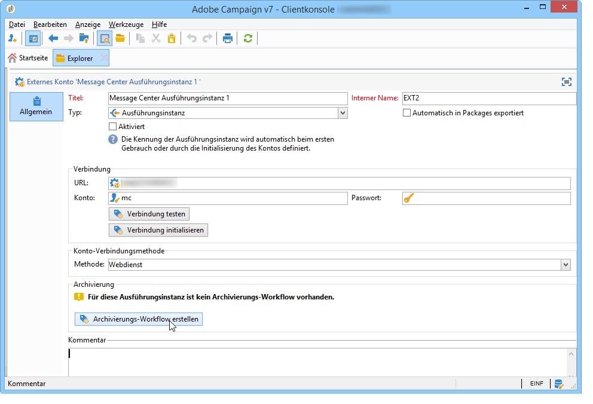

# Technische Workflows{#technical-workflows}

Die technischen Workflows für Message Center sind teils in der Kontrollinstanz, teils in der oder den Ausführungsinstanz(en) enthalten.

Vor Freigabe der Transaktionsnachrichten-Vorlagen muss sichergestellt werden, dass die mit Transaktionsnachrichten in Verbindung stehenden technischen Workflows (Message Center) der Kontrollinstanz und der verschiedenen Ausführungsinstanzen erstellt und gestartet sind.

## Workflows der Kontrollinstanz {#control-instance-workflows}

In der Kontrollinstanz ist für jede Ausführungsinstanz ein separater Archivierungs-Workflow zu erstellen. Diese Workflows sind anschließend im Knoten **Administration > Betreibung > Message Center** verfügbar. Nach ihrer Erstellung starten die Archivierungs-Workflows automatisch.

**Verteilte Architektur**

Wenn Sie eine oder mehrere Ausführungsinstanzen registriert haben, müssen Sie in der Steuerelementinstanz für jedes **[!UICONTROL Message Center execution instance]** externe Konto einen Archivierungsarbeitsablauf erstellen. Klicken Sie auf die **[!UICONTROL Create the archiving workflow]** Schaltfläche, um den Workflow zu erstellen und zu starten.

**Minimale Architektur**

Nachdem die Kontroll- und Ausführungsmodule auf derselben Instanz installiert wurden, müssen Sie den Archivierungsarbeitsablauf mithilfe des Bereitstellungsassistenten erstellen. Klicken Sie auf die **[!UICONTROL Create the archiving workflow]** Schaltfläche, um den Workflow zu erstellen und zu starten.

## Workflows der Ausführungsinstanz {#execution-instance-workflows}

Der Zugriff auf die Transaktionsnachrichten-spezifischen, technischen Workflows erfolgt in der oder den Ausführungsinstanz(en) im Knoten **Administration > Betreibung > Message Center**. Stellen Sie sicher, dass alle Workflows gestartet wurden. Folgende Workflows stehen zur Verfügung:

* **[!UICONTROL Processing batch events]** (interner Name: **[!UICONTROL batchEventsProcessing]** ): Mit diesem Arbeitsablauf können Sie Batch-Ereignisse in einer Warteschlange unterteilen, bevor sie mit einer Meldungsvorlage verknüpft werden.
* **[!UICONTROL Processing real time events]** (interner Name: **[!UICONTROL rtEventsProcessing]** ): Mit diesem Arbeitsablauf können Sie Echtzeit-Ereignisse in einer Warteschlange unterteilen, bevor sie mit einer Nachrichtenvorlage verknüpft werden.
* **[!UICONTROL Update event status]** (interner Name: **[!UICONTROL updateEventStatus]** ): Mit diesem Arbeitsablauf können Sie dem Ereignis einen Status zuweisen.

   Folgende Status sind möglich:

   * **[!UICONTROL Pending]** : das Ereignis sich in der Warteschlange befindet. Es wurde noch keine Nachrichtenvorlage zugeordnet.
   * **[!UICONTROL Pending delivery]** : Wenn sich das Ereignis in der Warteschlange befindet, wurde ihm eine Meldungsvorlage zugewiesen und wird von der Bereitstellung verarbeitet.
   * **[!UICONTROL Sent]** : dieser Status wird aus den Lieferprotokollen kopiert. Das bedeutet, dass die Lieferung gesendet wurde.
   * **[!UICONTROL Ignored by the delivery]** : dieser Status wird aus den Lieferprotokollen kopiert. Er bedeutet, dass kein Versand vorgenommen bzw. die Sendung ignoriert/nicht berücksichtigt wurde.
   * **[!UICONTROL Delivery failed]** : dieser Status wird aus den Lieferprotokollen kopiert. Er bedeutet, dass der Versand fehlgeschlagen ist.
   * **[!UICONTROL Event not taken into account]** : das Ereignis konnte nicht mit einer Meldungsvorlage verknüpft werden. Es erfolgt kein weiterer Versuch der Ereignisverarbeitung.

