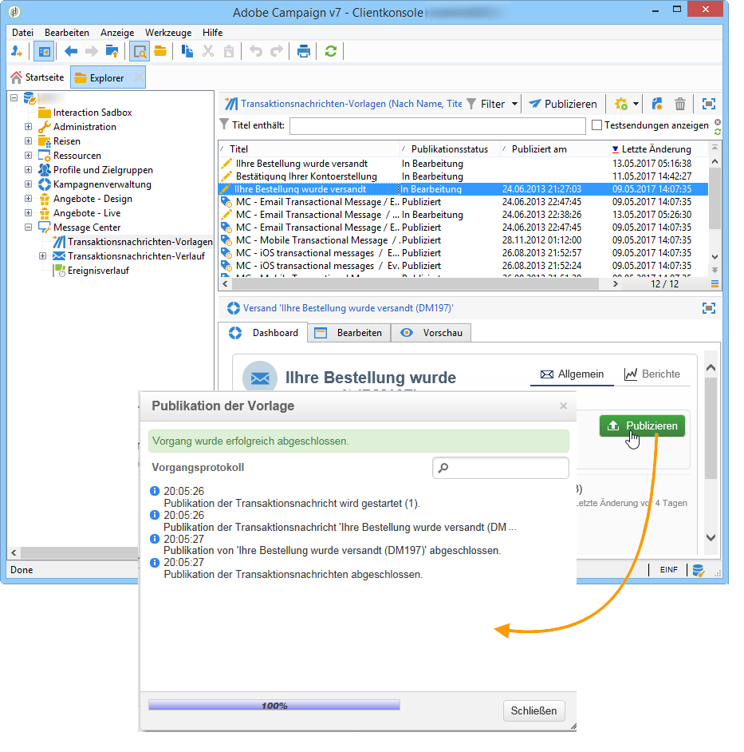
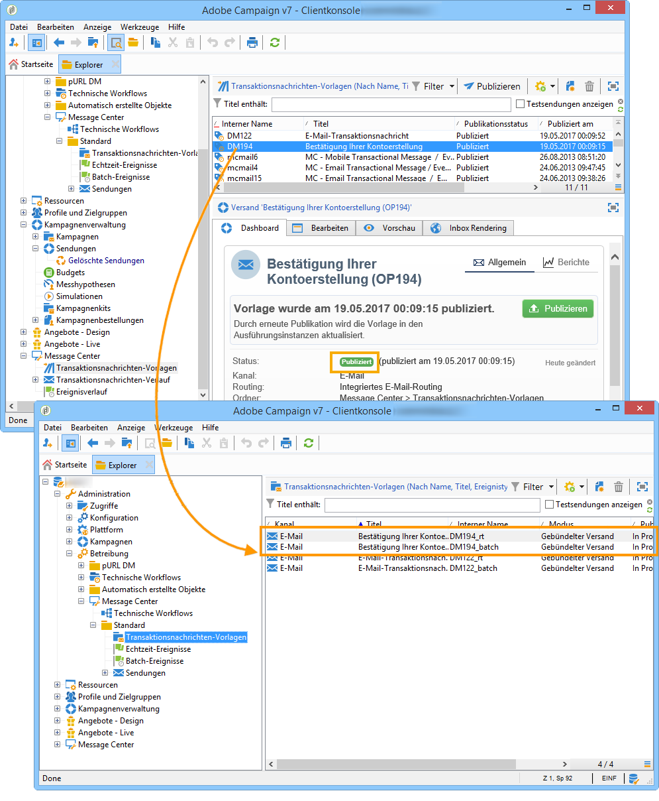

# Vorlagenpublikation{#template-publication}

Sobald die in der Kontrollinstanz erstellte Nachrichtenvorlage fertig ist, können Sie sie in allen Ausführungsinstanzen publizieren. Bei der Publikation können Sie in der Ausführungsinstanz automatisch zwei Nachrichtenvorlagen erstellen, um Nachrichten senden zu können, die mit Echtzeit- und Batch-Ereignissen verknüpft sind.

>[!IMPORTANT]
>
>Nach jeder Änderung an der Vorlage muss diese erneut publizert werden, damit die Änderungen in den von der Ausführungsinstanz gesendeten Transaktionsnachrichten berücksichtigt werden.

>[!NOTE]
>
>Bei der Publikation der Transaktionsnachrichten-Vorlagen werden auch die Typologieregeln automatisch auf den Ausführungsinstanzen publiziert.

1. Gehen Sie in der Kontrollinstanz in den Knoten **[!UICONTROL Message Center > Transaktionsnachrichten-Vorlagen]** des Navigationsbaums.
1. Wählen Sie die auf den Ausführungsinstanzen zu publizierende Vorlage aus.
1. Klicken Sie auf **[!UICONTROL Publizieren]**.

   

Nach Abschluss der Publikation werden die beiden Vorlagen, die auf die Echtzeit- und Batch-Ereignisse angewendet werden, im Navigationsbaum der Ausführungsinstanz im Ordner **[!UICONTROL Administration > Betreibung > Message Center > Standard > Transaktionsnachrichten-Vorlagen]** erstellt.

>[!NOTE]
>
>Wenn Sie ein bestehendes Feld der Transaktionsnachrichtenvorlage, wie z. B. die Adresse des Absenders, durch einen leeren Wert ersetzen, wird das entsprechende Feld in der/den Ausführungsinstanz(en) nicht aktualisiert, wenn die Transaktionsnachricht erneut publiziert wird. Es enthält weiterhin den vorherigen Wert. Wenn Sie jedoch einen nicht leeren Wert hinzufügen, wird das entsprechende Feld nach der nächsten Publikation wie gewohnt aktualisiert.
