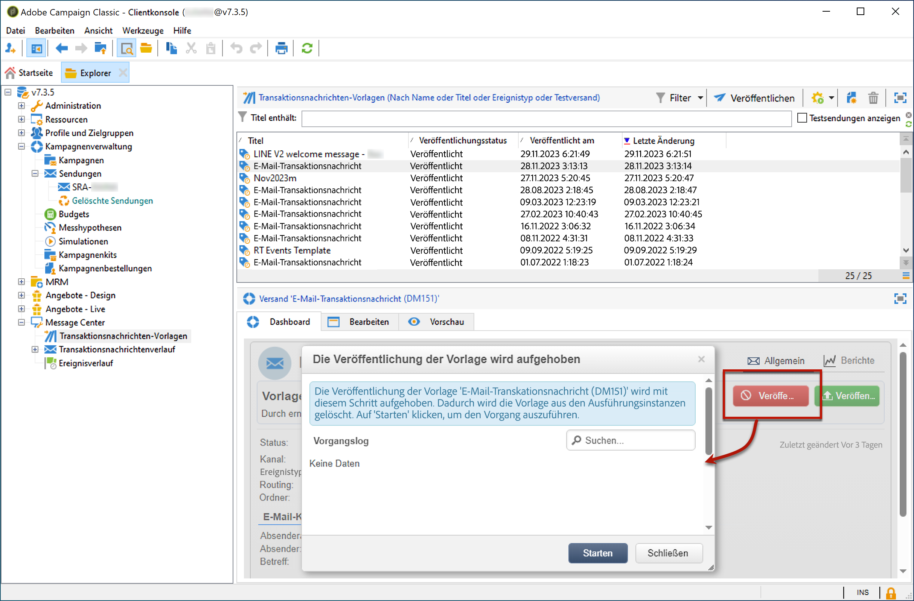

# Vorlage ohne Veröffentlichung{#template-unpublication}

Sobald eine Nachrichtenvorlage auf den Ausführungsinstanzen veröffentlicht wurde, kann sie rückgängig gemacht werden.

Tatsächlich kann eine veröffentlichte Vorlage immer noch aufgerufen werden. Wenn Sie daher keine Nachrichtenvorlage mehr verwenden, wird empfohlen, die Veröffentlichung rückgängig zu machen. Damit soll verhindert werden, dass versehentlich eine unerwünschte Transaktionsnachricht gesendet wird. Sie haben beispielsweise eine Nachrichtenvorlage veröffentlicht, die Sie nur für Weihnachten-Kampagnen verwenden. Sie können die Veröffentlichung nach Ablauf der Weihnachtszeit rückgängig machen und sie im nächsten Jahr erneut veröffentlichen.

Außerdem können Sie keine Transaktionsnachrichtenvorlagen mit dem Status &quot; **[!UICONTROL Veröffentlicht]** &quot;löschen. Sie müssen die Veröffentlichung zuerst rückgängig machen.

Gehen Sie wie folgt vor, um die Veröffentlichung einer Transaktionsnachrichtenvorlage rückgängig zu machen.

1. Gehen Sie in der Kontrollinstanz in den Knoten **[!UICONTROL Message Center > Transaktionsnachrichten-Vorlagen]** des Navigationsbaums.
1. Wählen Sie die Vorlage aus, deren Veröffentlichung Sie rückgängig machen möchten.
1. Klicken Sie auf **[!UICONTROL Veröffentlichung rückgängig machen]**.

   <!--1. Fill in the **[!UICONTROL Log of the process]** field.-->

1. Klicken Sie auf **[!UICONTROL Starten]**.

Der Status &quot;Transaktionsnachrichtenvorlage&quot;ändert sich von &quot; **[!UICONTROL Veröffentlicht]** &quot;in &quot; **[!UICONTROL Bearbeitung]**&quot;.

Nach Abschluss der Veröffentlichung:

* Beide Meldungsvorlagen (auf Batch- und Echtzeit-Ereignis angewendet) werden aus jeder Ausführungsinstanz gelöscht. Sie werden nicht mehr im Ordner **[!UICONTROL &quot;Administration&quot;> &quot;Produktion&quot;> &quot;Message Center-Ausführung&quot;> &quot;Standard&quot;> &quot;Transaktionsnachrichtenvorlagen]** &quot;angezeigt.

* Sobald die Veröffentlichung einer Vorlage rückgängig gemacht wurde, können Sie sie bei Bedarf aus der Kontrollinstanz löschen. Wählen Sie dazu das gewünschte Element in der Liste aus und klicken Sie auf die Schaltfläche &quot; **[!UICONTROL Löschen]** &quot;oben rechts im Bildschirm.